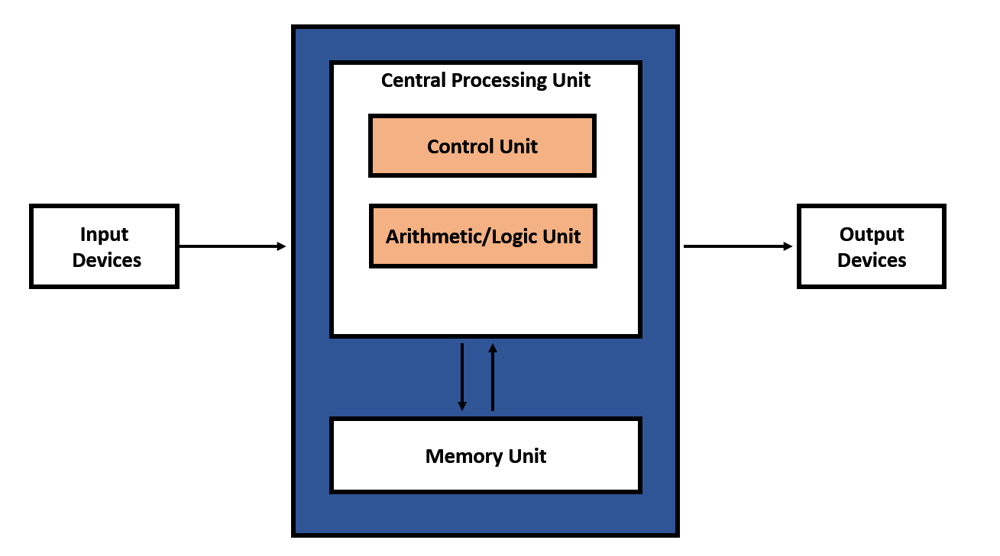
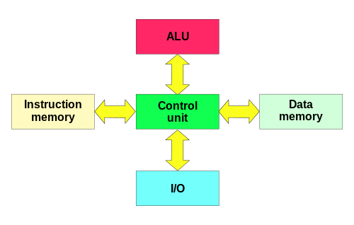

# 폰 노이만 구조
프로그램과 데이터를 동일한 메모리에 저장하고, CPU가 이를 순차적으로 불러와 실행하는 컴퓨터 아키텍처

## 특징

### 저장 프로그램 방식

- 명령어와 데이터를 같은 메모리에 저장
- 프로그램을 바꿀 때 하드웨어 변경 없이 메모리 내용만 수정하면 됨

### 순차적 처리

- 명령어는 프로그램 카운터(PC)에 의해 메모리에서 하나씩 가져와 실행
- 점프, 분기 등 제어 흐름 명령어가 없는 한 직렬적으로 진행

### 단일 버스 구조

- 데이터와 명령어가 같은 버스 공유
- 이는 구현은 단순하지만 성능 병목으로 이어짐

## 구성 요소
5가지 블록으로 설명

- **메모리** : 프로그램과 데이터 저장 (주소 기반 접근)
- **산술 논리 연산 장치** : 산술, 논리 연산 수행
- **제어 장치** : 명령어 인출, 해석, 실행 제어
- **입력 장치** : 외부 데이터를 시스템으로 전달
- **출력 장치** : 연산 결과를 외부로 전달

## 폰 노이만 병목 현상

### 정의
명령어와 데이터가 같은 메모리, 같은 버스를 공유하기 때문에 CPU와 메모리 간 전송 속도가 전체 시스템 성능을 제한하는 현상

### 문제점
CPU 연산 속도 >> 메모리 접근 속도 -> CPU가 자주 유휴 상태에 놓임

### 해결책
캐시 메모리, 파이프라이닝, 명령어, 데이터 분리 캐시 등

## vs 하버드 구조

**폰 노이만 구조** : 프로그램과 데이터가 같은 메모리, 버스 공유 -> 단순, 저비용
**하버드 구조** : 프로그램 메모리와 데이터 메모리를 분리, 각각의 버스 사용 -> 동시 접근 가능, 성능 향상

### 응용
PC, 범용 컴퓨터 -> 폰 노이만 구조 기반
DSP, 임베디드 시스템 -> 하버드 구조

## 응용 - 수정된 하버드 구조

현대 CPU는 기본적으로 폰 노이만 구조를 따르지만, 성능 향상을 위해 캐시 단계에서 하버드 구조를 차용
- 명령어 캐시와 데이터 캐시를 분리 -> 동시 접근 가능
- 메모리 계층 구조로 병목 완화