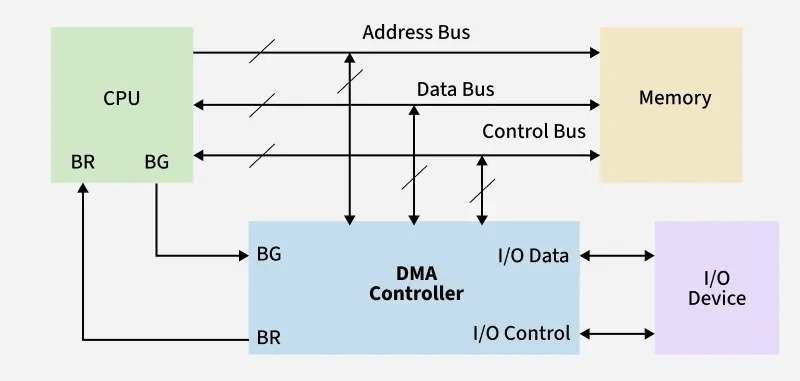

# 버스 구조 & I/O

## 버스 구조

- 버스 : CPU, 주기억장치, 외부 입출력 장치 사이의 정보 전송 위한 전기적 통로
	-> 컴퓨터의 많은 장치들이 서로 데이터 주고 받기 위한 통로
- 버스 크기, 버스 통한 데이터 전송 속도가 시스템 성능 좌우

### 종류
- 통신 선 가닥수에 따른 구분 : 병렬 버스 / 직렬 버스
- 공통 클럭 여부에 따른 구분 : 동기식 버스 / 비동기식 버스
- 버스 위치에 따른 구분 : 내부 버스 / 외부 버스
- 컴퓨터 내 버스 : 구조 상의 위치에 따른 구분 - 시스템 버스 / I/O버스 , 전달 정보에 따른 구분 - 데이터 버스, 주소 버스, 제어 버스

- **시스템 버스 구성**
	1. 데이터 버스 : 메모리 - CPU, 입출력장치 - 메모리, CPU 내부 모듈간 데이터 이동 경로, 양방향
	2. 주소 버스 : CPU가 사용하고자 하는 데이터가 위치한 주소 이동하는 경로
		CPU -> 메모리, CPU <-> I/O, 메모리 <-> I/O
	3. 제어 버스 : CPU에서 발생하는 제어 명령, 상태 신호들이 이동하는 경로, 양방향

### 버스 역할
1) CPU <-> 메모리 : 적재(Load)와 저장(Store) 명령에 의해 수행
	적재(Load)
	- 주소 버스 : 메모리에서 불러올 데이터가 있는 주소값 전달 (CPU -> 메모리)
	- 제어 버스 : Memory Read 신호 전달 (CPU -> 메모리)
	- 데이터 버스 : 지정한 메모리에 저장된 값 전달 (메모리 -> CPU)
	
	저장(Store)
	- 주소 버스 : 메모리에서 데이터 저장할 주소값 전달 (CPU -> 메모리)
	- 제어 버스 : Memory Write 신호 전달 (CPU -> 메모리)
	- 데이터 버스 : 저장할 데이터 전달 (CPU -> 메모리)

2) CPU <-> I/O : 입력(Input)과 출력(Output) 명령에 의해 수행
	입력(Input)
	- 주소 버스 : 해당 입출력 장치의 포트 번호 전달 (CPU -> I/O)
	- 제어 버스 : I/O Read(input) 신호 전달 (CPU -> I/O)
	- 데이터 버스 : 해당 입출력 장치에서 데이터 전달 (I/O -> CPU)
	
	출력(Output)
	- 주소 버스 : 해당 입출력 장치의 포트 번호 전달(CPU -> I/O)
	- 제어 버스 : I/O Write(output) 신호 전달 (CPU -> I/O)
	- 데이터 버스 : 입출력 장치에 데이터 전달 (CPU -> I/O)

3) 메모리 <-> I/O : CPU 이용하지 않고 직접 기억장치 액세스 방식(DMA, Direct Memory Access)으로 통신
	- DMA 제어기는 CPU 대신해 주소 버스와 제어 버스에 신호 전달
	- DMA 제어기는 통신 시작 전 CPU에 버스 사용에 대한 허가 받아야 함
	- ex. 하드디스크(I/O)에 저장된 파일 읽고 메모리(RAM)로 가져옴

### 버스 중재 방식
- 버스 중재 : 버스에 접속된 두 개 이상의 모듈들이 동시에 버스 사용하고자 할 때 순서대로 한 개씩 버스 사용할 수 있게 하는 제어
중재에 사용하는 신호
- 버스 중재 신호 종류
  - 버스 요청 : 특정 장치가 버스 사용을 요구했음을 알리는 신호
  - 버스 승인 : 버스 사용을 요구하는 장치에게 사용을 허가하는 신호
  - 버스 사용 중 : 현재 버스가 사용되고 있는 중임을 나타내는 신호
- 버스 중재 신호는 제어 버스를 통해 이동

## I/O

- 컴퓨터 및 주변장치에 대하여 데이터를 전송한느 프로그램, 운영, 장치
- 입출력 장치 뿐만 아니라 프로세서와 메모리, 확장 슬롯, 마더보드에서 일어나는 데이터 전송도 I/O

### 종류
- 입력 장치 : 컴퓨터로 데이터를 들여보내는 장치 ex. 키보드, 마우스, 마이크, 스캐너, 카메라 등
- 출력 장치 : 컴퓨터가 처리한 결과를 외부로 내보내는 장치 ex. 모니터, 프린터, 스피커, 등
- 입출력 장치 : 입력과 출력이 모두 가능한 장치 ex. 저장장치(SSD, HDD), 터치스크린, 네트워크 카드 등

### I/O 제어 방식
1. **Polling (Programmed I/O, PIO)**
- CPU가 모든 제어와 데이터 전송 전담, I/O 장치의 상태를 주기적으로 직접 확인하는 방식
- 동작 과정
	1. CPU가 I/O 모듈의 명령 레지스터에 쓰기 / 읽기 명령 보냄
	2. CPU는 I/O 모듈의 상태 레지스터를 주기적으로 읽으며, 장치 준비되었는지(Ready) 작업 완료되었는지(Done) 확인 -> Busy-Waiting
	3. 상태 레지스터 준비 완료되면 CPU는 I/O 모듈의 데이터 레지스터 <-> CPU 내부 레지스터 읽기 / 쓰기
- I/O 작업 진행되는 모든 시간동안 CPU가 관여
- Busy-Waiting으로 인해 CPU는 다른 유용한 작업 수행 X -> 시스템 전체 성능 심각하게 저하

 

2. **인터럽트 기반 I/O (Interrupt-driven I/O)**
- I/O 작업의 대기 시간을 CPU가 다른 작업 수행하는 데 활용, I/O 작업 완료되면 장치가 CPU에게 신호(Interrupt)를 보내 알리는 방식
- 동작 과정
	1. CPU는 I/O 모듈에 명령 보낸 후, 즉시 다른 프로세스 명령 실행
	2. I/O 모듈은 독립적으로 작업 수행
	3. 작업 완료 -> I/O 모듈은 시스템의 제어 버스 통해 CPU에 인터럽트 요청(IRQ) 신호 보냄
	4. CPU는 현재 실행 중인 명령어 사이클 마친 뒤, 인터럽트 신호 감지
	5. CPU는 현재 실행 중이던 프로세스 상태를 스택에 저장, 해당 인터럽트 처리 위해 인터럽트 서비스 루틴(ISR)으로 프로그램 카운터 이동
	6. ISR 내부에서 CPU는 I/O 장치의 데이터를 메모리로 옮기는 등 필요한 처리 수행
	7. ISR 실행 완료 -> 스택에 저장했던 원래 프로세스 상태 복원, 중단된 작업 재개
- CPU는 I/O 작업이 시작될 때와 완료되었을 때만 개입
- 대기 시간동안 다른 작업 할 수 있어 폴링 방식보다 CPU 활용률 향상
- 여전히 데이터 전송 자체는 CPU가 직접 수행

 

1. **직접 메모리 접근 (Direct Memory Access, DMA)**
- CPU의 개입 최소화, DMA 컨트롤러(DMAC)라는 별도 하드웨어 모듈이 CPU를 거치지 않고 I/O 장치와 주 메모리 사이의 데이터 전송 전담
- 동작 과정
	1. CPU는 DMAC에게 I/O 장치 주소, 데이터 전송될 메모리의 시작 주소, 전송될 데이터의 크기(블록 단위) 등의 정보 설정하여 데이터 전송 명령
	2. 이후 CPU는 DMA 작업과 무관한 다른 프로세스 실행
	3. DMAC는 CPU 도움 없이 시스템 버스의 제어권 획득, I/O 장치와 메모리 사이에서 직접 데이터 블록 전송
	4. 지정된 크기의 데이터 블록 전송 완료 -> DMAC가 CPU에 인터럽트 신호 전송
	5. CPU는 인터럽트 받아 전체 블록 전송 완료를 인지, 후속 작업 처리
- CPU는 데이터 전송의 시작과 종료 시점에만 관여
- 실제 데이터가 블록 단위로 오고가는 과정에는 CPU 개입 X -> 대용량 데이터 전송 시 CPU 부하 최소화, 시스템 성능 극대화

#### 인터럽트와 DMA의 차이
- 데이터를 실제로 옮기는 주체
  - 인터럽트 기반 I/O : CPU가 데이터 전송 직접
  - DMA는 DMAC가 데이터 전송 대행
- 인터럽트 발생 빈도
	- 인터럽트 기반 I/O
    	- 데이터 한 단위 전송할 때마다 발생 가능
      	- 대용량 데이터 전송 시 인터럽트 매우 빈번히 발생
      	- CPU 작업 자주 중단시켜 오버헤드 커짐
	- DMA
    	- 요청한 데이터 블록 전체가 모두 전송되었을 때 한 번만 발생
    	- 대용량 데이터 처리할 때 시스템 성능 극대화
