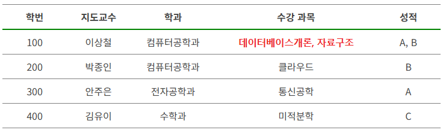
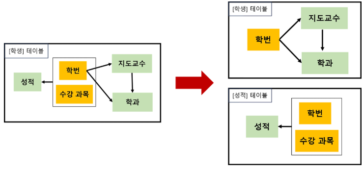
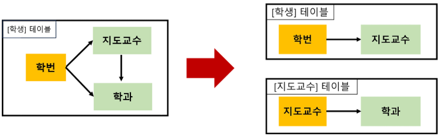

## 정규화 & 반정규화

### 정규화(Normalization)

1. **정의**

- 이상 현상이 있는 테이블을 분해하여 이상 현상을 없애는 방법
    - 이상 현상 : 데이터베이스에 중복된 데이터 있을 때 발생하는 문제 (삽입 이상, 삭제 이상, 갱신 이상)
- 데이터를 여러 테이블로 분리하여 각 테이블에 중복된 데이터를 저장하지 않도록 함
- 목적
    - 데이터 중복 줄여 저장공간 최소화, 데이터 무결성 유지
    - 데이터의 변경 있을 때 이상 현상 줄일 수 있음
    - 테이블을 논리적, 직관적으로 구성 가능

2. **장단점**

- 장점
    - 데이터베이스 변경 시 이상 현상 제거 가능(올바른 데이터 획득)
    - 정규화된 DB 구조에서는 새로운 데이터 형을 확장하려고 할 때, 테이블 구조를 변경하지 않거나 일부만 변경해도 됨
- 단점
    - 테이블을 분해하는 과정에서 테이블 간 JOIN 연산 증가
    - 지나치게 많은 JOIN 연산 때문에 성능 저하 발생 → 반정규화로 개선 가능

3. **정규화 단계**

- 제1정규형(1NF)
    - 테이블 컬럼이 원자값(Atomic Value, 하나의 값)을 갖도록 테이블 분해
    - 규칙
        - 각 컬럼은 하나의 값(속성)만 가짐
        - 각 컬럼은 같은 종류나 타입의 값 가져야 함 (ex.  문자열, 숫자를 동일 컬럼에 저장 X)
        - 컬럼의 배치 순서는 상관 없어야 함
 
 

- 제2정규형(2NF)
    - 제1정규화를 지키고 있는 테이블에 대한 부분 함수 종속성을 제거하는 과정
    - 모든 기본키의 부분 집합에 의존하는 컬럼들을 분리하여 새로운 테이블 만듦
    - 즉, 현재 테이블의 주제와 관련없는 컬럼을 다른 테이블로 빼는 작업
    - 규칙
        - 제1정규화를 만족해야 함
        - 모든 컬럼이 완전 함수 종속을 만족해야 함
 
 

- 제3정규형(3NF)
    - 제2정규화를 지키고 있는 테이블에 대한 이행적 종속을 없애도록 테이블을 분해하는 것
        - 이행적 종속 : A → B, B → C가 성립할 때 A→ C가 성립되는 것을 의미
    - 규칙
        - 제2정규화를 만족해야 함
        - 기본키를 제외한 속성들 간의 이행 종속성이 없어야 함
 
 

- BCNF(Boyce-codd Normal Form)
    - 3차 정규화에서 해결할 수 없는 이상현상을 해결하기 위해 3차 정규화를 강화한 버전
    - 규칙
        - 제3정규화를 만족해야 함
        - 모든 결정자가 후보키 집합에 속해야 함
            - 후보키 집합에 없는 컬럼이 결정자가 되어서는 안된다는 뜻
 
 

---

### 반정규화(Denormalization)

1. **정의**

- 데이터 중복을 허용하고 조인을 줄이는 데이터베이스 성능 향상 방법
- 의도적으로 정규화 원칙을 위배하는 행위
- 조회 속도를 향상시키지만 데이터 모델의 유연성은 낮아짐
- 데이터 조회할 때 조인으로 인한 성능저하가 예상될 때 사용

2. **반정규화 대상**

- 수행 속도가 많이 느린 경우
- 테이블의 조인 연산을 지나치게 사용하여 데이터 조회하는 것이 기술적으로 어려운 경우
- 테이블에 많은 데이터 있고, 다량의 범위 혹은 특정 범위를 자주 처리해야 하는 경우

3. **장단점**

- 장점
    - 데이터 빠르게 조회 가능
    - 데이터 조회 쿼리 간단
- 단점
    - 데이터의 삽입, 삭제, 수정 등 갱신 시 비용 증가
    - 데이터 간의 일관성 깨질 수 있음
    - 많은 저장 공간 필요