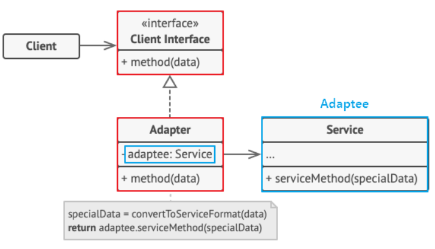
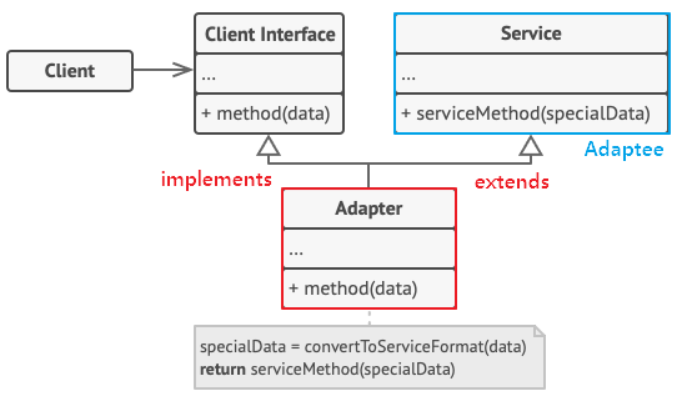
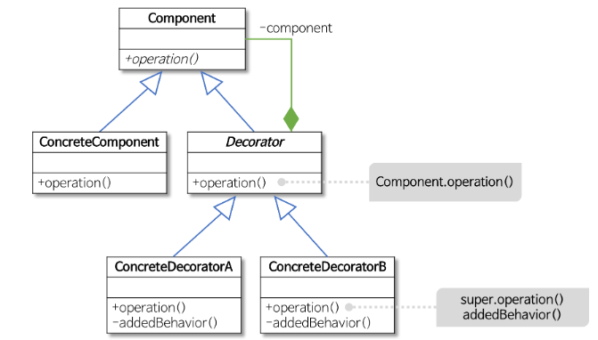
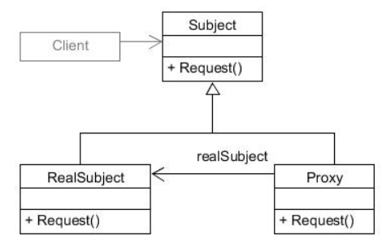

# 어댑터, 데코레이터 & 프록시

## 1. Adapter Pattern

**개념**

- 기존 클래스의 인터페이스가 달라서 사용 못할 때, 중간에 어댑터 끼워 넣어 호환되도록 변환하는 패턴
- 인터페이스 변환 (호환성 문제 해결)
- Lecacy 인터페이스를 감싸서 새로운 인터페이스로 변환 → Wrapper 패턴이라고도 함

**사용 예시**

- 기존 코드를 뜯지 못하는 상황에서 새 코드와 연결해야 할 때
- 레거시 시스템+ 신규 시스템 연결할 때

**구조**

- Object Adaptor
    - 합성(Composition)된 멤버에게 위임을 이용한 어댑터 패턴
    - 합성 활용했기 때문에 런타임 중이 Adaptee(Service)가 결정되어 유연
    - Adaptee(Service) 객체를 필드 변수로 저장해야 되기 때문에 공간 차지 비용 발생
    
    
    
    - Adaptee(Service) : 어댑터 대상 객체. 기존 시스템 / 외부 시스템 / 써드파티 라이브러리
    - Target(Client Interface) : Adapter가 구현하는 인터페이스
    - Adapter : Client와 Adaptee(Service) 중간에서 호환성이 없는 둘을 연결시켜주는 역할
    - Client : 기존 시스템을 어댑터 통해 이용하려는 쪽. Client Interface 통해 Service 이용 가능
- Class Adaptor
    - 클래스 상속을 이용한 어댑터 패턴
    - Adaptee(Service)를 상속했기 때문에 따로 객체 구현 없이 바로 코드 재사용 가능
    
    
    
    - Adaptee(Service) : 어댑터 대상 객체. 기존 시스템 / 외부 시스템  / 써드파티 라이브러리
    - Target(Client Interface) : Adapter가 구현하는 인터페이스
    - Adapter : Client와 Adaptee(Service) 중간에서 호환성 없는 둘을 연결시켜주는 역할
    - Client : 기존 시스템을 어댑터 통해 이용하려는 쪽. Client Interface 통해 Service 이용 가능

**장단점**

- 장점
    - 단일 책임 원칙(SRP) & 개방 폐쇄 원칙(OCP) 만족
    - 어댑터에 추가 메소드 빠르게 생성 가능
- 단점
    - 코드 복잡성 증가
    - 직접 Adaptee 클래스 수정이 간단한 경우 있음

## 2. Decorator 패턴

**목적**

- 상속 대신, 필요한 기능을 감싸서 점진적으로 추가하는 패턴
- 기능을 붙였다 뗐다 할 수 있음

**사용 예시**

- 런타임에서 기능을 확장하고 싶을 때
- 클래스 폭발을 막고 싶을 때 (ex. A+B+C 조합이 너무 많을 때)

**구조**

- 기능을 동적으로 추가
- Componenet
    - 기본 기능을 뜻하는 ConcreteComponent와 추가 기능을 뜻하는 Decorator의 공통 기능 정의
    - 클라이언트는 Component 통해 실제 객체 사용함
- ConcreteComponent : 기본 기능을 구현하는 클래스
- Decorator : 많은 수가 존재하는 구체적인 Decorator의 공통 기능 제공
- ConcreteDecoratorA, ConcreteDecoratorB
    - Decorator의 하위 클래스로 기본 기능에 추가되는 개별저깅ㄴ 기능
    - ConcreteDecorator 클래스는 ConcreteComponenet 객체에 대한 참조 필요, 이는 Decorator 클래스에서 Component 클래스로의 합성(composition) 관계를 통해 표현

**장단점**

- 장점
    - 유연한 확장
    - 코드 재사용 가능
    - 책임 분리
- 단점
    - 클래스 수 증가
    - 코드  복잡성

## 3. Proxy Pattern

**목적**

- 원본 객체 대신 앞에서 대리 역할 수행하는 객체 둠
- 대표적인 용도 → 캐싱, 접근 제어, 로깅, Lazy Loading

**사용 예시**

- 무거운 객체의 생성을 지연시키고 싶을 때 (Lazy Loading)
- 네트워크나 I/O 호출을 감싸고 싶을 때
- 접근 권한을 체크하고 싶을 때
- 요청 결과를 캐싱하고 싶을 때

**구조**

- Subject : Proxy와 RealSubject가 모두 구현하는 인터페이스로 클라이언트가 프록시와 실제 대상을 동일하게 다룰 수 있도록 정의
- RealSubject : 클라이언트가 직접 상호작용하는 실제 객체
- Proxy : RealSubject를 감싸며 실제 작업을 수행하는 주체로 클라이언트와 RealSubject 사이에 위치한 중간 객체. RealSubject의 같은 이름의 메서드를 호출하며, 클라이언트의 요청을 처리하기 전이나 후에 추가적인 작업 수행 가능

**장단점**

- 장점
    - 접근 제어
    - 지연 초기화
    - 캐싱
    - 유효성 검사
    - 원격 액세스
- 단점
    - 복잡성 증가
    - 성능 저하
    - 디자인 복잡성