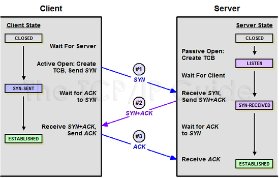

# 3-Way / 4-Way 핸드셰이크

## TCP의 연결과 해제

- TCP : 신뢰성 있는 연결 지향형 프로토콜 → 통신하기 전 **연결 성립(Establish)**, 통신 끝나면 **종료(Terminate)**
- 연결 시 : 3-way handshake
- 연결 해제 시 : 4-way handshake
- 데이터 안정적으로 주고받기 위해 양쪽이 모두 준비 상태임을 확인하는 절차

### 3-Way Handshake (연결 성립)

1. 목적
    1. 서로 통신 가능한지 확인
    2. 서로의 초기 순서 번호(Sequence Number, SYN 번호) 교환
    3. 양방향 통신 준비 완료
2. 과정
    1. SYN : 지금 보내는 데이터의 첫 번째 바이트 번호
    2. ACK에 1 더하는 이유 : 다음에 받아야 할 데이터의 시퀀스 번호 의미

| 단계 | 송신자 → 수신자 | 플래그 | SEQ | ACK | 설명 |
| --- | --- | --- | --- | --- | --- |
| 1 | 클라이언트 → 서버 | SYN = 1 | x | - | 네 서버에 연결하고 싶음. 내 초기 번호 x임 |
| 2 | 서버 → 클라이언트 | SYN = 1, ACK = 1 | y | x + 1 | ok. 연결할게. 내 초기번호는 y. 당신 번호 x+1 확인함 |
| 3 | 클라이언트 → 서버 | ACK = 1 | x + 1 | y + 1 | 확인함. 데이터 주고받을 준비 완료 |

- **SYN-SENT** : SYN 세그먼트 보낸 뒤 SYN+ACK 세그먼트 기다리는 상태
- **SYN-RECEIVED** : SYN+ACK 보낸 뒤 ACK 세그먼트 기다리는 상태
- **ESTABLISHED** : 연결 확립. 데이터 송수신 가능한 상태

### 4-way Handshake (연결 종료)

1. 목적
    1. 연결 정상적으로 끊기 위해 양쪽의 데이터 전송 종료를 확인하는 절차
2. 과정 

| 단계 | 송신자 → 수신자 | 플래그 | SEQ | ACK | 설명 |
| --- | --- | --- | --- | --- | --- |
| 1 | 클라이언트 → 서버 | FIN = 1 | u | - | 나 이제 데이터 다 보냄 |
| 2 | 서버 → 클라이언트 | ACK = 1 | v | u + 1 | ok. 일단 확인 |
| 3 | 서버 → 클라이언트 | FIN = 1 | w | - | 이제 다 보냄 |
| 4 | 클라이언트 → 서버 | ACK = 1 | u + 1 | w + 1 | ok. 연결 종료할게 |

- **FIN-WAIT-1** : FIN 세그먼트로서 연결 종료 요청 보낸 후 ACK 세그먼트 기다리는 상태
- **CLOSE-WAIT** : ACK 세그먼트 보낸 후 대기하는 상태
- **FIN-WAIT-2** : FIN-WAIT-1 상태에서 ACK 세그먼트 받음. 상대의 FIN 세그먼트 기다리는 상태
- **LAST-ACK** : CLOSE-WAIT 상태에서 FIN 세그먼트 전송한 뒤 ACK 세그먼트 기다리는 상태
- **TIME-WAIT** : FIN 세그먼트 수신하고 이에 대한 ACK 전송한 뒤 접어드는 상태
- **CLOSING** : 동시에 연결 종료하려 할 때 전이되는 상태 → ACK 세그먼트를 수신하면 각자 TIME-WAIT 상태로 접어든 뒤 종료