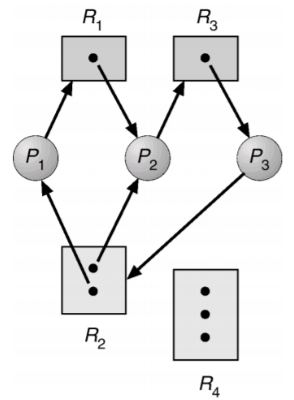

# Deadlock (교착 상태)

- 두 개 이상의 프로세스나 스레드가 서로의 자원을 얻지 못해서 **무한히** 대기하는 상태
- 다른 프로세스가 점유하고 있는 자원을 **둘 이상의 프로세스**가 서로 기다릴 때 **무한 대기**에 빠지는 상태

## 자원 할당 그래프

- 어떤 프로세스가 어떤 자원을 할당받아 사용 중인지 확인 가능
- 어떤 프로세스가 어떤 자원을 기다리고 있는지 확인 가능
1. 프로세스는 원으로, 자원의 종류는 사각형으로 표현
2. 사용할 수 있는 자원의 개수는 자원 사각형 내 점으로 표현
3. 프로세스가 어떤 자원을 할당 받아 사용중이라면 자원에서 프로세스를 향해 화살표 표시
4. 프로세스가 어떤 자원을 기다리고 있다면 프로세스에서 자원으로 화살표 표시

⇒ 자원 할당 그래프가 **원의 형태**를 띠고 있을 때 **교착 상태 발생**

## Deadlock 발생 조건

- 4가지 모두 성립해야 데드락 발생

### 상호 배제 (mutual exclusion)

- 자원은 한 번에 한 프로세스만 사용 가능
- 한 프로세스가 사용하는 자원을 다른 프로세스가 사용할 수 없는 상태

### 점유와 대기 (hold and wait)

- 자원을 할당받은 상태에서 다른 자원을 할당 받기를 기다리는 상태

### 비선점(non-preemption)

- 어떤 프로세스도 다른 프로세스의 자원을 강제로 빼앗지 못하는 상태

### 순환 대기(circular wait)

- 프로세스들이 원의 형태로 자원을 대기하는 상태

## 교착 상태 해결

### 예방 (Prevention)

- 교착 상태 발생 조건 중 하나를 제거(부정) → 자원 낭비로 성능 저하
- **상호배제 부정**
    - 여러 프로세스가 공유 자원 사용
    - 자원 낭비나 신뢰성 떨어지기 때문에 사용하기 적절하지 않은 방법
    - 자원 공유가 현실적으로 불가능
- **점유와 대기 부정**
    - 프로세스 실행 전 필요한 모든 자원 할당
    - 필요한 자원 중 하나라도 사용중이면 아예 할당 X
    - 자원 요구가 수용되지 않으면 원래 갖고 있던 자원 반납, 필요 시에 다시 요구해야 함
    - 자원의 활용률 낮아짐
- **비선점 부정**
    - 프로세스가 점유하고 있는 자원들을 언제든지 빼앗을 수 있음
    - 선점이 가능한 자원에 한해 효과적, but 모든 자원이 선점 가능은 X
- **순환 대기 부정**
    - 자원에 유형별로 할당 순서 부여하고 선형 순서로 분류
    - 자원 할당이 원의 형태를 띄지 않음
    - 어떤 자원에 어떤 번호를 붙이느냐에 따라 자원 활용률 달라짐

### 회피 (Avoidance)

- 배분할 수 있는 자원의 양을 고려해서 교착 상태가 발생하지 않을 만큼만 자원 배분
- **안전 순서열**
    - 교착 상태 없이 안전하게 모든 프로세스들에 자원을 할당할 수 있게 하는 순서
- **안전 상태**
    - 교착 상태 없이 모든 프로세스가 자원을 할당받고 종료될 수 있는 상태
    - 안전 순서열이 있는 상태
- **은행원 알고리즘** (Banker’s Algorithm)
    - 은행에서 모든 고객의 요구가 충족되도록 현금을 할당하는 데서 유래
    - 프로세스가 자원을 요구할 때, 시스템은 자원을 할당한 후에도 안정 상태로 남아있게 되는지 사전에 검사하여 교착 상태 회피
    - 안정 상태면 자원 할당, 아니면 다른 프로세스들이 자원 해지까지 대기

### 검출 후 회복

- 프로세스가 자원을 요구하면 일단 할당 후 교착 상태가 검출되면 회복하는 방식

### 검출 / 탐지 / 발견 (Detection)

- 자원 할당 그래프를 통해 교착 상태 탐지
- 자원 요청 시, 탐지 알고리즘 실행시켜 그에 대한 오버헤드 발생

### 회복 (Recovery)

- **선점을 통한 회복**
    - 교착 상태가 해결될 때까지 한 프로세스씩 자원을 몰아주는 방식
- **프로세스 강제 종료를 통한 회복**
    - 교착 상태에 놓인 프로세스 모두를 강제 종료하는 방식 → 작업 내용 잃을 위험성
    - 교착 상태가 해결될 때까지 한 프로세스씩 강제 종료하는 방식 → 종료하고 해결되었는지 확인 작업 반복 → 오버헤드 발생