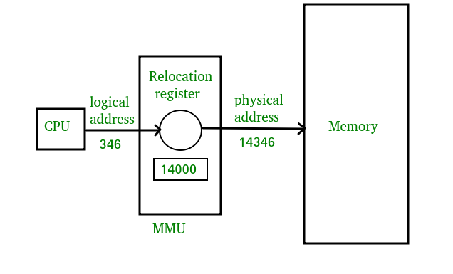

# 메모리 관리

- 운영체제가 시스템의 메모리를 효율적으로 할당, 관리, 회수하는 프로세스
- 시스템 성능과 안정성에 직접적인 영향

## 주소 (Address)

- 서로 다른 위치를 구분하기 위해 사용하는 일련의 숫자
- 32비트 컴퓨터 = $2^{32}$개의 서로 다른 메모리 위치 사용 가능
- 64비트 컴퓨터 = $2^{64}$개의 서로 다른 메모리 위치 사용 가능

### 주소의 종류

- 논리 주소 (Logical Address, =Virtual Address) → 사용자가 보는 주소
    - CPU가 프로세스 입장에서 바라보는 주소
    - 프로세스가 메모리에 직접 접근한다고 착각하는 **가상 주소**
    - 실제 RAM 위치와는 무관하게 운영체제와 하드웨어(MMU)가 매핑해줌
    - ex. `0x0000`, `0x0040`, `0x00A0`
- 물리 주소 (Pysical Address) → 하드웨어가 보는 주소
    - RAM 상의 실제 주소
    - CPU가 최종적으로 접근하는 진짜 메모리 위치
    - 논리 주소는 MMU(Memory Management Unit)를 통해 변환되어 물리 주소가 됨
    
    

### 주소 바인딩 (Address Binding)

- 논리적 주소를 물리적 메모리 주소로 연결시켜주는 작업

## 메모리 관련 용어

### 동적 로딩 (Dynamic Loading)

- 프로세스 전체를 메모리에 미리 다 올리는 것이 아니라 해당 루틴이 불려질 때 메모리에 load하는 것
- 메모리의 이용성 향상 : 같은 크기의 물리적 메모리에 더 많은 프로그램을 적재할 수 있음

### 동적 연결 (Dynamic Linking)

- 연결 : 프로그래머가 작성한 소스 코드를 컴파일하여 생성된 목적 파일과 이미 컴파일된 라이브러리 파일들을 묶어 하나의 실행 파일을 생성하는 과정
- 동적 연결 : 컴파일을 통해 생성된 목적 파일과 라이브러리 파일 사이의 연결을 프로그램의 실행 시점까지 지연시키는 기법

### 중첩 (Overlays)

- 프로세스의 주소 공간을 분할해 실제 필요한 부분만을 적재하는 기법
- 중첩은 프로세스의 크기가 메모리보다 클 때 유용한 방법, 동적 로딩은 더 많은 프로세스를 동시에 올려놓고 실행하기 위한 기법

### Swapping

- 메모리에 올라온 프로세스의 주소 공간 전체를 디스크의 swap area에 일시적으로 내려놓는 것
- swap area를 backing store라고도 부름
- 디스크 내에 파일 시스템과는 별도로 존재하는 영역
- 디스크로 내보내는 것을 swap out, 메모리로 들여보내는 것을 swap in
- 우선순위를 기준으로 우선순위가 낮은 프로세스를 swap out, 높은 프로세스를 swap in

## 물리적 메모리의 관리

- 일반적으로 OS 상주 영역과 사용자 프로세스 영역으로 나뉘어 사용
- 사용자 프로세스 영역의 할당 방법은 연속 할당, 불연속 할당으로 나뉨

### 연속 할당 (Contiguous Allocation)

- 프로세스를 메모리에 올릴 때 그 주소 공간을 여러 개로 분할하지 않고 연속적인 메모리 공간을 차지하게 적재
- 각 프로세스를 메모리에 담기 위해 메모리 공간 분할
    - 고정 분할 방식
        - 물리적 메모리를 주어진 개수만큼의 영구적인 분할로 나누어 두고 각 분할에 하나의 프로세스를 적재해 실행
        - 분할 당 하나의 프로세스가 적재되기 때문에 메모리에 load되는 프로세스의 수 고정
        - 수행 가능한 프로세스의 최대 크기가 제한되어 융통성 떨어짐
    - 가변 분할 방식
        - 프로세스의 크기를 고려해서 할당하기 때문에 분할의 크기나 개수가 동적으로 변함
        - 이를 위해서 기술적인 관리 기법 필요

### 불연속 할당 (Noncontiguous Allocation)

- 분할하는 기준에 따라 페이징 기법, 세그멘테이션 기법, 페이지드 세그멘테이션 기법으로 나눌 수 있음
- 현대의 운영체제에서는 불연속 할당 기법 사용

## 불연속 할당의 기법

### 페이징 (Paging)

- 프로세스의 주소 공간을 동일한 사이즈의 페이지 단위로 나누어 물리적 메모리에 불연속적으로 저장하는 방식
- 작업이 페이지 단위로 이루어져야 하기 때문에 연속 할당 방식에 비해 주소 변환 절차 복잡

### 계층적 페이징 (Multilevel Paging)

- 논리적 주소 공간을 여러 단계의 페이지 테이블로 분할하여 현재 사용되고 있는 페이지의 페이지 테이블만 할당하는 기법
- 각각의 페이지 테이블이 불연속하게 할당되도록 하는 것이 목표

### 세그멘테이션 (Segmentation)

- 하나의 프로세스를 여러 개의 segment로 나누는 것을 의미
- 작게는 프로그램을 구성하는 함수 하나하나를, 크게는 프로그램 전체를 하나의 segment로 정의 가능
- 일반적으로는 code, data, stack 부분이 하나의 segment로 정의

### 페이지드 세그멘테이션 (Paged Segmentation)

- 페이징 기법과 세그멘테이션 기법의 장점만 취한 방법
- 세그멘테이션 기법과 같이 프로그램을 의미 단위로 나누되, segment가 임의의 길이가 아닌 반드시 동일한 크기의 페이지들의 집합으로 구성되도록 하는 것