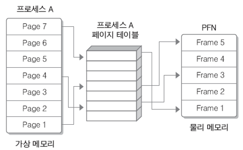
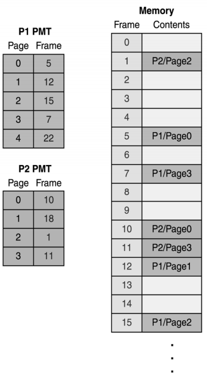
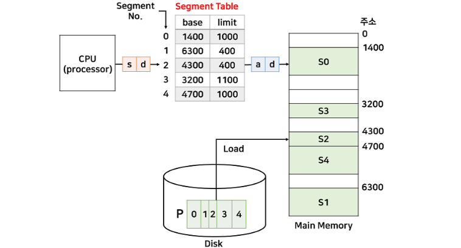

# 페이징 & 세그멘테이션

## 불연속 메모리 관리

- 프로그램의 일부가 서로 다른 주소 공간에 할당될 수 있는 기법
- 단편화 문제를 해결하기 위해 제시된 기법
- 페이징 = 외부 단편화 해소
- 세그멘테이션 = 내부 단편화 해소

## 페이징(Paging)

- 프로세스를 일정한 크기의 페이지로 분할해서 메모리에 적재하는 방식
- 페이지 : 작은 고정 사이즈의 프로세스 조각 (물리적 단위)
- 물리 메모리 공간 또한 페이지와 동일한 크기의 프레임으로 쪼갬

### 페이지 테이블

- **물리 메모리**는 고정 크기의 **프레임**으로, **가상 메모리**는 고정 크기의 **페이지**로 분리
- 개별 페이지는 순서에 상관 없이 물리 메모리에 있는 프레임에 매핑되어 저장
- 모든 프로세스는 하나의 페이지 테이블 가짐
- 메인 메모리에 적재되어 있는 페이지 번호와 해당 페이지가 위치한 메인 메모리의 시작 주소 있음

> **페이지 테이블 vs 페이징 테이블**
> 
> - 운영체제 교과서나 논문, 영어 원문에서는 Page Table
> - 한국어 번역에서 의미 차이
>     - 페이지 테이블 : 페이지들의 매핑 정보를 담는 테이블
>     - 페이징 테이블 : 페이지 단위로 나눠서 관리하는 테이블

### 페이징 장점

- 외부 단편화 해소
    - 고정된 크기로 메모리 쪼갬
    - 순서에 상관없이 빈 프레임에 흩어져 적재
- 메모리 효율적으로 사용 가능

### 페이징 단점

- **내부 단편화** 발생
    - 프레임 크기보다 작은 페이지는 공간 남음

## 세그멘테이션(Segmentation)

- 가상메모리를 서로 다른 크기의 단위인 세그먼트로 분할하는 방식
- 세그먼트는 의미가 같지 않는 논리적 내용을 기준으로 프로그램을 분할하기 때문에 크기 같지 않음 (논리적 단위)
- 코드, 데이터, 스택, 힙 등의 세그먼트 단위로 나눔

### 세그먼트 테이블

- 분할 방식을 제외하고 페이징과 세그멘테이션 동일 → 매핑 테이블의 동작 방식도 동일
- (base, limit)로 매핑하여 기록
    - base : 세그먼트가 적재된 물리 메모리의 시작 주소
    - limit : 세그먼트의 크기

### 세그멘테이션 장점

- 내부 단편화 해소
    - 세그먼트 크기만큼 물리 메모리를 쪼개 적재
- 사용자가 논리적으로 이해하기 쉬움
- 세그먼트 단위로 접근하기 때문에 보안과 공유가 용이

### 세그멘테이션 단점

- **외부 단편화** 발생
    - 가변 크기이므로 남는 공간이 흩어짐
- 메모리 관리 복잡