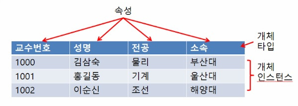
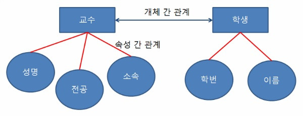
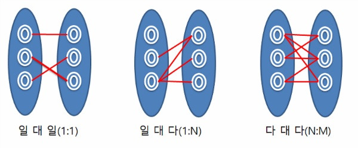
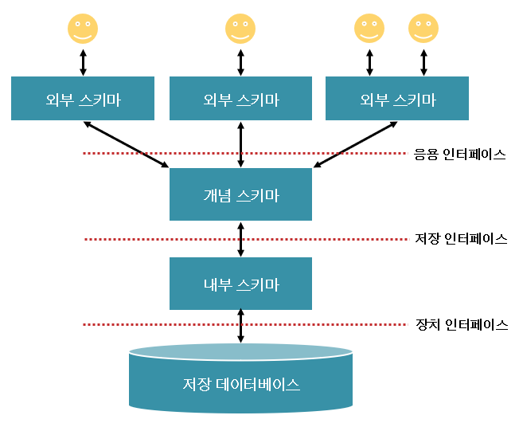
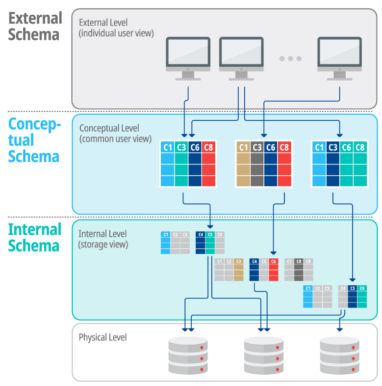

# 데이터 모델 & 스키마

## 데이터 모델(Data Model)이란?
- 현실 세계의 정보들을 컴퓨터에 표현하기 위해서 단순화, 추상화 하여 체계적으로 표현한 개념적 모형
- 데이터, 데이터의 관계, 데이터의 의미 및 일관성, 제약조건 등을 기술하기 위한 개념적 도구들의 모임
- 현실 세계를 데이터베이스에 표현하는 중간 과정, 즉 데이터베이스 설계 과정에서 데이터의 구조를 논리적으로 표현하기 위해 사용되는 도구
- 데이터의 구조(Schema)를 논리적으로 묘사하기 위해 사용되는 지능적 도구

## 데이터모델의 종류

### 개념적 데이터 모델
- 현실 세계에 대한 인간의 이해를 돕기 위해 현실 세계에 대한 인식을 추상적 개념으로 표현하는 과정
- 속성들로 기술된 개체 타입과 이 개체 타입들 간의 관계를 이용하여 현실 세계를 표현
- 현실 세계에 존재하는 개체를 인간이 이해할 수 있는 정보 구조로 표현하기 떄문에 정보 모델이라고도 함
- 대표적인 개념적 데이터 모델 : E-R모델

### 논리적 데이터 모델
- 개념적 모델링 과정에서 얻은 개념적 구조를 컴퓨터가 이해하고 처리할 수 있는 컴퓨터 세계의 환경에 맞도록 변환하는 과정
- 논리적 데이터 모델은 필드로 기술된 데이터 타입과 이 데이터 타입들 간의 관계를 이용하여 현실 세계를 표현함
- 단순히 데이터 모델이라고 하면 논리적 데이터 모델을 의미
- 특정 DBMS는 특정 논리적 데이터 모델 하나만 선정하여 사용함
- 데이터 간의 관계를 어떻게 표현하느냐에 따라 관계 모델, 계층 모델, 네트워크 모델로 구분한다.

## 데이터모델의 구성요소

### 개체(Entity)
- 데이터베이스에 표현하려는 것으로 사람이 생각하는 개념이나 정보 단위 같은 현실 세계의 대상체
- 개체는 실세계에 독립적으로 존재하는 유형, 무형의 정보로서 서로 연관된 몇 개의 속성으로 구성됨
- 파일 시스템의 레코드에 대응하는 것으로 어떤 정보를 제공하는 역할을 수행
- 독립적으로 존재하거나 그 자체로서도 구별 가능

### 속성(Attribute)
- 데이터의 가장 작은 논리적 단위로서 파일 구조상의 데이터 항목 또는 데이터 필드에 해당
- 개체를 구성하는 항목

### 관계(Relation)
- 개체 감의 관계 또는 속성 간의 관계

#### 관계의 형태
**일대일** : 개체 집합 A의 각 원소가 개체 집합 B의 원소 한개와 대응하는 관계
**일대다** : 개체 집합 A의 각 원소는 개체 집합 B의 원소 여러 개와 대응하고 있지만, 개체 집합 B의 각 원소는 개체 집합 A의 원소 한 개와 대응하는 관계
**다대다** : 개체 집합 A의 각 원소는 개체 집합 B의 원소 여러개와 대응하고 개체 집합 B의 각 원소도 개체 집합 A의 원소 여러개와 대응하는 관계

## 데이터 모델에 표시할 요소

- 구조(Structure) : 논리적으로 표현된 개체 타입들 간의 관계로서 데이터 구조 및 정적 성질을 표현
- 연산(Operation) : 데이터베이스에 저장된 실제 데이터를 처리하는 작업에 대한 명세로서 데이터베이스를 조작하는 기본도구
- 제약조건(Constraint) : 데이터베이스에 저장될 수 있는 실제 데이터의 논리적인 제약 조건

-----

## 스키마(계획, 도식)

- 데이터베이스의 구조(개체, 속성, 관계)와 제약 조건에 대한 정의이다. 메타 데이터라고도 한다.
- 데이터베이스 관리 시스템(DBMS)이 주어진 설정에 따라 데이터베이스 스키마를 생성하고, 데이터베이스 사용자가 자료를 저장, 조회, 삭제, 변경 할 때 DBMS는 자신이 생성한 데이터 베이스 스키마를 참조하여 명령을 수행한다.
- 한마디로 DBMS는 스키마를 참조하여 사용자의 명령을 수행하는 것이다.

### 스키마 3계층

### 외부(서브) 스키마(External Schema) = 사용자 뷰

- 사용자나 응용프로그래머가 각 개인의 입장에서 필요로 하는 데이터베이스의 논리적 구조를 정의한 것
- 전체 데이터베이스의 한 논리적인 부분으로 볼 수 있으므로 서브 스키마(Sub Schema)라고도 함
- 하나의 데이터베이스 시스템에는 여러개의 외부 스키마가 존재할 수 있으며 하나의 외부 스키마를 여러개의 응용 프로그램이나 사용자가 공용할 수도 있다.
- 일반 사용자는 질의어(SQL)을 이용하여 DB를 쉽게 사용할 수 있다.
- 응용 프로그래머는 C, JAVA등의 언어를 사용하여 DB에 접근한다.

### 개념 스키마(Conceptual Schema) = 전체적인 뷰

- 데이터베이스의 전체적인 논리적 구조로서, 모든 응용 프로그램이나 사용자들이 필요로 하는 데이터를 종합한 조직 전체의 데이터베이스로 하나만 존재한다.
- 개체간의 관계와 제약 조건을 나타내고 데이터베이스의 접근 권한, 보안 및 무결성 규칙에 관한 명세를 정의한다.
- 데이터베이스 파일에 저장되는 데이터의 형태를 나타내는 것으로, 단순히 스키마(Schema)라고 하면 개념 스키마를 의미한다.
- 데이터베이스 관리자(DBA)에 의해서 구성된다.

 
### 내부 스키마(Internal Schema) = 저장 스키마(Storage Schema)

- 물리적 저장장치의 입장에서 본 데이터베이스 구조로, 물리적인 저장장치와 밀접한 계층이다.
- 실제로 데이터베이스에 저장될 레코드의 물리적인 구조를 정의하고, 저장 데이터 항목의 표현방법, 내부 레코드의 물리적 순서 등을 나타낸다.
- 시스템 프로그래머나 시스템 설계자가 보는 관점의 스키마이다.

