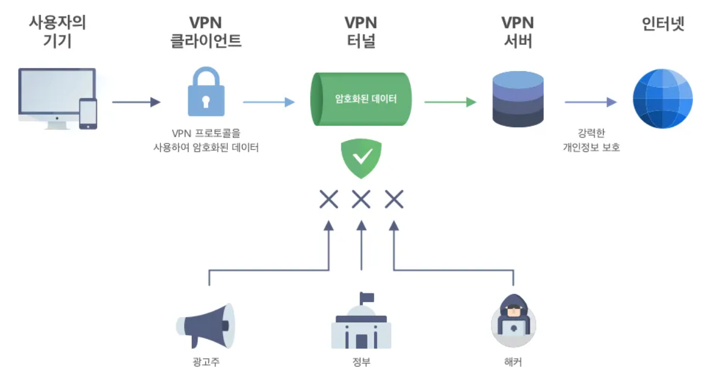

# NAT, VPN, 방화벽

## 개요

인터넷을 사용할 때 우리를 보호하고, 효율적으로 연결해주는 3가지 기술

- **NAT**: IP 주소를 변환해주는 기술
- **VPN**: 안전한 통신을 위한 가상 사설망
- **방화벽**: 네트워크를 지키는 보안 시스템

---

## NAT (Network Address Translation)

### 개념

**네트워크 주소 변환** 기술
쉽게 말해, IP 주소를 다른 IP 주소로 바꿔주는 것

### 필요성

#### 문제 상황
- IPv4 주소의 부족 (약 43억 개밖에 없음)
- 전 세계 모든 기기에 공인 IP를 줄 수 없음

#### 해결책
- 집 내부에서는 **사설 IP** 사용
- 인터넷에 나갈 때는 **공인 IP**로 변환
- 하나의 공인 IP로 여러 기기 사용 가능!

### 동작 방식

```
[집 안 - 사설 IP]              [공유기 - NAT]              [인터넷 - 공인 IP]

PC: 192.168.0.2                                          
스마트폰: 192.168.0.3     ----→  [NAT 변환]  ----→     118.235.x.x
노트북: 192.168.0.4                                     (하나의 공인 IP)
```


### NAT의 장단점

**장점**
- IP 주소 절약 (여러 기기가 하나의 공인 IP 사용)
- 보안 향상 (내부 구조 숨김)
- 네트워크 관리 편리

**단점**
- 외부에서 내부로 직접 접속 어려움
- P2P 통신 문제
- 성능 오버헤드 (주소 변환 처리 필요)

---

## VPN (Virtual Private Network)

### 개념

**가상 사설망**
공용 인터넷을 마치 전용선처럼 안전하게 사용할 수 있게 함

### 필요성

#### 문제 상황
- 공용 와이파이는 해킹 위험이 있음
- 회사 자료를 집에서 안전하게 접근하고 싶다면
- 특정 지역에서 차단된 사이트에 접속하고 싶다면
- 내 인터넷 활동을 숨기고 싶다면

#### 해결책
VPN을 사용하면:
- 데이터를 암호화해서 전송
- 내 위치를 숨길 수 있음
- 안전하게 회사 네트워크 접속 가능

### 동작 방식



**단계별 설명**

```
1단계: VPN 연결 요청
[사용자] → [VPN 클라이언트] → [VPN 서버]
"안전하게 연결하고 싶어요!"

2단계: 인증 및 터널 생성
[VPN 서버] → 사용자 인증 → 암호화 터널 생성 🔒

3단계: 데이터 전송
[사용자] 
   ↓ 원본 데이터
[암호화] 🔒
   ↓ 암호화된 데이터
[VPN 터널] 
   ↓ 
[VPN 서버]
   ↓ 복호화
[인터넷] 
   ↓
[목적지]
```

### VPN의 종류

#### 1️⃣ 원격 접속 VPN (Remote Access VPN)
```
재택근무자 ---(VPN)--→ 회사 네트워크
```
- 집에서 회사 네트워크에 접속
- 개인 사용자가 가장 많이 사용

#### 2️⃣ 사이트 간 VPN (Site-to-Site VPN)
```
본사 네트워크 ---(VPN)--→ 지사 네트워크
```
- 두 네트워크를 안전하게 연결
- 기업에서 주로 사용

### VPN 프로토콜

주요 VPN 프로토콜들:

| 프로토콜 | 특징 | 속도 | 보안 |
|---------|------|------|------|
| **PPTP** | 오래됨, 설정 쉬움 | ⭐⭐⭐ | ⭐ |
| **L2TP/IPSec** | 안정적, 널리 사용 | ⭐⭐ | ⭐⭐⭐ |
| **OpenVPN** | 오픈소스, 매우 안전 | ⭐⭐ | ⭐⭐⭐⭐⭐ |
| **WireGuard** | 최신, 빠르고 안전 | ⭐⭐⭐⭐⭐ | ⭐⭐⭐⭐⭐ |

### VPN의 장단점

**장점**
- 강력한 암호화로 보안 강화
- 익명성 보장 (IP 주소 숨김)
- 지역 제한 우회 가능
- 공용 와이파이에서 안전

**단점**
- 속도가 느려질 수 있음 (암호화 처리)
- 비용이 들 수 있음 (유료 VPN)
- 일부 서비스에서 차단될 수 있음

---

## 방화벽 (Firewall)

### 개념

**네트워크 보안 시스템**
패킷을 검사해서 허가된 것만 통과시킴

### 필요성

#### 문제 상황
- 해커의 공격 시도
- 악성코드 유포
- 무단 접근 시도
- DDoS 공격

#### 해결책
- 들어오고 나가는 트래픽 감시
- 위험한 패킷 차단
- 허가된 트래픽만 통과

### 동작 방식

```
[외부 인터넷]
      ↓
      ↓ 모든 패킷
      ↓
[방화벽] ← 규칙(Rule) 적용
      ↓
      ├─→ ✅ 허용 → [내부 네트워크]
      │
      └─→ ❌ 차단 → 버림
```

### 방화벽 종류

#### 1️⃣ 패킷 필터링 방화벽 (Packet Filtering)

가장 기본적인 방화벽

```
[패킷 검사 항목]
- 출발지 IP 주소
- 목적지 IP 주소
- 포트 번호
- 프로토콜 (TCP/UDP)

예시:
✅ 출발지 192.168.0.2 → 목적지 8.8.8.8:80 (허용)
❌ 출발지 1.2.3.4 → 목적지 내부서버:22 (차단)
```

**장점**
- 빠른 처리 속도
- 간단한 구조

**단점**
- 패킷 내용은 확인 못 함
- 정교한 공격 막기 어려움

#### 2️⃣ 상태 기반 방화벽 (Stateful Inspection)

연결 상태까지 확인

```
[연결 상태 테이블]
출발지 | 목적지 | 상태 | 시간
192.168.0.2:5000 | 8.8.8.8:80 | ESTABLISHED | 10:30
192.168.0.3:6000 | 1.1.1.1:443 | SYN_SENT | 10:31

- 기존 연결의 응답 패킷인지 확인
- 새로운 연결 시도인지 확인
- 비정상적인 패킷 차단
```

**장점**
- 더 정교한 보안
- 연결 흐름 추적 가능

**단점**
- 처리 속도 조금 느림
- 메모리 사용량 증가

#### 3️⃣ 애플리케이션 방화벽 (Application-Level)

패킷 내용까지 깊게 검사

```
[검사 내용]
- HTTP 요청 내용
- SQL 인젝션 시도
- 악성 스크립트
- 파일 업로드 검증

예시:
❌ GET /admin.php?id=1' OR '1'='1 (SQL 인젝션 차단)
❌ <script>alert('hack')</script> (XSS 공격 차단)
✅ GET /index.html (정상 요청 허용)
```

**장점**
- 가장 강력한 보안
- 애플리케이션 레벨 공격 방어

**단점**
- 처리 속도 가장 느림
- 설정이 복잡함

#### 4️⃣ 차세대 방화벽 (NGFW - Next Generation Firewall)

모든 기능을 합친 최신 방화벽

```
[통합 기능]
✅ 패킷 필터링
✅ 상태 기반 검사
✅ 애플리케이션 제어
✅ 침입 탐지/방지 (IPS)
✅ 안티바이러스
✅ URL 필터링
✅ SSL/TLS 복호화
```

### 방화벽 구성 방식

#### 네트워크 방화벽
```
[인터넷] ←→ [방화벽] ←→ [내부 네트워크]
              (하드웨어)
```
- 전체 네트워크 보호
- 기업에서 사용

#### 호스트 방화벽
```
[내 컴퓨터]
    └─ 방화벽 (소프트웨어)
```
- 개별 컴퓨터 보호
- Windows 방화벽, Mac 방화벽

### DMZ (DeMilitarized Zone)

특별한 보안 영역이야!

```
[인터넷]
    ↓
[외부 방화벽]
    ↓
[DMZ] ← 웹서버, 메일서버 (외부 공개)
    ↓
[내부 방화벽]
    ↓
[내부 네트워크] ← DB서버, 업무 서버 (보호됨)
```

**DMZ의 목적**
- 외부에 공개할 서버와 내부 서버 분리
- 이중 방화벽으로 보안 강화
- 웹서버가 해킹당해도 내부는 안전

---