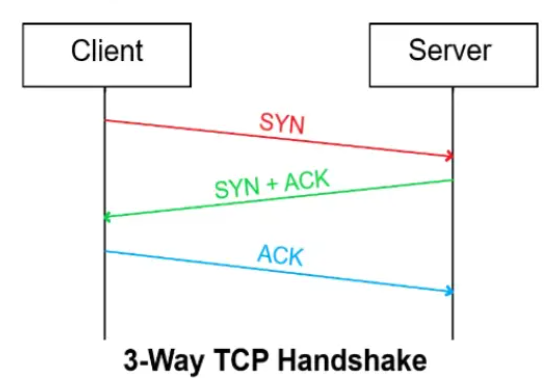
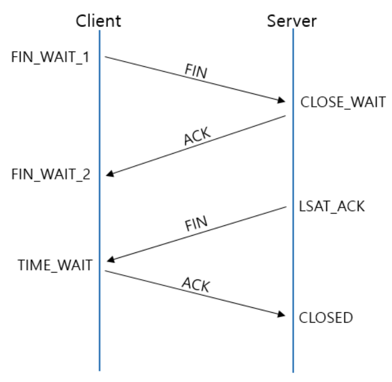

# 3-Way/4-Way 핸드셰이크

## 개요

- 핸드셰이크(Handshake)는 두 컴퓨터가 네트워크를 통해 통신을 시작하거나 종료할 때 서로 신호를 주고받는 과정이다. 
- 마치 사람들이 만날 때 악수를 하는 것처럼, 컴퓨터도 "연결할게요", "알겠습니다"라고 대화를 나누는 것.

이 개념은 **TCP(Transmission Control Protocol)** 프로토콜에서 사용됨.

---

## 3-Way Handshake (연결 수립)

### 개념
TCP 연결을 **시작(수립)** 할 때 사용하는 방법이다. 클라이언트와 서버가 3번의 메시지를 주고받아 연결을 확립한다.

### 과정

#### 단계별 설명

**1단계: SYN (Synchronize)**
- 클라이언트가 서버에게 연결 요청을 보낸다
- "안녕하세요, 연결하고 싶습니다!" 라는 의미
- 자신의 초기 순서 번호(Sequence Number)를 함께 보낸다

**2단계: SYN-ACK (Synchronize-Acknowledge)**
- 서버가 클라이언트의 요청을 받았다는 확인 응답을 보낸다
- "네, 받았습니다! 저도 연결할 준비가 됐어요!" 라는 의미
- 서버도 자신의 초기 순서 번호를 보낸다

**3단계: ACK (Acknowledge)**
- 클라이언트가 서버의 응답을 받았다고 최종 확인을 보낸다
- "확인했습니다! 이제 통신을 시작하죠!" 라는 의미
- 이제부터 실제 데이터 전송이 가능하다

### 왜 3번이나 주고받는지?

- **신뢰성 확보**: 양쪽 모두 데이터를 주고받을 수 있는지 확인
- **동기화**: 서로의 순서 번호를 교환하여 데이터 순서를 맞춤
- **연결 보장**: 상대방이 정말 통신 가능한 상태인지 확인

---

## 👋 4-Way Handshake (연결 종료)

### 개념
TCP 연결을 **종료**할 때 사용하는 방법이다. 클라이언트와 서버가 4번의 메시지를 주고받아 안전하게 연결을 끊는다.

### 과정

#### 단계별 설명

**1단계: FIN (Finish)**
- 클라이언트가 서버에게 연결 종료 요청을 보낸다
- "제가 보낼 데이터는 다 보냈어요. 이제 끝낼게요!" 라는 의미

**2단계: ACK (Acknowledge)**
- 서버가 클라이언트의 종료 요청을 확인했다고 응답한다
- "네, 알겠습니다. 잠시만요, 제가 보낼 데이터가 남아있어요!" 라는 의미
- 서버는 아직 보낼 데이터가 있을 수 있다

**3단계: FIN (Finish)**
- 서버가 남은 데이터를 모두 보낸 후, 종료 준비가 되었다고 알린다
- "저도 이제 다 보냈습니다. 이제 끝내도 돼요!" 라는 의미

**4단계: ACK (Acknowledge)**
- 클라이언트가 서버의 종료 요청을 확인했다고 최종 응답한다
- "확인했습니다! 완전히 종료할게요!" 라는 의미
- 이제 연결이 완전히 종료된다

### 왜 4번이나 주고받는지?

- **양방향 연결**: TCP는 양방향 통신이므로 각 방향을 따로 종료해야 함
- **데이터 보장**: 서버가 아직 보낼 데이터가 남아있을 수 있어서 시간이 필요
- **안전한 종료**: 모든 데이터가 제대로 전송되었는지 확인 후 종료

---

## 🔍 비교 정리

| 구분 | 3-Way Handshake | 4-Way Handshake |
|------|----------------|----------------|
| **목적** | 연결 수립 (시작) | 연결 종료 (끝) |
| **단계** | 3단계 | 4단계 |
| **메시지** | SYN → SYN+ACK → ACK | FIN → ACK → FIN → ACK |
| **소요 시간** | 짧음 | 조금 더 김 |
| **특징** | 빠른 연결 수립 | 안전한 연결 종료 |

---

## 추가로 생각할 부분

**Q1. 왜 연결할 때는 3번인데 끊을 때는 4번인지?**
- 연결할 때: 서버가 SYN과 ACK를 한 번에 보낼 수 있어서 3번
- 종료할 때: 서버가 아직 보낼 데이터가 있을 수 있어서 ACK와 FIN을 따로 보내야 하므로 4번

**Q2. 핸드셰이크가 실패하면?**
- 일정 시간 후 재시도(Retry)
- 여러 번 실패하면 연결 실패로 처리된다.

---
