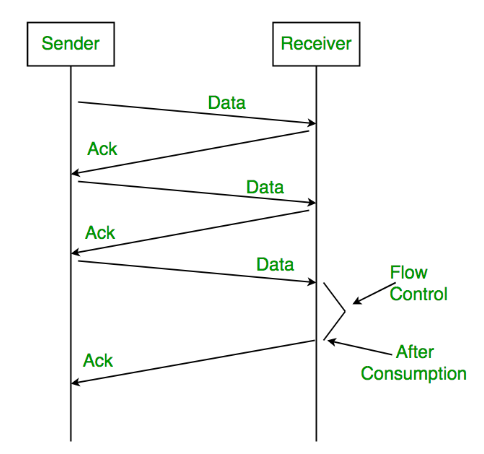
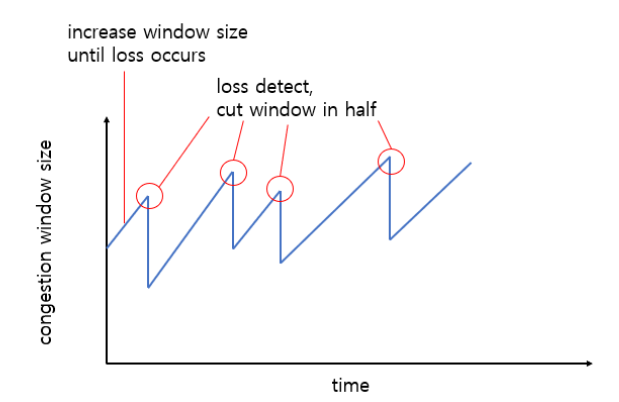
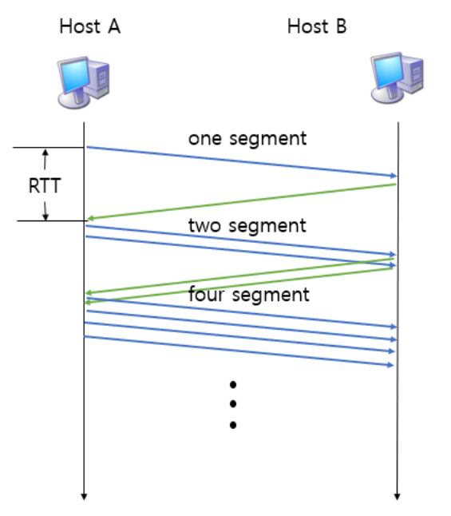

# 흐름 제어 & 혼잡 제어

## 개요

네트워크에서 데이터를 주고받을 때, 너무 빠르게 보내면 문제가 생길 수 있다.

**흐름 제어(Flow Control)** 와 **혼잡 제어(Congestion Control)** 는 이런 문제를 해결하기 위한 방법

---

## 흐름 제어 (Flow Control)

### 개념
**송신자와 수신자 사이**에서 데이터 전송 속도를 조절하는 기법

### 필요성

받는 쪽(수신자)이 처리할 수 있는 속도보다 빠르게 데이터가 오면:
- 수신 버퍼가 넘쳐서 데이터 손실 발생
- 재전송으로 인한 네트워크 낭비
- 전체적인 성능 저하

### 주요 기법

#### 1️⃣ Stop and Wait (정지-대기)

가장 간단한 방법



**장점**
- 구현이 매우 간단함
- 확실한 흐름 제어 가능

**단점**
- 매우 느림
- 네트워크 효율이 매우 낮음
- 하나씩 보내고 기다려야 해서 시간 낭비

#### 2️⃣ Sliding Window (슬라이딩 윈도우) ⭐

현재 가장 많이 사용하는 방법

**윈도우(Window)란?**
- 한 번에 보낼 수 있는 데이터의 양
- 수신자가 "이만큼은 받을 수 있어!"라고 알려주는 크기

**동작 과정**
1. 수신자가 자신의 버퍼 크기를 송신자에게 알려줌
2. 송신자는 그 크기만큼만 데이터를 보냄
3. 수신자가 데이터를 처리하면 버퍼 공간이 생김
4. 새로운 버퍼 크기를 송신자에게 알려줌
5. 반복!

**장점**
- 빠른 전송 속도
- 높은 네트워크 효율
- 유연한 흐름 제어

---

## 혼잡 제어 (Congestion Control)

### 개념
**네트워크 전체**의 혼잡 상황을 고려해서 데이터 전송 속도를 조절하는 기법

### 흐름 제어 vs 혼잡 제어

| 구분 | 흐름 제어 | 혼잡 제어 |
|------|----------|----------|
| **관점** | 수신자 중심 | 네트워크 중심 |
| **목적** | 수신자 보호 | 네트워크 보호 |
| **문제** | "상대방이 못 받아요!" | "네트워크가 막혔어요!" |

### 혼잡이 발생하는 이유

네트워크에 데이터가 너무 많으면:
- 라우터의 버퍼가 넘침
- 패킷 손실 발생
- 재전송 증가 → 더 혼잡해짐 (악순환!)
- 전체 네트워크 속도 저하

### 주요 기법

#### 1️⃣ AIMD (Additive Increase / Multiplicative Decrease)

합 증가 / 곱 감소 방식이야.

**동작 방식**
- **평소**: 윈도우 크기를 조금씩 증가 (+1)
- **혼잡 발생**: 윈도우 크기를 확 줄임 (÷2)



**특징**
- 천천히 증가, 빠르게 감소
- 네트워크를 안전하게 사용
- 공평한 대역폭 분배

#### 2️⃣ Slow Start (슬로우 스타트)

**동작 방식**
- 처음엔 윈도우 크기 1에서 시작
- 문제없으면 **지수적으로 증가** (1 → 2 → 4 → 8 → 16...)
- 임계값(Threshold)에 도달하면 선형 증가로 전환
- 혼잡 발생 시 다시 처음부터



#### 3️⃣ Fast Retransmit (빠른 재전송)

**동작 방식**
1. 같은 ACK를 3번 받으면 (중복 ACK)
2. 타임아웃을 기다리지 않고 즉시 재전송
3. 빠르게 복구!

```
[예시]
송신: 1, 2, 3, 4, 5
수신: 1, (2 손실!), 3, 4, 5

송신자가 받는 ACK:
ACK 1, ACK 1, ACK 1, ACK 1
    ↑  ↑  ↑ 중복 ACK 3번!
    
→ 즉시 2번 재전송!
```

#### 4️⃣ Fast Recovery (빠른 회복)

**동작 방식**
1. 3번의 중복 ACK 받음 (패킷 손실 감지)
2. 임계값을 현재 윈도우의 절반으로 설정
3. 윈도우를 임계값으로 줄임 (1까지 줄이지 않음!)
4. 선형 증가 시작 (Slow Start 건너뛰기)

```
[비교]
일반적인 방식:
8 → 1 (처음부터) → 2 → 4 → 8... (느림!)

Fast Recovery:
8 → 4 (절반) → 5 → 6 → 7... (빠름!)
```

---

## 🎯 TCP의 혼잡 제어 전략 (전체 흐름)

TCP는 위 기법들을 조합해서 사용한다.

### 1단계: Slow Start
```
윈도우 크기를 지수적으로 증가
1 → 2 → 4 → 8 → 16...
```

### 2단계: Congestion Avoidance (혼잡 회피)
```
임계값 도달 후 선형 증가
16 → 17 → 18 → 19...
```

### 3단계: Congestion Detection (혼잡 감지)
```
타임아웃 발생: Slow Start로 돌아감
중복 ACK 3번: Fast Recovery 진입
```
---

## 📊 핵심 비교표

| 항목 | 흐름 제어 | 혼잡 제어 |
|------|----------|----------|
| **주체** | 송신자 ↔ 수신자 | 송신자 ↔ 네트워크 |
| **목적** | 수신자 버퍼 오버플로우 방지 | 네트워크 혼잡 방지 |
| **판단 기준** | 수신자의 윈도우 크기 | 패킷 손실, 타임아웃 |
| **주요 기법** | Sliding Window | AIMD, Slow Start, Fast Recovery |
| **제어 범위** | 점대점(Point-to-Point) | 전체 네트워크 |

---
