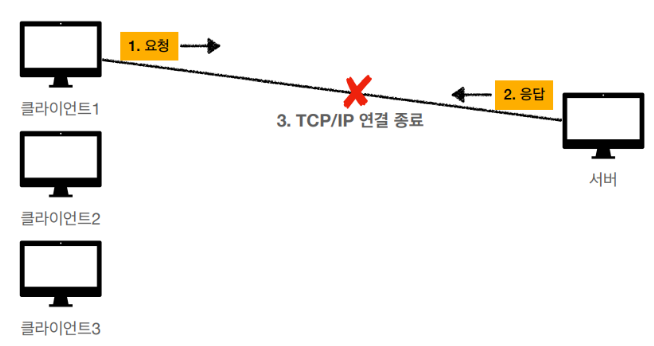
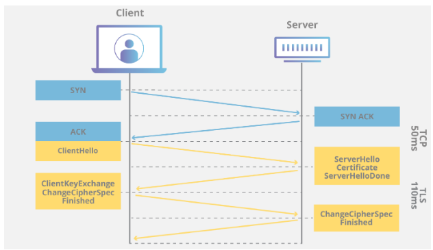

# HTTP / HTTPS

## 개요

웹 브라우저와 웹 서버가 대화하는 방법

- **HTTP**: 웹에서 데이터를 주고받는 기본 프로토콜
- **HTTPS**: HTTP에 보안을 더한 안전한 버전

주소창의 `http://`나 `https://`

---

## HTTP (HyperText Transfer Protocol)

### 개념

**하이퍼텍스트 전송 프로토콜**이야.
웹 브라우저(클라이언트)와 웹 서버가 **HTML 문서나 데이터를 주고받는 규칙**

### HTTP의 특징

#### 1️⃣ 클라이언트-서버 구조


#### 2️⃣ 무상태 (Stateless)
서버가 클라이언트의 **상태를 기억하지 않는다.** -> 쿠키와 세션으로 해결

**장점**
- 서버가 단순해짐 (상태 저장 안 해도 됨)
- 서버 확장이 쉬움 (어느 서버로 가도 상관없음)

**단점**
- 매번 추가 데이터 전송 필요 (쿠키 등)

#### 3️⃣ 비연결성 (Connectionless)
요청-응답 후 **연결을 끊음**



**HTTP/1.0 문제점**
```
[네이버 접속]
HTML 요청 → 연결 → 응답 → 연결 끊기
CSS 요청 → 연결 → 응답 → 연결 끊기
이미지1 요청 → 연결 → 응답 → 연결 끊기
이미지2 요청 → 연결 → 응답 → 연결 끊기
...
매번 연결해야해서 너무 느림
```

**HTTP/1.1 개선: Keep-Alive**
```
연결 유지 ────────────────────────
HTML 요청 → 응답
CSS 요청 → 응답
이미지1 요청 → 응답
이미지2 요청 → 응답
연결 종료 ────────────────────────
한 번 연결로 여러 요청을 한다.
```

---

## HTTP 메시지 구조

### HTTP 요청 (Request)

```
GET /index.html HTTP/1.1              ← 시작 라인 (요청 라인)
Host: www.example.com                 ← 헤더 (어느 서버로 갈 지)
User-Agent: Mozilla/5.0                     (어떤 브라우저인지)
Accept: text/html                           (어떤 형식을 받을 수 있는지)
Connection: keep-alive                      (연결을 유지할지)
                                      ← 빈 줄 (헤더와 본문 구분)
[요청 본문 - 있을 수도 있고 없을 수도]  ← 본문 (Body)
```

**시작 라인 구성**
```
GET /index.html HTTP/1.1
 │      │         │
 │      │         └─ HTTP 버전
 │      └─ 요청 경로 (URI)
 └─ HTTP 메서드
```

### HTTP 응답 (Response)

```
HTTP/1.1 200 OK                       ← 상태 라인
Content-Type: text/html               ← 헤더   (응답 데이터 형식)
Content-Length: 1234                           (응답 데이터 크기)
Date: Wed, 29 Oct 2025 10:30:00 GMT             (응답 시간)
                                      ← 빈 줄
<html>                                ← 본문 (Body)
  <body>Hello World!</body>
</html>
```

**상태 라인 구성**
```
HTTP/1.1 200 OK
    │     │   │
    │     │   └─ 상태 메시지
    │     └─ 상태 코드
    └─ HTTP 버전
```

---

## HTTP 메서드

서버에게 **무엇을 할지** 알려주는 명령어

### 주요 메서드

| 메서드 | 의미 | 용도 | 예시 |
|--------|------|------|------|
| **GET** | 조회 | 데이터 가져오기 | 웹페이지 조회 |
| **POST** | 생성 | 데이터 전송 | 회원가입, 글쓰기 |
| **PUT** | 전체 수정 | 데이터 전체 업데이트 | 회원정보 전체 수정 |
| **PATCH** | 일부 수정 | 데이터 일부 업데이트 | 닉네임만 변경 |
| **DELETE** | 삭제 | 데이터 삭제 | 계정 삭제, 글 삭제 |
| **HEAD** | 헤더만 조회 | 메타데이터만 확인 | 파일 크기 확인 |
| **OPTIONS** | 지원 메서드 확인 | CORS 확인 | 서버가 뭘 지원하나? |

### 메서드 특징

#### GET
```
GET /users/123 HTTP/1.1
Host: api.example.com

특징:
✅ URL에 데이터 포함 (쿼리 스트링)
✅ 캐싱 가능
✅ 브라우저 히스토리에 남음
❌ 민감한 정보 전송 X (URL에 노출)
❌ 길이 제한 있음
```

**GET 예시**
```
검색: https://www.google.com/search?q=강아지
         └─ 쿼리 스트링: ?q=강아지

상품: https://shop.com/product?id=123&color=red
         └─ 여러 파라미터: &로 구분
```

#### POST
```
POST /users HTTP/1.1
Host: api.example.com
Content-Type: application/json

{
  "name": "홍길동",
  "email": "hong@example.com"
}

특징:
✅ 본문(Body)에 데이터 포함
✅ 데이터 길이 제한 없음
✅ 민감한 정보 전송 가능
❌ 캐싱 안 됨
❌ 브라우저 히스토리에 안 남음
```

#### GET vs POST

```
[GET - 게시글 조회]
브라우저 → GET /board/123 → 서버
브라우저 ← [게시글 내용] ← 서버

[POST - 게시글 작성]
브라우저 → POST /board → 서버
         제목: "안녕하세요"
         내용: "첫 글입니다"
브라우저 ← 작성 완료! ← 서버
```

---

## HTTP 상태 코드

서버가 요청을 **어떻게 처리했는지** 알려주는 코드

### 상태 코드 분류

```
1xx: 정보성 (Information) - "처리 중"
2xx: 성공 (Success) - "성공"
3xx: 리다이렉션 (Redirection) - "다른 곳으로 가라"
4xx: 클라이언트 에러 (Client Error) - "내 잘못 아님~ 니 잘못~"
5xx: 서버 에러 (Server Error) - "Sorry My Bad"
```

### 주요 상태 코드

#### 2xx - 성공
```
200 OK
- 가장 일반적인 성공
- "요청 잘 받았고, 처리 완료!"

201 Created
- 새로운 리소스 생성 성공
- 회원가입, 글 작성 성공

204 No Content
- 성공했는데 보낼 내용 없음
- 삭제 성공 후 응답
```

#### 3xx - 리다이렉션
```
301 Moved Permanently
- 영구적으로 이동함
- 예: http:// → https:// 리다이렉트

302 Found
- 임시로 이동함
- 예: 로그인 페이지로 임시 이동

304 Not Modified
- 캐시된 버전 사용해도 됨
- "바뀐 거 없어, 캐시 써!"
```

#### 4xx - 클라이언트 에러
```
400 Bad Request
- 요청이 잘못됨
- 문법 오류, 잘못된 형식

401 Unauthorized
- 인증 필요
- "로그인 안 했잖아!"

403 Forbidden
- 권한 없음
- "로그인은 했는데 권한이 없어"

404 Not Found
- 찾을 수 없음
- "그런 페이지 없는데?"
- 가장 유명한 에러!

405 Method Not Allowed
- 지원하지 않는 메서드
- "GET만 되는데 POST 보냈네?"

429 Too Many Requests
- 요청이 너무 많음
- "좀 천천히 보내!"
```

#### 5xx - 서버 에러 💥
```
500 Internal Server Error
- 서버 내부 오류
- "뭔가 잘못됐는데 정확히 모르겠어"

502 Bad Gateway
- 게이트웨이 오류
- 서버 앞단의 프록시/게이트웨이 문제

503 Service Unavailable
- 서비스 이용 불가
- 서버 과부하, 점검 중

504 Gateway Timeout
- 게이트웨이 타임아웃
- 서버 응답이 너무 느림
```

---

## HTTPS (HTTP Secure)

### 개념

**HTTP + SSL/TLS = HTTPS**

HTTP에 **암호화 보안 계층**을 추가한 프로토콜

### HTTP의 보안 문제

```
[HTTP - 평문 전송]
나 ----"ID: user123, PW: 1234"---→ 서버
        ↑
    해커가 중간에서 볼 수 있음
    (Man-in-the-Middle Attack)

[HTTPS - 암호화 전송]
나 ----"xk3$n#2@k!..."---→ 서버
        ↑
    해커가 봐도 모름
```

### HTTPS의 특징

```
✅ 데이터 암호화 (기밀성)
   → 제3자가 못 봄

✅ 데이터 무결성 (Integrity)
   → 중간에 데이터 변조 불가

✅ 인증 (Authentication)
   → 진짜 서버인지 확인 가능

✅ SEO 향상
   → 구글이 HTTPS 사이트를 우대

✅ 브라우저 신뢰
   → 자물쇠 표시 🔒
```

### SSL/TLS

**SSL (Secure Sockets Layer)**
- 옛날 방식 (SSL 2.0, 3.0)
- 보안 취약점 발견돼서 이제 사용 안됨

**TLS (Transport Layer Security)**
- SSL의 후속 버전
- 현재 사용: TLS 1.2, TLS 1.3
- 더 강력하고 빠름

**하지만 관습적으로 SSL이라고 많이 부름**

### HTTPS 동작 과정

#### 1단계: TCP 연결
```
클라이언트 ----[TCP 3-Way Handshake]---→ 서버
```

#### 2단계: TLS 핸드셰이크

```
[1] Client Hello
클라이언트 → 서버
"안녕! 내가 지원하는 암호화 방식은 이거야!"
- TLS 버전
- 지원하는 암호화 알고리즘 목록
- 랜덤 데이터

[2] Server Hello
서버 → 클라이언트
"나도 안녕! 이 방식으로 하자!"
- 선택한 TLS 버전
- 선택한 암호화 알고리즘
- 랜덤 데이터
- 서버 인증서 (SSL 인증서)

[3] 인증서 검증
클라이언트가 서버 인증서 확인
"이 서버 진짜 맞나?"
- 인증 기관(CA) 확인
- 유효 기간 확인
- 도메인 일치 확인

[4] Pre-Master Secret 전송
클라이언트 → 서버
"이걸로 암호화 키 만들자!" (공개키로 암호화해서 전송)

[5] 세션 키 생성
클라이언트 & 서버 둘 다
Pre-Master Secret으로 세션 키 생성
→ 이제 이 키로 암호화 통신!

[6] Finished
"준비 완료! 이제 암호화 시작!"
```



#### 3단계: 암호화 통신
```
클라이언트 ←--[암호화된 HTTP 데이터]-→ 서버
```

### SSL 인증서

- 웹사이트의 **신분증**!
- "이 사이트는 진짜입니다"라고 보증

**인증서에 포함된 정보**
```
SSL 인증서
├─ 도메인 이름: www.example.com
├─ 발급 대상: Example Inc.
├─ 발급 기관: DigiCert (CA)
├─ 유효 기간: 2024.01.01 ~ 2025.01.01
├─ 공개키
└─ 디지털 서명
```

**인증 기관 (CA - Certificate Authority)**
- 인증서를 발급하는 신뢰할 수 있는 기관
- 예: Let's Encrypt, DigiCert, GlobalSign
- 브라우저가 신뢰하는 CA 목록 보유

**인증서 종류**
```
1. DV (Domain Validation)
   - 도메인 소유만 확인
   - 가장 저렴, 빠름
   - 개인 블로그 등

2. OV (Organization Validation)
   - 조직 정보 확인
   - 기업 사이트

3. EV (Extended Validation)
   - 엄격한 검증
   - 주소창에 회사명 표시
   - 금융, 대기업
```

---

## 생각해볼 사항

**모든 사이트가 HTTPS를 써야 하는지?**
- 요즘은 거의 필수
- 크롬은 HTTP 사이트에 "안전하지 않음" 경고
- 로그인, 결제는 **반드시** HTTPS 사용

**HTTPS는 느린 것 아닌지?**
- 옛날엔 맞는 말
- 지금은 TLS 1.3, HTTP/2 덕분에 차이 거의 없음
- 오히려 HTTP/2는 HTTP/1.1보다 빠를 수 있음

**자물쇠 있으면 100% 안전을 보장하는지?**
- 자물쇠는 "통신이 암호화됨"만 의미
- 피싱 사이트도 HTTPS 쓸 수 있어
- **도메인 이름도 꼭 확인!**

---
