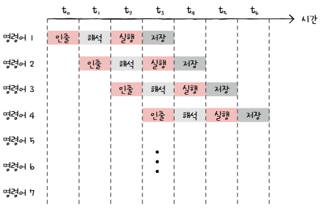

# 병렬 처리 & 멀티코어

## 명령어 병렬 처리 기법

성능이 좋은 CPU를 만드는 것(높은 클럭 속도, 멀티코어, 멀티스레드)과 별개로, CPU가 효율적으로 작동되게 만드는 것도 중요하다.

명령어를 동시에 처리하여 CPU가 잠시도 쉬지 않고 작동시키는 기법인 **명령어 병렬 처리 기법(ILP; Instruction-Level Parallelism)**이 있다.

대표적으로 **명령어 파이프 라이닝**, **슈퍼스칼라**, **비순차적 명령어 처리**가 있다.

### 명령어 파이프라인

하나의 명령어가 처리되는 전체 과정은 다음과 같다.

1. 명령어 인출(Instruction Fetch)
2. 명령어 해석(Instruction Decode)
3. 명령어 실행(Execute Instruction)
4. 결과 저장(Write Back)

같은 단계가 겹치지만 않는다면 CPU는 각 단계를 동시에 실행할 수 있다.

명령어를 겹쳐서 수행하면 명령어를 하나하나 실행하는 것보다 훨씬 더 효율적으로 처리할 수 있다.

마치 공장 생산 라인과 같이 명령어들을 **명령어 파이프라인(instruction pipeline)**에 넣고 동시에 처리하는 기법을 명령어 **파이프라이닝(instruction pipelining)**이라고 한다.

특정 상황에서는 성능 향상에 실패하는 경우도 있는데, 이 상황을 **파이프라인 위험(pipeline hazard)**라고 한다. 파이프라인 위험에는 크게 **데이터 위험, 제어 위험, 구조적 위험**이 있다.

#### 1. 데이터 위험 (Data Hazard)

명령어 간 '데이터 의존성'에 의해 발생한다. 어떤 명령어는 이전 명령어를 끝까지 실행해야만 비로소 실행할 수 있는 경우가 있는데, 이처럼 모든 명령어를 동시에 처리할 수는 없다. 데이터 의존적인 두 명령어를 무작정 동시에 실행하려고 하면 파이프라인이 제대로 작동하지 않는데, 이를 **데이터 위험**이라고 한다.

#### 2. 제어 위험 (Control Hazard)

주로 분기 등으로 인한 '프로그램 카운터의 갑작스러운 변화'에 의해 발생한다. 기본적으로 프로그램 카운터는 '현재 실행 중인 명령어의 다음 주소'로 갱신되지만, 프로그램 실행 흐름이 바뀌어 명령어가 실행되면서 프로그램 카운터 값에 갑작스러운 변화가 생긴다면 명령어 파이프라인에 미리 가지고 와서 처리중이었던 명령어들은 아무 쓸모가 없어진다. 이를 **제어 위험**이라고 한다. 이를 위해 사용하는 기술 중 하나는 **분기 예측(branch prediction)**이다. 분기 예측은 프로그램이 어디로 분기할지 미리 예측한 후 그 주소를 인출하는 기술이다.

#### 3. 구조적 위험 (Structural Hazard)

명령어들을 겹쳐 실행하는 과정에서 서로 다른 명령어가 동시에 ALU, 레지스터 등과 같은 CPU 부품을 사용하려고 할 때 발생한다. **자원위험**이라고도 부른다.

### 슈퍼스칼라 (Superscalar)

CPU 내부에 여러 개의 명령어 파이프라인을 포함한 구조이다. 공장 생산 라인을 여러개 두는 것. 슈퍼스칼라 구조로 명령어 처리가 가능한 CPU를 **슈퍼스칼라 프로세서** 또는 **슈퍼스칼라 CPU**라고 한다.

슈퍼스칼라 프로세서는 이론적으로 파이프라인 개수에 비례하여 프로그램 처리 속도가 빨라진다. 하지만 파이프라인 위험 등의 예상치 못한 문제로 인해 반드시 파이프라인 개수에 비례하여 빨라지는 것은 아니다. 때문에 슈퍼스칼라 방식을 차용한 CPU는 파이프라인 위험을 방지하기 위해 고도로 설계되어야 한다.

### 비순차적 명령어 처리 (OoOE; Out-of-order execution)

명령어들을 순차적으로 실행하지 않는 기법. 명령어를 순차적으로만 실행하지 않고 순서를 바꿔 실행해도 무방한 명령어를 먼저 실행하여 명령어 파이프라인이 멈추는 것을 방지하는 기법. 비순차적 명령어 처리가 가능한 CPU는 명령어들이 어떤 명령어와 데이터 의존성을 가지고 있는지, 순서를 바꿔 실행할 수 있는 명령어에는 어떤 것들이 있는지를 판단할 수 있어야 한다.

---

## 멀티코어

### 코어 (Core)

CPU 내에서 명령어를 실행하는 부품. 여러 개가 있을 수 있음

### 멀티코어 (Multi-Core) / 멀티코어 프로세서

코어를 여러 개 포함하고 있는 CPU

CPU의 종류는 CPU 안에 코어가 몇 개 포함되어 있는지에 따라 싱글코어, 듀얼코어, 트리플코어 등으로 나뉜다.

1: 싱글코어; 2: 듀얼코어; 3: 트리플코어; 4: 쿼드코어; 6: 헥사코어; 8: 옥타코어; 10: 데카코어; 12: 도데카코어

싱글 코어를 제외한 2개 이상의 코어를 가진 CPU는 모두 **멀티코어**이다.

CPU의 연산 속도는 꼭 코어 수에 비례하여 증가하지는 않는다. 코어마다 처리할 연산이 적절히 분배되지 않는다면 코어 수에 비례하여 연산 속도가 증가하지 않는다. 따라서 코어마다 처리할 명령어들을 얼마나 적절하게 분배하느냐에 따라 연산 속도가 크게 달라진다.

처리하고자 하는 작업량보다 코어 수가 지나치게 많아도 성능에는 크게 영향이 없다.