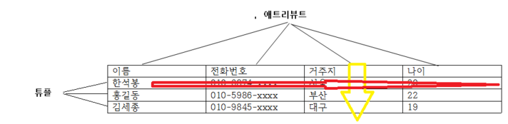
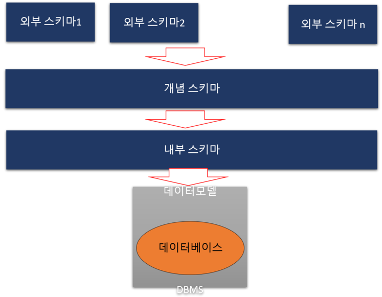
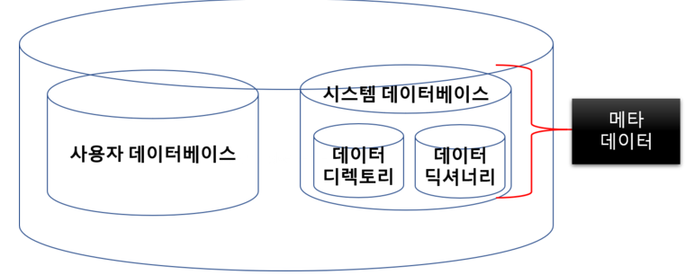

# 데이터 모델과 스키마

## 들어가기 앞서

데이터 모델과 스키마를 이해하기 위해 먼저 알아야 할 개념:
- **데이터베이스**: 체계적으로 조직된 데이터의 집합
- **추상화**: 복잡한 현실을 단순화하여 핵심만 표현하는 것
- **관계**: 데이터 간의 연결 방식

---

## 데이터 모델이란?

**현실 세계의 정보를 단순화하고 추상화하여 데이터베이스에 저장하는 개념적 틀**

### 데이터 모델의 3가지 구성 요소

**1. 데이터 구조 (Structure)**
- 데이터를 어떤 형태로 저장하는지를 표현하는 추상적 표현
- 예: 테이블, 트리, 그래프 등

**2. 연산 (Operation)**
- 개념적인 데이터 구조 안의 데이터를 어떤 방식으로 처리하는지를 표현
- 예: 삽입, 삭제, 수정, 조회 등

**3. 제약조건 (Constraint)**
- 데이터 구조 안에 데이터를 저장할 때의 구조적 제약 사항
- 연산을 적용할 때의 행위적 제약 사항
- 예: NOT NULL, UNIQUE, PRIMARY KEY 등

---

## 데이터 모델의 종류

### 1. 계층형 데이터 모델 (HDM: Hierarchical Data Model)

**특징**
- 데이터 사이의 연관 관계를 물리적 위치 정보인 **포인터**로 표현
- 트리 구조로 데이터를 조직화
- 검색 속도가 매우 빠름

**장점**
- 일대다(1:N) 관계를 갖는 대용량 데이터베이스 처리에 유리
- 빠른 검색 속도

**단점**
- 구조 변경이 어려움
- 다대다(N:M) 관계 표현이 복잡함

**사용 예시**
- ICBM 유도 제어 시스템
- 조직도, 파일 시스템

---

### 2. 관계형 데이터 모델 (RDM: Relational Data Model)

**특징**
- **테이블 형태**의 저장 구조
- 데이터 사이의 연관 관계를 테이블의 **키(Key)**와 **열(Column)**을 통해 표현
- 기본키(Primary Key)와 외래키(Foreign Key)를 통해 논리적 관련성 표현

**장점**
- 유연하고 이해하기 쉬움
- 데이터 중복 최소화
- 데이터 무결성 유지 용이

**단점**
- 대용량 데이터 처리 시 성능 저하 가능
- 복잡한 쿼리는 성능이 떨어질 수 있음

**사용 예시**
- 위키 데이터베이스
- 기업 데이터베이스
- 게임 데이터베이스
- 대다수의 데이터베이스 시스템 (MySQL, Oracle, PostgreSQL 등)

---

### 3. 객체 지향형 데이터 모델 (OODM: Object Oriented Data Model)

**특징**
- **객체 단위**의 저장 구조
- 연관된 데이터 사이의 관계를 **객체 식별자(OID)**로 표현
- 클래스, 상속, 자료 추상화 등의 객체 지향 개념과 데이터베이스 개념을 통합

**장점**
- 현실과 유사하게 모형화하기 쉬움
- 복잡한 데이터 구조 표현에 유리

**단점**
- 표준화가 부족함
- 성능 최적화가 어려움

**사용 예시**
- 일부 전문적인 프로그래밍
- CAD/CAM 시스템
- 멀티미디어 데이터베이스

---

## 스키마란?

**데이터베이스 안에 저장되는 데이터 구조와 제약 조건들을 정의한 것**

### 스키마 명세 예시

테이블 이름이 "사원명부"일 때:
```
사원명부 (이름, 전화번호, 거주지, 나이)
```

이는 사원명부 테이블이 4개의 속성(컬럼)을 가지고 있음을 정의함.



위 테이블 이름을 사원명부라고 한다면 다음과 같이 간단히 스키마를 명세 가능함
 

사원명부 (이름, 전화번호, 거주지, 나이)

---

## 스키마의 3계층 구조 (ANSI 1978)

데이터베이스 스키마는 3가지 관점에서 바라볼 수 있음.



### 1. 외부 스키마 (External Schema = 서브 스키마)

**정의**
- 사용자가 외부에서 바라본 관점에서 **개인적 데이터베이스 구조**를 정의한 것
- 사용자 또는 응용 프로그램이 접근하는 데이터베이스의 논리적 구조

**특징**
- 여러 개의 외부 스키마가 존재할 수 있음
- 각 사용자는 자신에게 필요한 데이터만 보게 됨
- 데이터 보안과 무결성 유지에 도움

**예시**
우주선을 여러 부분으로 나눠서 볼 때:
- '발사체' 서브 스키마(연료)
- '발사체' 서브 스키마(무게)
- '동체' 서브 스키마(외피 재료)


각 부서나 관찰자는 자신에게 필요한 부분만 봄.

---

### 2. 개념 스키마 (Conceptual Schema)

**정의**
- 모든 사용자들의 관점을 통합하여 **전체 조직 관점**에서 데이터베이스 구조를 정의한 것
- 데이터베이스의 전체적인 논리적 구조

**특징**
- **데이터베이스에는 하나의 개념 스키마만 존재함**
- 모든 외부 스키마들을 통합한 것
- 데이터베이스 관리자(DBA)가 관리
- 엔티티, 관계, 제약조건, 보안 정책 등을 정의

**예시**
```
사원 (사원번호, 이름, 부서번호, 급여)
부서 (부서번호, 부서명, 위치)
프로젝트 (프로젝트번호, 프로젝트명, 예산)
```

---

### 3. 내부 스키마 (Internal Schema)

**정의**
- **저장 장치의 관점**에서 전체 데이터베이스의 내부 구조를 정의한 것
- 데이터가 실제로 저장되는 물리적 구조

**특징**
- 데이터베이스에 하나만 존재
- 물리적 저장 구조, 인덱스, 레코드 배치 방법 등을 정의
- 일반 사용자는 접근 불가

**예시**
- 메모리 어디에 어떤 데이터가 저장되어 있는가
- 데이터베이스 자료구조(B-Tree, Hash)에서 어떤 노드에 무엇이 저장되어 있는가
- 파일 구조, 레코드 형식, 인덱스 구조 등

---

## 스키마의 독립성

**논리적 독립성**
- 개념 스키마가 변경되어도 외부 스키마는 영향을 받지 않음

**물리적 독립성**
- 내부 스키마가 변경되어도 개념 스키마는 영향을 받지 않음

이러한 독립성은 데이터베이스의 유연성과 유지보수성을 높임.

---

## 시스템 데이터베이스

데이터베이스 구조를 더 깊이 들여다보면:



### 1. 사용자 데이터베이스
- 사용자나 응용 프로그램이 실제로 데이터를 이용하는 데이터베이스

### 2. 시스템 데이터베이스 (시스템 카탈로그)

**데이터 디렉토리**
- 사용자가 접근할 수 없음
- 데이터 접근에 필요한 위치 정보를 저장

**데이터 딕셔너리**
- 다양한 데이터베이스 객체에 관한 모든 데이터를 포함
- 테이블, 뷰, 인덱스, 사용자, 권한 등의 정보

**메타 데이터**
- 데이터 딕셔너리에 저장된 데이터를 의미
- "데이터에 대한 데이터"
- 데이터의 구조, 제약조건, 관계 등을 설명하는 정보

---

## 핵심 정리

**데이터 모델**
- 현실 세계를 데이터베이스에 표현하기 위한 개념적 틀
- 구조, 연산, 제약조건으로 구성
- 계층형, 관계형, 객체지향형 등이 있음

**스키마**
- 데이터베이스의 구조와 제약조건을 정의한 것
- 외부 스키마(사용자 관점), 개념 스키마(전체 관점), 내부 스키마(물리적 관점)로 구성
- 3계층 구조는 데이터 독립성을 제공함

**관계형 모델이 가장 널리 사용되는 이유**
- 이해하기 쉬운 테이블 구조
- 유연한 데이터 조작
- 표준화된 SQL 언어
- 데이터 무결성 유지 용이