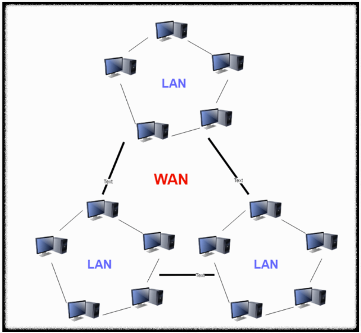
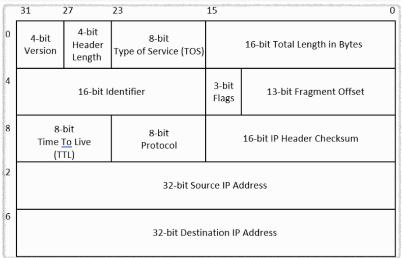

# IP 주소 체계
####
## 들어가기 전에


위 사진처럼 근거리 통신망이라는 것이 있는데 이는 같은 네트워크 대역에서 통신을 하는 것임.

Battle.net 처럼 다른 네트워크 대역을 사용하는 사람들과 게임을 하려면?

LAN(Local Area Network)의 개념에서 더 확장하여 WAN(Wide Area Network)의 개념으로 접근해야 함



우리가 배울 네트워크 계층(3계층)은 멀리 떨어진 곳에 존재하는 네트워크까지 어떻게 데이터를 전달할 지 제어하는 일을 담당

## IP 주소

### IP 주소 개념

```
LAN 에서의 통신은 MAC 주소로 통신할 수 있지만 다른 네트워크 대역에는 데이터를 보낼 수 없음

따라서 MAC 주소가 아닌 네트워크를 식별할 수 있는 다른 주소가 필요
```

**IP 주소 (Internet Protocol Address)**
- 네트워크 상에서 각 장치를 구별하기 위한 **논리적 주소**
- vs. MAC 주소: 물리적 주소 (데이터링크 계층)


> IP 주소를 안다면 그 목적지까지 데이터를 보낼 수 있음  
> 데이터를 어떤 경로로 보낼지도 결정해야함 => "라우팅"


**구조**
```
[ 네트워크 부분 | 호스트 부분 ]

네트워크 부분: 어떤 네트워크인지 식별
호스트 부분: 네트워크 내 어떤 장치인지 식별
```

<br>

---

## IPv4 vs. IPv6

### IPv4 (Internet Protocol version 4)

**기본 구조**
- 32비트 주소 체계 → 약 43억 개(2³²) 주소
- **점으로 구분된 10진수 표기법 (Dotted Decimal Notation)**
- 예: `192.168.0.10`

**문제점**
- 주소 고갈 문제 → 사설 IP, NAT 등의 기법 등장




> 출발지 IP 주소 : 32-bit Source IP Address  
> 목적지 IP 주소 :  32-bit Destination IP Address  


<br>

### IPv6 (Internet Protocol version 6)

**기본 구조**
- 128비트 주소 체계 → 사실상 무한대 수준의 주소 (2¹²⁸)
- **16진수 콜론 표기법 (Colon Hexadecimal Notation)**
- 예: `2001:0db8:85a3:0000:0000:8a2e:0370:7334`
- 축약: `2001:db8:85a3::8a2e:370:7334` (연속된 0은 ::로 한 번만 축약)

**특징**
- IPv4 주소 부족 대비 개발
- 동적 할당(DHCP)과 NAT 덕분에 IPv4 여전히 널리 사용 중


> 340 '간' 개의 IP주소 생성 가능 ( 340조의 1조 배의 1조 배 )


<br>

### IPv4 vs. IPv6 비교

| 구분 | IPv4 | IPv6 |
| --- | --- | --- |
| 발표 연도 | 1981 | 1999 |
| 주소 길이 | 32bit | 128bit |
| 표기 형식 | 10진수, 점 구분 | 16진수, 콜론 구분 |
| 예시 | 192.168.0.1 | 3FFE:F200:0234::1 |
| 주소 개수 | 약 43억 개 | 사실상 무한대 (2¹²⁸) |
| TTL 필드명 | Time to Live | Hop Limit |
| 헤더 구조 | 복잡, 다양한 옵션 | 단순화되어 라우팅 효율↑ |
| 브로드캐스트 | 지원 | 미지원 (멀티캐스트 사용) |

<br>

```
TTL 이란?
- 패킷이 네트워크에서 무한정 떠돌아다니는 것을 방지하는 "생존 시간" 값
- 라우터를 하나 거칠 때마다 1씩 감소
- 0이 되면 패킷 폐기

Time to Live는 1 TTL을 1초 단위로 만들었는데 실제로는 라우터마다 처리 시간이 달라 1 TTL이 1Hop 단위인 Hop Limit으로 이름만 바꿈


브로드캐스트란?
- 네트워크 내 모든 장치에게 한 번에 데이터를 보내는 방식

예: 192.168.1.0/24 네트워크

브로드캐스트 주소: 192.168.1.255
→ 이 주소로 보내면 192.168.1.1~254 모든 장치가 받음

IPv6에서는 브로드캐스트 미지원
- 대신 멀티캐스트 사용
- 브로드캐스트는 모든 장치가 처리해야 해서 네트워크 부담 ↑
- 멀티캐스트: 필요한 그룹에게만 전송 (더 효율적)
```


---

## 클래스 기반 주소 (Classful Addressing)

### Classful IP Addressing
 - IP주소의 범위를 각각 클래스별로 나눠가지고 클래스에 맞게 사용하는 IP 주소  
 - IPv4 에서 IP 주소의 비트 수는 32개, 여기서 32개의 비트를 8개씩 묶어서 4개의 필드를 구성하여 네트워크의 주소와 호스트 주소를 구분
 - 필드를 옥텟(Octet)이라고도 불리며 각 옥텟은 "." 으로 구분하며 총 4개의 옥텟이 존재


### Class A
```
범위: 0.0.0.0 ~ 127.255.255.255
형식: N.H.H.H (네트워크.호스트.호스트.호스트)

0xxxxxxx.xxxxxxxx.xxxxxxxx.xxxxxxxx
└─8비트─┴────────24비트───────────┘
네트워크        호스트

네트워크 수: 126개 (0과 127 제외) >> 첫 번째 옥텟으로 나타낼 수 있는 주소  
호스트 수: 약 1677만 개 (나머지 24개의 bits 로 나타낼 수 있는 주소의 수 (2^24) -2 개) 

모두가 1인 경우 브로드캐스트 주소로 사용하고 모두 0인 경우에는 네트워크 주소로 사용하기 때문

용도: 대규모 조직
```

### Class B
```
범위: 128.0.0.0 ~ 191.255.255.255
형식: N.N.H.H

10xxxxxx.xxxxxxxx.xxxxxxxx.xxxxxxxx
└───16비트────┴────16비트────┘
  네트워크         호스트

네트워크 수: 약 16,000개
호스트 수: 65,534개
용도: 중규모 조직
```

### Class C
```
범위: 192.0.0.0 ~ 223.255.255.255
형식: N.N.N.H

110xxxxx.xxxxxxxx.xxxxxxxx.xxxxxxxx
└────────24비트──────┴─8비트─┘
      네트워크          호스트

네트워크 수: 약 200만 개
호스트 수: 254개
용도: 소규모 조직
```

### Class D/E
| Class | 범위 | 용도 |
| --- | --- | --- |
| D | 224.0.0.0 ~ 239.255.255.255 | 멀티캐스트 |
| E | 240.0.0.0 ~ 255.255.255.255 | 예약 (실험용) |


### Classful 방식의 문제점
- 클래스에 딱 맞게 쓰다보니 IP 주소가 낭비

만약, 6대의 컴퓨터만 존재하는 PC방이 있다면 6개의  호스트 주소만 할당시키면 되는데 클래스 방식을 사용한다면 200개가 넘는 호스트 주소가 불필요하게 할당

<br>

---

## 서브넷 마스크 & CIDR

### 서브넷 마스크 (Subnet Mask)

**개념**
- 네트워크 부분과 호스트 부분을 구분하는 값
- 서브넷팅은 자원을 효율적으로 분배하기 위해 네트워크 영역과 호스트 영역을 분할
- 서브넷팅을 하기 위해 필요한 것이 서브넷 마스크
- IP주소처럼 2진수 32비트로 구성되어있고 10진수로 변환하여 표기
- 2진수로 표기했을 때 1로 시작을 하며 1과 1사이에는 0이 올 수 없다는 규칙을 가지고 있음


### CIDR (Classless Inter-Domain Routing)

**개념**
- 클래스 구분 없이 서브넷 마스크로 유연하게 네트워크 크기 결정


**동작**
```
IP 주소:       192.168.0.138 // C 클래스
서브넷 마스크:  255.255.255.248
```


**표기법**
- 점 표기법: `255.255.255.0`
- CIDR 표기법: `/24` (1이 24개)

<br>

---

## 특수 IP 주소


```
보통 인터넷을 신청하면 공유기가 오는데, 공인 IP를 받은 것과 마찬가지.

공유기랑 연결하는 순간 사설 IP를 할당 받아서 사용하게 됨

실제 네트워크 세상에는 오로지 공인 IP 주소만 보임

공인 IP 하나 당 여러 사설 네트워크 대역이 따로 존재하기 때문에 IP 주소 부족을 어느정도 해소가능
```


```
게이트웨이: 외부 세상으로 나가는 문이 어딘지를 알려주는 역할

 IPv4(사설IP)주소가 192.168.0.138 인 PC에서 다른 네트워크 대역의 데이터를 요청을 한다면 공유기를 거쳐서 가야함

 게이트웨이 192.168.0.1 라는 문을 통과해 WAN으로 연결
```

### 사설 IP (Private IP)

**특징**
- 인터넷에서 직접 사용 불가
- 내부 네트워크 전용
- NAT를 통해 공인 IP로 변환하여 인터넷 접속

| Class | 범위 | CIDR |
| --- | --- | --- |
| A | 10.0.0.0 ~ 10.255.255.255 | /8 |
| B | 172.16.0.0 ~ 172.31.255.255 | /12 |
| C | 192.168.0.0 ~ 192.168.255.255 | /16 |

<br>

### 공인 IP (Public IP)
- 인터넷에서 직접 사용 가능한 유일한 주소
- ISP에서 할당

<br>

### 특수 목적 주소

| 주소 | 의미 | 용도 |
| --- | --- | --- |
| 0.0.0.0 | 모든 IP, 네트워크 자체 | 기본 라우트 |
| 127.0.0.1 | 루프백 (자기 자신) | 로컬 테스트 |
| 255.255.255.255 | 브로드캐스트 | 네트워크 전체 전송 |
| 네트워크 주소 | 호스트 부분 모두 0 | 네트워크 식별 (예: 192.168.1.0/24) |
| 브로드캐스트 주소 | 호스트 부분 모두 1 | 네트워크 전체 전송 (예: 192.168.1.255/24) |

<br>

---

## IP 주소 할당 방식

| 방식 | 설명 | 사용 대상 |
| --- | --- | --- |
| **정적 할당 (Static)** | 수동으로 IP 설정 | 서버, 네트워크 장비 |
| **동적 할당 (Dynamic)** | DHCP를 통해 자동 할당 | 클라이언트 (PC, 스마트폰) |

<br>

---
