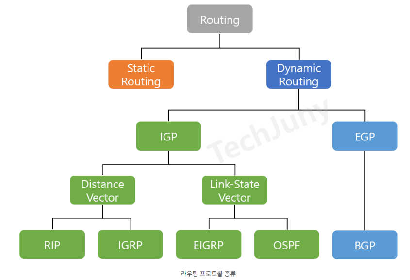

# 라우팅 (Routing)

## 라우팅 개념

**라우팅(Routing)**
- 출발지에서 목적지까지 데이터를 전달하기 위한 **최적 경로를 결정**하는 과정
- 네트워크 계층(Layer 3)의 핵심 기능
- 넓은 의미에서는 경로 결정과 패킷 전송까지 합쳐 패킷을 출발지에서 목적지까지 전달하는 과정을 말함

**라우터(Router)**
- 라우팅을 수행하는 네트워크 장비
- IP 주소를 기반으로 패킷을 다음 경로로 전달

<br>

---

## 라우팅 vs 포워딩

| 구분 | 라우팅 (Routing) | 포워딩 (Forwarding) |
| --- | --- | --- |
| 의미 | 경로 결정 (Path selection) | 패킷 전달 (Packet delivery) |
| 범위 | 전체 경로 계획 | 다음 홉으로 전송 |
| 시간 | 비교적 느림 (주기적 업데이트) | 매우 빠름 (실시간) |
| 주체 | 라우팅 알고리즘 | 라우팅 테이블 참조 |
| 예시 | 서울 → 부산 가는 최적 경로 결정 | 현재 교차로에서 다음 방향 선택 |

<br>

---

## 라우팅 테이블 (Routing Table)

**개념**
- 라우터가 패킷을 어디로 보낼지 기록한 표

**구성 요소**
```
목적지 네트워크 | 서브넷 마스크 | 다음 홉(게이트웨이) | 인터페이스 | 메트릭
```

**예시**
| 목적지 | 넷마스크 | 게이트웨이 | 인터페이스 | 메트릭 |
| --- | --- | --- | --- | --- |
| 192.168.1.0 | /24 | 직접연결 | eth0 | 0 |
| 10.0.0.0 | /8 | 192.168.1.1 | eth0 | 1 |
| 0.0.0.0 | /0 | 192.168.1.254 | eth0 | 10 |


```
인터페이스?

직접 연결
목적지: 192.168.1.0/24
게이트웨이: 직접연결
인터페이스: eth0

의미:
→ eth0로 나가면 바로 목적지 네트워크
→ 중간 라우터 없이 직접 도달 가능


간접 연결
목적지: 10.0.0.0/8
게이트웨이: 192.168.1.1
인터페이스: eth0

의미:
→ eth0로 나가서 192.168.1.1 라우터를 거쳐야 함
→ 다음 홉 라우터 필요

```

```
메트릭(Metric)?
 - 경로의 비용(Cost) 또는 우선순위
→ "이 경로가 얼마나 좋은지"를 나타내는 숫자


문제 상황: 같은 목적지로 가는 경로가 여러 개인 경우

경로 1:
게이트웨이: 192.168.1.1
인터페이스: eth0
메트릭: 1

경로 2:
게이트웨이: 192.168.1.2
인터페이스: eth1
메트릭: 5

선택: 메트릭이 낮은 경로 1 사용 (1 < 5)

```


<br>

---

## 라우팅 방식

- 사람이 수동으로 설정하는 정적 라우팅과 라우팅 프로토콜로 인해 자동으로 할당 받는 동적 라우팅이 있음



### 정적 라우팅 (Static Routing)

**개념**
- 관리자가 수동으로 경로 설정
- 경로 정보를 라우터에 미리 저장하여 중개

**특징**
```
장점:
- 네트워크 부하 없음
- 예측 가능
- 보안성 높음
- 설정 단순

단점:
- 확장성 낮음
- 네트워크 변화에 대응 불가
- 관리 부담 큼
```

**사용 환경**
- 소규모 네트워크
- 네트워크 토폴로지 고정
- 보안이 중요한 경우

<br>

### 동적 라우팅 (Dynamic Routing)

**개념**
- 라우팅 프로토콜을 통해 자동으로 경로 결정 및 업데이트

**특징**
```
장점:
- 자동 경로 갱신
- 장애 대응 자동화
- 확장성 좋음
- 최적 경로 자동 선택

단점:
- 네트워크 오버헤드 발생
- 설정 복잡
- CPU/메모리 사용량 증가
```

**사용 환경**
- 대규모 네트워크
- 네트워크 토폴로지 동적 변화
- 인터넷 백본

<br>

---

## 라우팅 알고리즘

### 분류

| 분류 기준 | 종류 |
| --- | --- |
| 정보 관리 | 집중형 / 분산형 |
| 경로 결정 | 정적 / 동적 |
| 경로 계산 방식 | Distance Vector / Link State |

<br>

### Distance Vector (거리 벡터)

**개념**
- 인접 라우터와 정보 교환
- 목적지까지의 **거리(홉 수 또는 비용)**와 **방향(다음 라우터)**만 알면 됨

**동작 원리**
```
1. 각 라우터가 인접 라우터에게 자신의 라우팅 테이블 전송
2. 받은 정보로 자신의 테이블 업데이트
3. 변경사항 발생 시 인접 라우터에게 전파
4. 주기적으로 반복
```

**특징**
| 장점 | 단점 |
| --- | --- |
| 구현 단순 | 느린 수렴 속도 |
| 메모리 적게 사용 | 라우팅 루프 발생 가능 |
| 작은 네트워크에 적합 | Count to Infinity 문제 |

**대표 프로토콜**
- RIP (Routing Information Protocol)

<br>

### Link State (링크 상태)

**개념**
- 네트워크 전체의 **토폴로지 맵**을 각 라우터가 보유
- 모든 라우터가 전체 네트워크 구조를 알고 있음

**동작 원리**
```
1. 각 라우터가 인접 링크 정보 수집
2. 링크 상태 정보를 네트워크 전체에 플러딩(Flooding)
3. 모든 라우터가 동일한 토폴로지 맵 구축
4. Dijkstra 알고리즘으로 최단 경로 계산
```

**특징**
| 장점 | 단점 |
| --- | --- |
| 빠른 수렴 속도 | 구현 복잡 |
| 루프 방지 | 메모리 많이 사용 |
| 확장성 좋음 | CPU 부담 큼 |
| 정확한 경로 계산 | 초기 플러딩 부하 |

**대표 프로토콜**
- OSPF (Open Shortest Path First)

<br>

### Distance Vector vs Link State 비교

| 구분 | Distance Vector | Link State |
| --- | --- | --- |
| 경로 정보 | 방향과 거리만 | 전체 토폴로지 |
| 업데이트 대상 | 인접 라우터만 | 모든 라우터 |
| 업데이트 내용 | 전체 라우팅 테이블 | 링크 상태 변화만 |
| 수렴 속도 | 느림 | 빠름 |
| 메모리 사용 | 적음 | 많음 |
| CPU 사용 | 적음 | 많음 |
| 확장성 | 낮음 | 높음 |

<br>

---

## 주요 라우팅 프로토콜

### 분류

**IGP (Interior Gateway Protocol) - AS 내부**
- 동일한 관리 도메인(AS) 내부에서 사용
- RIP, OSPF, EIGRP

**EGP (Exterior Gateway Protocol) - AS 간**
- 서로 다른 AS 간 라우팅
- BGP

<br>

### RIP (Routing Information Protocol)

| 특징 | 내용 |
| --- | --- |
| 알고리즘 | Distance Vector |
| 메트릭 | 홉 카운트 (최대 15홉) |
| 업데이트 주기 | 30초마다 전체 테이블 전송 |
| 수렴 속도 | 느림 |
| 용도 | 소규모 네트워크 |

**장단점**
```
장점:
- 설정 매우 간단
- 소규모에 적합

단점:
- 최대 15홉 제한
- 느린 수렴
- 대역폭 낭비
```

<br>

### OSPF (Open Shortest Path First)

| 특징 | 내용 |
| --- | --- |
| 알고리즘 | Link State |
| 메트릭 | 대역폭 기반 비용 |
| 업데이트 | 변경 시에만 LSA 전송 |
| 수렴 속도 | 빠름 |
| 용도 | 중대규모 네트워크, 기업망 |

```
LSA(Link State Advertisement)

- OSPF 프로토콜에서 사용하는 링크 상태 정보 패킷
- 각 라우터가 자신의 링크 상태를 네트워크 전체에 알리는 메시지
```

**장단점**
```
장점:
- 빠른 수렴
- 무한 루프 방지
- 계층적 구조 (Area 개념)
- 대역폭 효율적

단점:
- 설정 복잡
- 메모리/CPU 사용량 높음
```

<br>

### BGP (Border Gateway Protocol)

| 특징 | 내용 |
| --- | --- |
| 알고리즘 | Path Vector |
| 메트릭 | AS 경로, 정책 기반 |
| 용도 | 인터넷 백본, ISP 간 |
| 스케일 | 전체 인터넷 |

**특징**
```
- AS(Autonomous System) 간 라우팅
- 정책 기반 라우팅 가능
- 인터넷의 핵심 프로토콜
- 안정성과 확장성 우선
```

```
AS (Autonomous System)
- 하나의 관리 주체가 운영하는 네트워크 집합

예시
AS 3786: KT
AS 9318: SK브로드밴드  
AS 17858: LG유플러스
```

```
정책 기반 라우팅
- 단순히 "최단 경로"가 아닌 "정책"에 따라 경로를 선택하는 방식

목적지까지:
- 경로 A: 경쟁사 망 경유
- 경로 B: 제휴사 망 경유

선택: 경로 B (제휴사 망 우선)
→ 비즈니스 정책으로 판단
```

<br>

---

