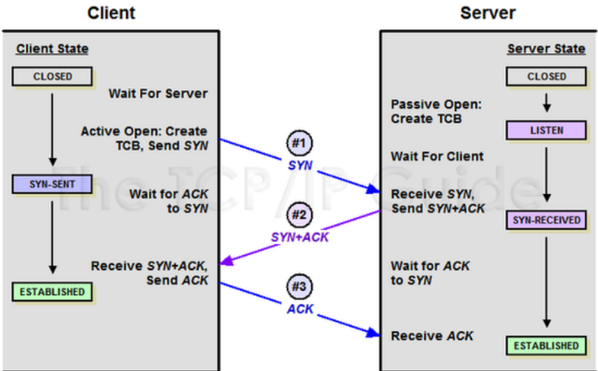
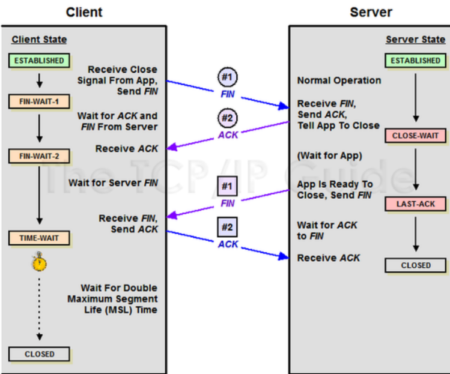

## 들어가기 전에

### TCP란? (Transmission Control Protocol)
- 인터넷 상에서 데이터를 메세지의 형태로 보내기 위해 IP와 함께 사용하는 프로토콜을 말한다.
- TCP는 애플리케이션에게 신뢰적이고 연결지향성 서비스를 제공한다.

따라서, 서버와 클라이언트간에 데이터를 신뢰성 있게 전달하기 위해 만들어진 프로토콜이다. 그리고 TCP는 장치들 사이에 논리적인 접속을 성립(establish)하기 위해서 3-Way handshake를 사용한다.

## 3-Way Handshake란?
- TCP/IP 프로토콜을 이용해서 통신을 하는 응용프로그램이 데이터를 전송하기 전에 먼저 정확한 전송을 보장하기 위해 상대방 컴퓨터와 사전에 세션을 수립하는 과정을 말한다.

## 3-way handshake의 역할

-  3way handshake는 양쪽 모두 데이터를 전송할 준비가 되어있다는 것을 보장
- 실제로 데이터 전달이 시작하기 전에 다른 한쪽이 준비되었다는 것을 알 수 있도록 해줌

이미지에 작성되어있는 상태와 SYN과 ACK의 플래그 내용은 다음과 같다.

### **[State 정보]**

**CLOSED**: 포트가 닫힌 상태  
**LISTEN**: 포트가 열린 상태로 연결 요청 대기 중  
**SYN_RECV**: SYNC 요청을 받고 상대방의 응답을 기다리는 중  
**ESTABLISHED**: 포트 연결 상태  
**TIME-WAIT**: Server로부터 FIN을 수신하더라도 일정시간(default: 240초)동안 세션을 남겨놓고 잉여 패킷을 기다리는 과정을 말한다.

     
### **[Flag 정보]**

**TCP Header**에는 **CONTROL BIT**(플래그 비트, 6bit)가 존재하며, 각각의 bit는 "URG-ACK-PSH-RST-SYN-FIN"의 의미를 가진다.

즉, **해당 위치의 bit가 1이면** 해당 패킷이 **어떠한** 내용을 담고 있는 **패킷인지를 나타낸다.**

**SYN(Synchronize Sequence Number)**

- 연결 설정. Sequence Number를 랜덤으로 설정하여 세션을 연결하는 데 사용하며, 초기에 Sequence Number를 전송한다.  
- 따라서, Connection을 생성할때 사용하는 flag이다.

**ACK(Acknowledgement)**

- 응답 확인. 패킷을 받았다는 것을 의미하는 flag이다.  
- Acknowledgement Number 필드가 유효한지를 나타낸다.  
- 양단 프로세스가 쉬지 않고 데이터를 전송한다고 가정하면 최초 연결 설정 과정에서 전송되는 첫 번째 세그먼트를 제외한 모든 세그먼트의 ACK 비트는 1로 지정된다고 생각할 수 있다.

**FIN(Finish)**

- 연결 해제. 세션 연결을 종료시킬 때 사용되며, 더 이상 전송할 데이터가 없음을 의미한다.  
- 4way handshake에서 사용한다.  

---

### 3Way handshake의 동작방식을 말로 풀어내면?

**Step1 [Client -> SYN -> Server]**  
Client가 Server에게 접속을 요청하는 SYN플래그를 보낸다.  

 
**Step2. [Server -> SYN + ACK -> Client ]**  
Server는 Listen상태에서 SYN이 들어온 것을 확인하고 SYN_RECV상태로 바뀌어 SYN + ACK플래그를 Client에게 전송한다. 그 후 Server는 다시 ACK 플래그를 받기 위해 대기상태로 변경된다.  

 
**Step3. [Client -> ACK -> Server]**  
SYN + ACK 상태를 확인한 Client는 서버에게 ACK를 보내고 연결 성립(Established)이 된다.   
 
위와 같이 신뢰성을 위해 3번의 핸드쉐이킹을 거쳐 연결을 맺는것을 3-Way Handshake라고 한다.  

## 4-Way Handshake란?

3way handshake가 연결확립을 위해 진행했다면 4way handshake는 세션을 종료하기 위해 수행되는 절차를 말한다.  

 
다음과 4way handshake 프로세스 과정의 이미지에 대한 내용을 알아보자.  

 
### **Step1 [Client -> FIN -> Server]**       
- Client가 연결을 종료하겠다는 FIN플래그를 전송한다. 보낸 후에 FIN-WAIT-1 상태로 변한다.  

 
### **Step2 [Server-> ACK -> Client]**  
- FIN 플래그를 받은 Server는 확인메세지인 ACK를 Client에게 보내준다.  
- 그 후 CLOSE-WAIT상태로 변한다.   
- Client도 마찬가지로 Server에서 종료될 준비가 됐다는 FIN을 받기위해  FIN-WAIT-2 상태가 된다.  

 
### **Step3 [Server -> FIN -> Client]**  
- Close준비가 다 된 후 Server는 Client에게 FIN 플래그를 전송한다.  

 
### **Step4 [Client -> ACK-> Server]**  
- Client는 해지 준비가 되었다는 정상응답인 ACK를 Server에게 보내준다.  
- 이 때, Client는 TIME-WAIT 상태로 변경된다.  

 
여기서 TIME-WAIT 상태는 의도치않은 에러로 인해 연결이 데드락으로 빠지는 것을 방지하기 위해 변경 되는 것인데, 만약 에러로 인해 종료가 지연되다가 타임이 초과되면 CLOSED 상태로 변경된다.  

---------------

## Question 정리

### **[Q1] TCP의 연결 설정 과정(3단계)과 연결 종료 과정(4단계)이 단계가 차이나는 이유? **  

Client가 데이터 전송을 마쳤다고 하더라도 Server는 아직 보낼 데이터가 남아 있을 수 있기 때문에 일단 FIN에 대한 ACK만 보내고, 데이터를 모두 전송한 후에 자신도 FIN 메세지를 보내기 때문이라고 볼 수 있다.   
 

### **[Q2] 만약 Server에서 FIN 플래그를 전송하기 전에 전송한 패킷이 Routing 지연이나 패킷 유실로 인한 재전송 등으로 인해 FIN 패킷보다 늦게 도착하는 상황이 발생하면 어떻게 될까?**  

위에서 4way handshake과정 마지막 부분에서 말한 TIME-WAIT을 말한 부분이 답이라고 보면되는데, TCP는 이러한 현상에 대비하여 Client는 Server로부터 FIN 플래그를 수신하더라도 일정시간동안 세션을 남겨놓고 잉여 패킷을 기다리는 과정을 거친다.
 
 
### **[Q3] 초기 Sequence Number인 ISN을 0부터 시작하지 않고 난수를 생성해서 설정하는 이유?**  
Connection을 맺을 때 사용하는 포트(Port)는 유한 범위 내에서 사용하고 시간이 지남에 따라 재사용된다.  
따라서 두 통신 호스트가 과거에 사용된 포트 번호 쌍을 사용하는 가능성이 존재한다.   
서버 측에서는 패킷의 SYN을 보고 패킷을 구분하게 되는데 난수가 아닌 순처적인 Number가 전송된다면 이전의 Connection으로부터 오는 패킷으로 인식할 수 있다.  
이런 문제가 발생할 가능성을 줄이기 위해서 난수로 ISN을 설정한다.  
