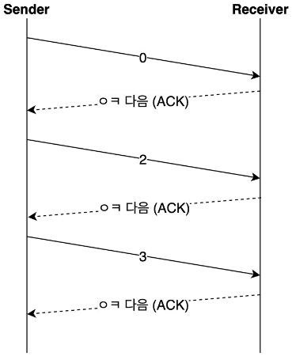
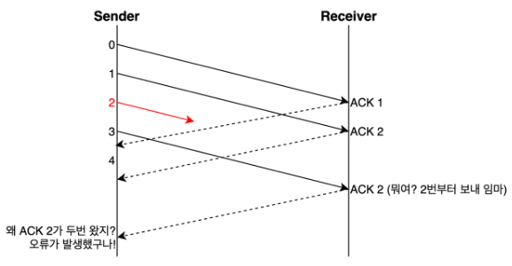
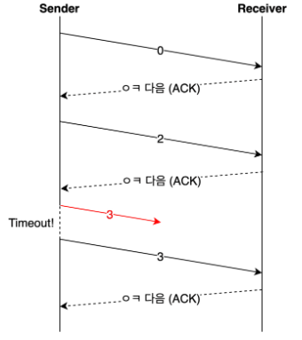
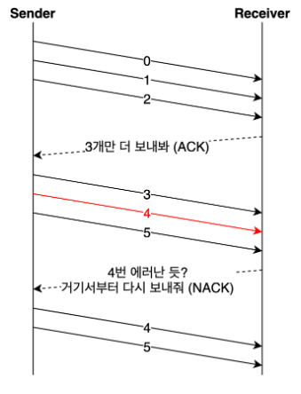
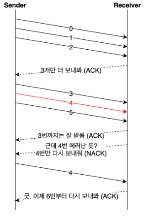
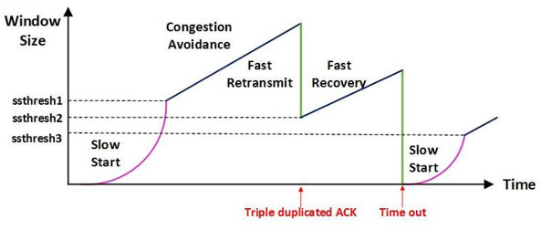
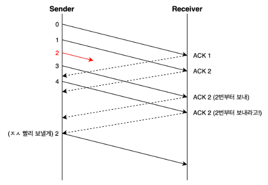

# TCP의 3가지 제어 기능

TCP에는 크게 3가지 제어 기능이 있다.
- 전송되는 데이터의 양을 조절하는 **흐름 제어**  
- 데이터가 유실되거나 잘못된 데이터가 수신되었을 경우 대처 **오류 제어**
- 네트워크 혼잡에 대처하는 **혼잡 제어**

이 기능들 덕분에 예외 상황에 크게 신경쓰지 않고 상위 레이어 동작에 집중 가능

## 흐름 제어
- 송신 측과 수신 측의 데이터 처리 속도가 다를 수 있다.

- 송신 측이 빠를 때 수신 측 버퍼가 넘치는 오버플로우 문제가 발생한다.

- 이러한 문제를 줄이기 위해 윈도우 크기로 송신 측의 데이터 전송량을 조절한다.

>윈도우 크기 : 자신이 처리할 수 있는 데이터의 양

### Stop and Wait
- 상대방에게 데이터를 보낸 후 잘 받았다는 응답이 올 때까지 기다리는 방식

### sliding winodw

송신 측이 수신 측에서 받은 윈도우 크기를 참고해서 데이터의 흐름을 제어하는 방식
- 수신 측이 한 번에 처리할 수 있는 데이터의 양(윈도우 크기)을 3 way handshake할 때 송신 측에 전달한다.  
- 상대방에게 응답을 받지 않아도 범위 내에서 데이터를 보낼 수 있다.
- 패킷의 왕복 시간(RTT)이 크다면 네트워크가 혼잡하다고 생각하여 윈도우 크기를 실제 버퍼의 크기보다 작게 설정한다.
- 통신 과정 중에도 네트워크 혼잡 등의 조건을 통해 윈도우 크기는 유동적으로 설정된다.

## 오류 제어
- TCP는 통신 중에 오류가 발생하면 해당 데이터를 재전송한다.

- 즉, 재전송 기반 오류 제어 ARQ(Automatic Repeat Request)를 사용한다.

- 재전송은 비효율적이므로 적을수록 좋다.

### 오류를 알 수 있는 방법?

- 송신 측이 ACK(긍정응답)을 받지 못함
    - 송신 측이 보낸 데이터가 유실되거나, 수신 측이 보낸 ACK 데이터가 유실될 경우
- 중복된 ACK를 받는다.

- 수신 측이 NACK(부정응답)을 보냄
    - ACK만으로 오류를 추정하기 위해 사용하지 않기도 한다.

### Stop and Wait
- ACK를 받고 나서 다음 데이터를 보내는 방식이다.

- 일정 시간을 지나 timeout이 발생하면 이전 데이터를 재전송한다.

- 흐름 제어에서의 슬라이딩 윈도우를 사용할 수 없으므로 더 효율적인 ARQ가 필요하다.

### Go Back N
- 연속으로 데이터를 보내다가 오류가 발생한 지점부터 재전송하는 방식이다.

 

- 아래처럼 4번 데이터에서 에러가 발생했다면 4번 이후의 데이터는 모두 삭제한다.

- 성공적으로 전송된 데이터까지 재전송하기 때문에 조금 비효율적이다.

### Selective Repeat
- 오류가 발생한 데이터만 재전송하는 방식이다.

- Selective Repeat의 단점은 수신 측 버퍼의 데이터가 순차적이지 않다는 것이다.

- 정렬의 과정이 추가로 필요하고 별도의 버퍼가 필요하다.

- Go Back N과 비교하여 상황에 따라 더 유리한 방법을 선택하면 된다.

## 혼잡 제어
- 네트워크 내에 패킷의 수가 과도하게 증가하는 현상을 혼잡이라고 한다.

- 혼잡 제어는 혼잡 현상을 방지하고 제거하기 위한 기능이다.

- 흐름 제어는 송신 측과 수신 측의 전송 속도를 다루고, 혼잡 제어는 라우터를 포함한 넓은 범위의 전송 문제를 다룬다.

### AIMD (Additive Increase / Multiplicative Decrease)
- 처음에 패킷을 하나씩 보내고 문제가 발생하지 않으면 윈도우 크기를 1씩 증가하는 방법  
- 패킷 전송에 실패하거나 일정 시간을 넘으면 패킷 전송 속도를 절반으로 줄인다.
- 네트워크에 늦게 들어온 호스트가 처음에는 불리하지만, 시간이 흐르면서 평형상태로 수렴한다.
- 단점
    - 처음에 전송 속도를 올리는 데 시간이 오래걸린다.
    - 네트워크가 혼잡해지는 상황을 미리 감지하지 못한다. 즉, 네트워크가 혼잡해지고 나서야 대역폭을 줄인다.

### Slow Start (느린 시작)
- AIMD와 같이 패킷을 하나씩 보내고 문제가 발생하지 않으면 각 ACK 패킷마다 윈도우 크기를 1씩 늘려준다. 즉, 한 주기가 지나면 윈도우 크기는 2배가 된다.
- AIMD와 달리 전송 속도를 지수 함수 꼴로 증가시켜서 윈도우 크기를 더 빠르게 증가시킨다.
- 혼잡이 감지되면 윈도우 크기를 1로 줄인다.
- 처음에는 네트워크 수용량을 예상할 수 있는 정보가 없지만, 한 번 혼잡 현상이 발생한 후에는 네트워크의 수용량을 어느 정도 예상할 수 있다.
- 그래서 혼잡 현상이 발생하는 윈도우 크기의 절반가지는 지수 함수 꼴로 윈도우 크기를 증가시키고 그 이후에는 완만하게 1씩 증가시킨다.

### Fast Retransmit (빠른 재전송) 
- TCP는 지금가지 받은 데이터 중 연속되는 패킷의 마지막 순번 이후를 ACK 패킷에 실어서 보낸다.
- 그래서 송신 측이 아래처럼 3, 4번을 보내더라도 ACK 2 를 중복해서 받는다.
- 그러면 timeout이 발생하기 전이라도 송신 측은 문제가 되는 2번 패킷을 재전송한다.
- 그리고 혼잡한 상황이라고 판단해서 윈도우 크기를 줄인다.
- 3 ACK Duplicated : 송신 측이 3번 이상 중복된 ACK 번호를 받은 상황

### Fast Recovery (빠른 회복)
- 혼잡한 상태가 되면 윈도우 크기를 1이 아니라 반으로 줄이고, 선형 증가시킨다.
- 혼잡 상황을 한번 겪은 이후로는 AIMD 방식으로 동작한다.