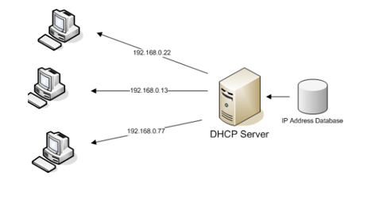
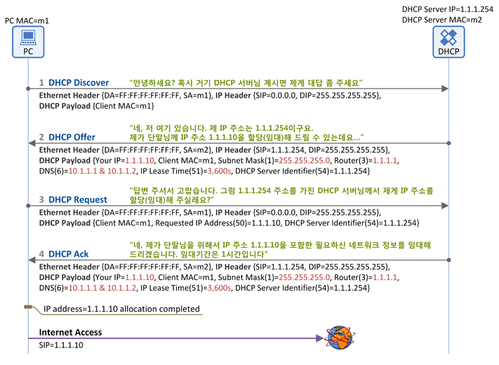
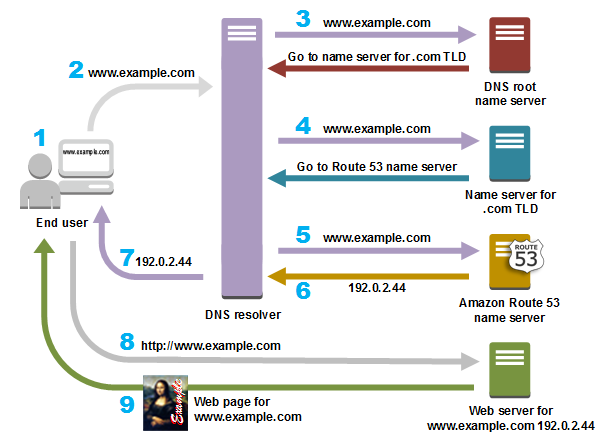

# DHCP 프로토콜

## DHCP (Dynamic Host Configuration Protocol) 개념

  - **동적 호스트 설정 프로토콜**
  - 호스트에게 **IP주소, 서브넷 마스크, 기본게이트웨이 IP주소, DNS서버 IP주소**를 자동으로 **일정 시간** 할당해주는 인터넷 프로토콜

**DHCP 임대 (Lease)**

  - DHCP 서버가 IP 주소를 영구적으로 할당하는 것이 아님
  - \*\*임대기간(IP Lease Time)\*\*을 명시하여 그 기간 동안만 IP 주소를 사용하도록 함
  - **IP 주소 임대기간 갱신 (IP Address Renewal)**: 임대기간 이후 계속 사용 시 DHCP 서버에 요청
  - **IP 주소 반납 절차 (IP Address Release)**: IP 주소가 더 이상 필요치 않을 때 수행

> 즉, 유동 IP 할당 == DHCP 서버로부터 IP를 설정된 사용시간만큼 임대

 

-----

## DHCP의 구성

### 1\. DHCP 서버

  - 인터넷 제공자의 서버에서 실행되는 프로그램
  - 일정한 범위의 IP 주소를 클라이언트에게 할당하고 자동 설정
  - 클라이언트에게 할당된 IP 주소를 변경 없이 유지 가능

**설정 정보 예시**
| 항목 | 결과 |
| --- | --- |
| IP 주소 | `192.168.0.4` |
| 서브넷 마스크 | `255.255.255.0` |
| 기본 게이트웨이 | `192.168.0.1` |
| DNS 서버 IP 주소 | `210.220.163.82` / `219.250.363.130` |

 

### 2\. DHCP 클라이언트

  - 시스템 시작 시 DHCP 서버에 IP 주소를 요청
  - IP 주소를 부여받으면 TCP/IP 설정이 초기화되고 통신 가능
  - 즉, 서버에게 IP를 할당받으면 TCP/IP 통신 가능

 

-----

## DHCP 임대 절차

IP 주소 할당(임대) 절차는 4개의 메시지로 구성됨.

### 1\. DHCP Discover

  - **패킷 방향**: 클라이언트 -\> DHCP 서버
  - **브로드캐스트 패킷**: Destination MAC = `FF:FF:FF:FF:FF:FF`
  - **의미**: 클라이언트가 DHCP 서버를 찾기 위한 메시지. "거기 혹시 DHCP 서버 있으면 내게 응답 좀 해 주세요"
  - 이 패킷에는 호스트의 MAC 주소가 담겨있어 서버가 응답 가능
  - **주요 파라미터**:
      - `Client MAC`: 클라이언트의 MAC 주소

### 2\. DHCP Offer

  - **패킷 방향**: DHCP 서버 -\> 클라이언트
  - **브로드캐스트/유니캐스트**:
      - Discover 메시지의 Broadcast Flag=1이면 Broadcast
      - Flag=0이면 Unicast
  - **의미**: DHCP 서버의 응답. "저 여기 있어요\~". \*\*클라이언트에 할당할 "네트워크 정보"\*\*를 포함하여 전달
  - **주요 파라미터**:
      - `Client MAC`: 단말의 MAC 주소
      - `Your IP`: 단말에 할당(임대)할 IP 주소
      - `Subnet Mask (Option 1)`
      - `Router (Option 3)`: 단말의 Default Gateway IP 주소
      - `DNS (Option 6)`: DNS 서버 IP 주소
      - `IP Lease Time (Option 51)`: IP 주소 임대 기간
      - `DHCP Server Identifier (Option 54)`: 응답을 보낸 DHCP 서버의 주소 (여러 서버가 응답 가능하므로)

### 3\. DHCP Request

  - **패킷 방향**: 클라이언트 -\> DHCP 서버
  - **브로드캐스트 메시지**: Destination MAC = `FF:FF:FF:FF:FF:FF`
  - **의미**: 단말이 Offer를 받고, **하나의 DHCP 서버를 선택**하여 "단말이 사용할 네트워크 정보"를 공식적으로 요청
  - **주요 파라미터**:
      - `Client MAC`: 단말의 MAC 주소
      - `Requested IP Address (Option 50)`: 사용하려는 IP 주소 (Offer의 Your IP)
      - `DHCP Server Identifier (Option 54)`: 단말이 선택한 DHCP 서버의 주소

### 4\. DHCP Ack

  - **패킷 방향**: DHCP 서버 -\> 클라이언트
  - **브로드캐스트/유니캐스트**:
      - Request 메시지의 Broadcast Flag=1이면 Broadcast
      - Flag=0이면 Unicast
  - **의미**: DHCP 절차의 마지막. DHCP 서버가 단말에게 "네트워크 정보"를 최종 전달 (DHCP Offer의 정보와 동일)
  - **주요 파라미터**: **DHCP Request 패킷의 파라미터와 동일**

 

-----

# DNS 프로토콜

## DNS (Domain Name Server) 개념

  - 도메인 네임과 IP 주소의 대응 관계를 데이터베이스로 구축해 사용하는 인터넷 프로토콜
  - (DHCP 서버가 클라이언트에게 DNS 서버 주소를 제공)
  - DNS는 **브라우징을 단순화하는 목적**을 수행

**필요성**

  - 네트워크의 모든 컴퓨터는 고유 IP 주소를 가짐
  - 사이트 방문 시 IP 주소를 매번 기억하는 것은 불가능
  - `https://kinam/ssafy` 같은 **도메인 이름**을 `125.209.222.141` 같은 **IP 주소**로 변환
  - 이 DNS를 운영하는 서버를 \*\*네임서버(Name Server)\*\*라고 함

 

-----

## DNS 절차

1.  사용자가 브라우저에 URL(도메인 이름)을 입력.
2.  브라우저는 DNS에 접속하여 입력한 도메인 이름과 관련된 IP 주소를 요청.
3.  획득한 IP 주소를 사용하여 브라우저는 해당 컴퓨터(서버)와 통신하고 요청된 페이지를 요청.
  

