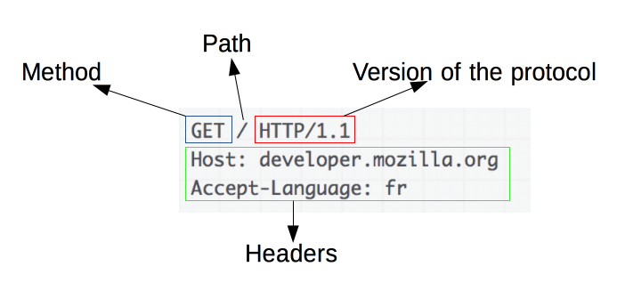
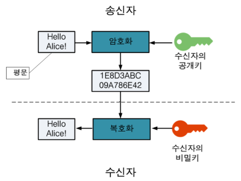
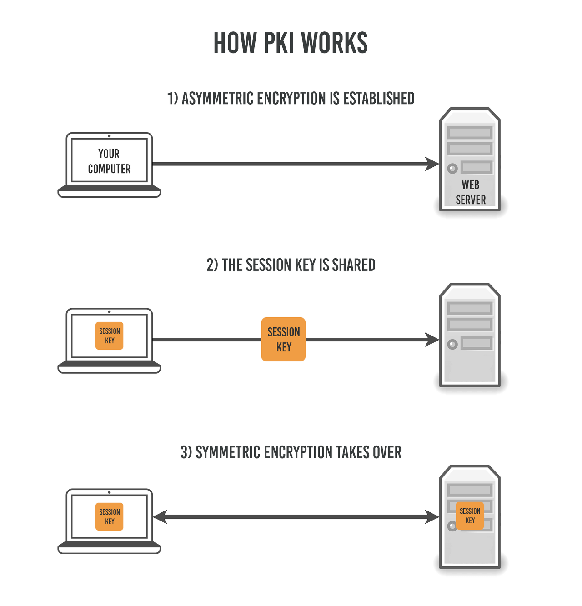
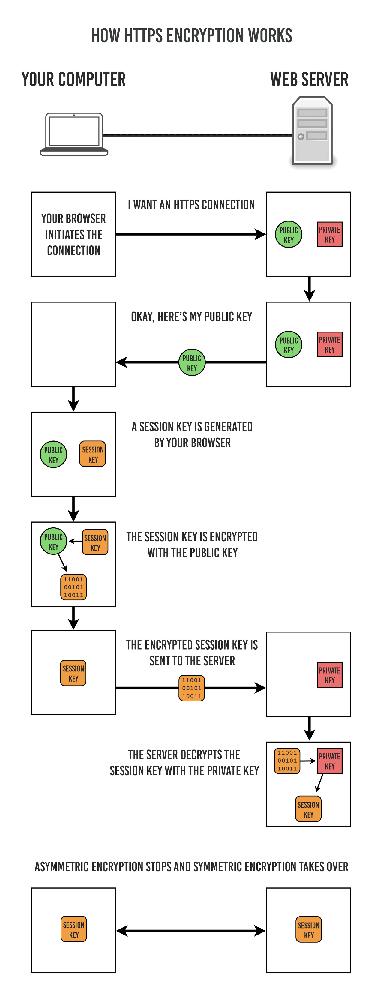
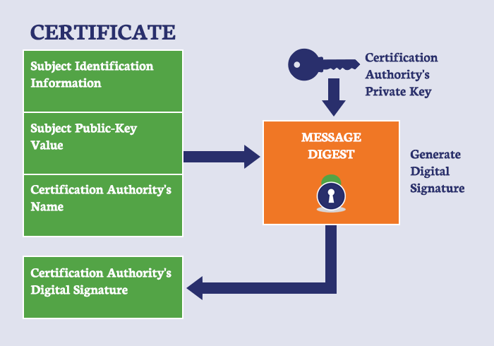
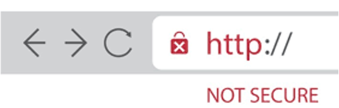

# HTTP와 HTTPS

## 1. HTTP란?

### HTTP(Hyper Text Transfer Protocol) 정의

서버/클라이언트 모델을 따라 데이터를 주고 받기 위한 프로토콜

인터넷에서 하이퍼텍스트를 교환하기 위한 통신 규약으로, **80번 포트**를 사용함. HTTP 서버가 80번 포트에서 요청을 기다리고 있으며, 클라이언트는 80번 포트로 요청을 보냄

### HTTP의 역사

1989년 팀 버너스 리(Tim Berners Lee)에 의해 처음 설계되었으며, WWW(World-Wide-Web) 기반에서 세계적인 정보를 공유하는데 큰 역할을 함

### HTTP의 구조

- **애플리케이션 레벨의 프로토콜**로 TCP/IP 위에서 작동
- **Stateless 프로토콜**: 상태를 가지고 있지 않음
- 구성 요소: Method, Path, Version, Headers, Body 등

```
애플리케이션 레벨 : 네트워크 7계층인 응용 계층(Application) 계층을 의미

```



### HTTP의 문제점

**암호화가 되지 않은 평문 데이터를 전송**하는 프로토콜이기 때문에, 비밀번호나 주민등록번호 등을 주고 받으면 제3자가 정보를 조회할 수 있음

이러한 보안 문제를 해결하기 위해 HTTPS가 등장

---

## 2. HTTPS란?

### HTTPS(Hyper Text Transfer Protocol Secure) 정의

다른 명칭:
- HyperText Transfer Protocol over Secure Socket Layer
- HTTP over TLS
- HTTP over SSL
- HTTP Secure

**HTTP에 데이터 암호화가 추가된 프로토콜**

- **443번 포트** 사용
- 네트워크 상에서 중간에 제3자가 정보를 볼 수 없도록 암호화를 지원

### 암호화 방식

HTTPS는 **대칭키 암호화**와 **비대칭키 암호화** 방식을 모두 사용

#### 대칭키 암호화
- 클라이언트와 서버가 **동일한 키**를 사용해 암호화/복호화를 진행
- **장점**: 연산 속도가 빠름
- **단점**: 키가 노출되면 매우 위험

#### 비대칭키 암호화
- **1개의 쌍으로 구성된 공개키와 개인키**를 암호화/복호화 하는데 사용
- **장점**: 키가 노출되어도 비교적 안전
- **단점**: 연산 속도가 느림

### 공개키/개인키 암호화 원리

공개키와 개인키는 서로를 위한 1쌍의 키

- **공개키(Public Key)**: 모두에게 공개 가능한 키
- **개인키(Private Key)**: 나만 가지고 알고 있어야 하는 키

암호화를 공개키로 하느냐 개인키로 하느냐에 따라 얻는 효과가 다름:

#### 공개키로 암호화
- 공개키로 암호화하면 **개인키로만 복호화** 가능
- 효과: 개인키는 나만 가지고 있으므로, **나만 볼 수 있음**

#### 개인키로 암호화
- 개인키로 암호화하면 **공개키로만 복호화** 가능
- 효과: 공개키는 모두에게 공개되어 있으므로, **내가 인증한 정보임을 알려 신뢰성을 보장**



---


### 예시: 네이버와 철수(같은 키로 암호화하고 복호화)
```
문제 상황:
네이버 → 철수에게 비밀키 "abc123" 전송
해커 → 중간에 "abc123" 가로챔 ✗

이후:
철수 → 네이버: ID/PW를 "abc123"으로 암호화
해커 → "abc123"으로 복호화 → ID/PW 탈취 ✗

결론: 키 전달이 안전하지 않음!
```

### 예시: 공개키와 개인키 쌍 사용

```
네이버:
공개키: "NAVER_PUBLIC" (공개)
개인키: "NAVER_PRIVATE" (비밀)

철수 → 네이버로 데이터 전송:
1. 네이버 공개키로 "ID/PW" 암호화
2. 해커가 가로챔
3. 해커가 공개키로 복호화 시도 → 실패! ✗
   (공개키로 암호화한 건 개인키로만 복호화 가능)
4. 네이버만 개인키로 복호화 성공 ✓

결론: 안전하지만 느림!
```


## 3. HTTPS의 동작 과정

### 핵심 개념

HTTPS는 **대칭키 암호화와 비대칭키 암호화를 모두 사용**하여 빠른 연산 속도와 안정성을 모두 얻음

- **비대칭키**: 처음 연결을 성립하여 안전하게 세션키를 공유하는 과정에서 사용
- **대칭키(세션키)**: 이후 데이터를 교환하는 과정에서 빠른 연산 속도를 위해 사용



### HTTPS 연결 과정 (Hand-Shaking)

1. **클라이언트(브라우저)가 서버로 최초 연결 시도**
2. **서버는 공개키(엄밀히는 인증서)를 브라우저에게 전달**
3. **브라우저는 인증서의 유효성을 검사하고 세션키를 발급**
4. **브라우저는 세션키를 보관하며, 서버의 공개키로 세션키를 암호화하여 서버로 전송**
5. **서버는 개인키로 암호화된 세션키를 복호화하여 세션키를 획득**
6. **클라이언트와 서버는 동일한 세션키를 공유**하므로 데이터를 전달할 때 세션키로 암호화/복호화를 진행



---

## 4. HTTPS 인증서 발급 과정

### CA (Certificate Authority)

인증된 기관에서 공개키를 포함한 인증서를 발급함

### 인증서 발급 및 사용 과정

1. **A기업은 HTTPS를 적용하기 위해 공개키/개인키를 발급**
2. **CA 기업에게 돈을 지불하고, 공개키를 저장하는 인증서의 발급을 요청**
3. **CA 기업은 인증서를 생성**
   - 포함 내용: CA기업의 이름, 서버의 공개키, 서버의 정보 등
   - CA 기업의 개인키로 암호화하여 A기업에게 제공
4. **A기업은 클라이언트에게 암호화된 인증서를 제공**
5. **브라우저는 CA기업의 공개키를 미리 다운받아 갖고 있어, 암호화된 인증서를 복호화**
6. **복호화하여 얻은 A기업의 공개키로 세션키를 공유**



### 인증서의 신뢰성

- 인증서는 **CA의 개인키로 암호화**되었기 때문에 신뢰성을 확보
- 클라이언트는 **A 기업의 공개키로 데이터를 암호화**하여 A기업만 복호화할 수 있음
- 브라우저에는 **인증된 CA 기관의 정보들이 사전에 등록**되어 있음
- 인증된 CA 기관의 인증서가 아닐 경우 브라우저에서 경고 표시



---

## 5. HTTP vs HTTPS 비교

### 보안

| HTTP | HTTPS |
|------|-------|
| 암호화가 추가되지 않아 **보안에 취약** | **안전하게 데이터를 주고받을 수 있음** |

### 속도

| HTTP | HTTPS |
|------|-------|
| 빠름 | 암호화/복호화 과정이 필요하여 상대적으로 느림 (하지만 오늘날에는 거의 차이를 못느낄 정도) |

### 비용

| HTTP | HTTPS |
|------|-------|
| 추가 비용 없음 | 인증서를 발급하고 유지하기 위한 추가 비용 발생 |

### 포트 번호

| HTTP | HTTPS |
|------|-------|
| 80번 포트 | 443번 포트 |

---

## 6. HTTP와 HTTPS 사용 기준

### HTTPS를 사용해야 하는 경우
**개인 정보와 같은 민감한 데이터를 주고 받아야 하는 경우**
- 로그인 정보
- 결제 정보
- 개인 식별 정보

### HTTP를 사용해도 되는 경우
**노출이 되어도 괜찮은 단순한 정보 조회 등을 처리하는 경우**
- 공개 블로그 글
- 공개 게시판
- 단순 정보 페이지

---

## 7. 핵심 정리

### HTTP
- 80번 포트 사용
- 평문 데이터 전송으로 보안 취약
- TCP/IP 위에서 작동하는 Stateless 프로토콜

### HTTPS
- 443번 포트 사용
- HTTP + 암호화(SSL/TLS)
- 대칭키와 비대칭키 암호화를 혼합 사용
- 연결 시작 단계: 비대칭키로 세션키 교환
- 데이터 전송 단계: 대칭키(세션키)로 암호화/복호화
- CA 인증서를 통해 신뢰성 보장

### HTTPS 동작 흐름 요약
```
1. 클라이언트 → 서버 연결 시도
2. 서버 → 클라이언트 인증서(공개키) 전달
3. 클라이언트: 인증서 검증 + 세션키 생성
4. 클라이언트 → 서버: 공개키로 암호화한 세션키 전송
5. 서버: 개인키로 세션키 복호화
6. 이후 통신: 세션키(대칭키)로 암호화/복호화
```