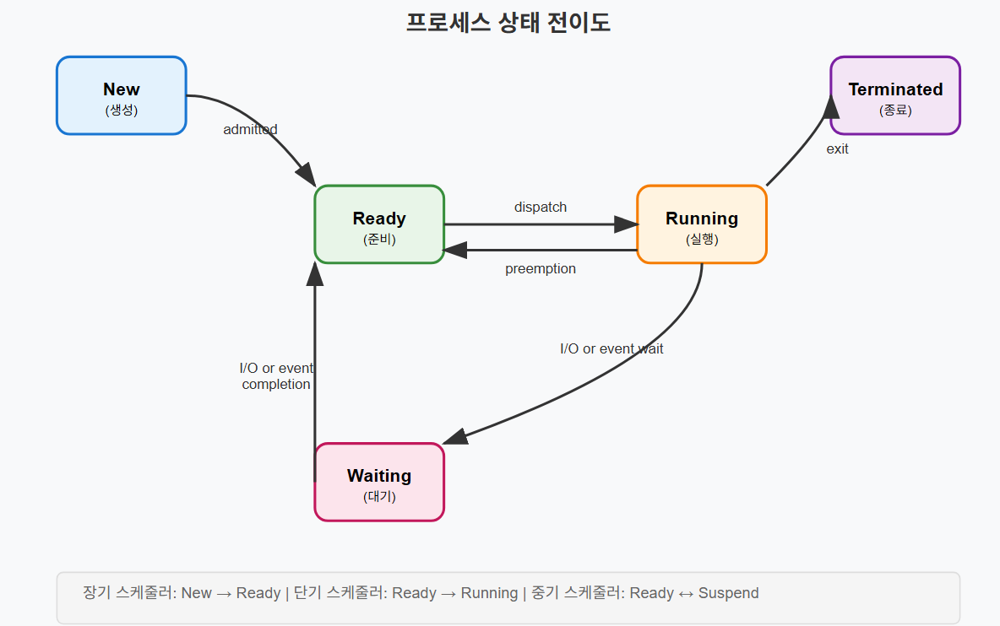

# 프로세스 개념과 상태 전이

## 1. 프로세스의 기본 개념

### 프로그램 vs 프로세스
- **프로그램**: 디스크에 저장된 실행 가능한 파일 (정적인 개념)
- **프로세스**: 메모리에 적재되어 실행 중인 프로그램 (동적인 개념)

### 프로세스의 정의
프로세스는 **실행 중인 프로그램의 인스턴스**를 의미한다. 운영체제로부터 시스템 자원을 할당받아 독립적으로 실행되는 작업의 단위이다.

### 프로세스가 할당받는 자원
- **CPU 시간**: 프로세서 사용 권한
- **메모리 공간**: Code, Data, Heap, Stack 영역
- **파일 디스크립터**: 열린 파일들에 대한 참조
- **프로세스 ID(PID)**: 고유 식별자

-----
### 파일 디스크립터(File Descriptor, FD)
- 운영체제가 열려있는 파일을 식별하기 위해 부여하는 번호
- 프로세스는 특정 파일에 접근할 때 파일 이름 대신 이 번호를 사용

### 프로세스 ID(Process ID, PID)
- 운영체제가 실행 중인 각각의 프로세스를 구별하기 위해 부여하는 고유 번호
- 프로세스가 종료되면 해당 PID는 다른 프로세스가 재사용 가능 (ex. 301호의 첫 번째 책상, 502호의 첫 번째 책상 등)

301호, 502호는 FD로,  첫 번째 책상은 PID로 이해
PID는 어떤 프로세스인지를 식별하고, FD는 해당 프로세스가 사용하는 파일을 식별
-----


## 2. 프로세스 메모리 구조

```
높은 주소
┌─────────────┐
│    Stack    │ ← 지역변수, 함수 매개변수, 리턴 주소
├─────────────┤
│      ↓      │
│             │
│      ↑      │
├─────────────┤
│    Heap     │ ← 동적 할당 메모리 (malloc, new)
├─────────────┤
│    Data     │ ← 전역변수, 정적변수
├─────────────┤
│    Code     │ ← 실행 코드 (텍스트 영역)
└─────────────┘
낮은 주소
```

---------------
**Code 영역**
- 코드 그 자체가 기계어 형태로 저장되는 공간. 프로그램이 시작되면 이 영역의 코드를 CPU가 순서대로 읽어서 실행
- 중간에 코드가 바뀌면 안 되므로 읽기 전용(Read-Only) 상태

**Data 영역**
- 전역 변수(Global variables)와 정적 변수(Static variables)가 저장되는 공간
- 프로그램 시작과 동시에 할당되고, 끌날 때 소멸

**Heap 영역**
- 프로그래머가 코드를 통해 직접 메모리를 할당하고 해제하는 공간. 동적 할당을 위한 영역
- 개발자가 직접 관리해야 하므로, 사용 후 메모리 해제하지 않으면 메모리 누수 발생

**Stack 영역**
- 함수의 호출 정보 관련된 데이터 저장되는 공간. 지역 변수(Local variables), 매개변수(Parameters) 포함
- LIFO(Last-In, First-Out)구조. 가장 나중에 들어온 데이터가 가장 먼저 나감
---------------


## 3. 프로세스 상태 (Process State)

프로세스는 실행 중에 여러 상태를 전이하며 동작한다.

### 기본 5가지 상태

#### New (생성)
- 프로세스가 생성된 상태
- 아직 메모리에 적재되지 않음
- 운영체제가 프로세스 생성을 완료하지 않은 상태

#### Ready (준비)
- 프로세스가 메모리에 적재되어 실행 준비가 완료된 상태
- CPU만 할당받으면 즉시 실행 가능
- Ready Queue에서 CPU 할당을 대기

#### Running (실행)
- CPU를 할당받아 명령어를 실행하는 상태
- 단일 프로세서에서는 한 번에 하나의 프로세스만 Running 상태

#### Waiting (대기/블록)
- 프로세스가 특정 이벤트를 기다리는 상태
- I/O 작업 완료, 자원 획득 등을 대기
- CPU를 할당받아도 실행할 수 없는 상태

#### Terminated (종료)
- 프로세스 실행이 완료된 상태
- 자원을 반납하고 시스템에서 제거 대기

## 4. 프로세스 상태 전이도



## 5. 상태 전이 과정 상세 설명

### 1) New → Ready (admitted)
- 메모리에 적재되어 실행 대기
- 프로세스 생성이 완료되고 메모리에 적재
- PCB(Process Control Block) 생성
- Ready Queue에 삽입

-----
**PCB**

운영체제가 수많은 프로세스 돌리기 위해 각 프로세스 정보를 PCB에 담아둠
---


### 2) Ready → Running (dispatch)
- 스케줄러가 Ready Queue에서 프로세스 선택
- CPU 할당 (Context Switching 발생)
- 프로세스 실행 시작

### 3) Running → Ready (preemption)
- 선점 스케줄링으로 CPU 회수 
- **시분할 시스템**에서 할당된 시간 만료
- 더 높은 우선순위 프로세스 도착
- 강제적 CPU 회수

### 4) Running → Waiting (I/O or event wait)
- I/O 요청 (파일 읽기/쓰기, 네트워크 통신)
- 자원 요청 (세마포어, 뮤텍스 대기)
- 자식 프로세스 종료 대기

### 5) Waiting → Ready (I/O or event completion)
- I/O 작업 완료
- 요청한 자원 획득
- 대기 중이던 이벤트 발생

### 6) Running → Terminated (exit)
- 프로세스 정상 종료
- 오류로 인한 비정상 종료
- 운영체제에 의한 강제 종료

프로세스 상태 전이는 **운영체제의 효율적인 자원 관리**를 위한 핵심 메커니즘이다. 각 상태 간 전이는 시스템의 성능과 응답성에 직접적인 영향을 미친다.