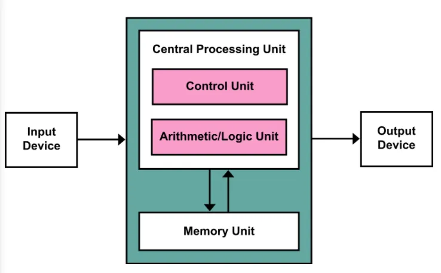

## 폰 노이만 구조

- **주기억 장치 - 중앙 처리 장치 - 입출력 장치**의 3단계 구조로 이루어진 프로그램 내장형 컴퓨터 구조
- (오늘날까지도) 현대적인 컴퓨터 구조는 대부분 폰 노이만 아키텍처를 따름
- 모든 프로그램은 명령어를 메모리에 올려 실행
- 프로세서(CPU) 와 기억장치(Memory)를 분리했다는 것이 핵심

 

### 폰 노이만 구조 컴퓨터의 작동

1. 메모리로부터 CPU로 명령어 가져오기
2. 명령어를 해석하고 (필요하면) 실행에 필요한 데이터를 메모리 또는 레지스터에서 가져오기
3. 명령어 실행
4. 실행 결과를 (필요하면) 메모리에 저장

- 기본적으로, 순차적으로 한 번에 하나의 명령어만 실행

 

### 구성 요소

#### Input/Output

- 사용자의 입력을 받고 동작 결과 출력

#### CPU

- 연산 수행 및 컴퓨터 각 요소들을 제어
- ALU (Arithmetic/Logic Unit): 연산 수행
- Control Unit: 연산 등 컴퓨터 동작에 필요한 요소들을 제어

#### Memory

- 컴퓨터 동작에 필요한 명령어, 데이터 등 저장

 

## 폰 노이만 구조의 장단점

### 장점: 범용성

- 컴퓨터로 다른 작업을 하려면 하드웨어를 재배치할 필요 없이, 소프트웨어만 교체하면 됨
- 설계가 단순하고 비용 저렴

 

### 한계: CPU-메모리 간 병목현상

- CPU-메모리 간 데이터 전송율 느려 성능 저하 가능성
- → 이를 개선하기 위한 노력들:
  - HW 기술 발전에 따른 명령어 처리 능력 향상
  - 명령어를 저장하는 메모리와 데이터를 저장하는 메모리 분리 (하버드 구조)
