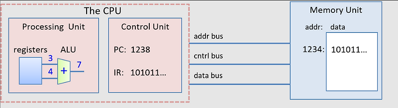

## CPU

- CPU (Central Processing Unit)
- 명령어를 해석하고 실행하는, 컴퓨터 시스템의 핵심 장치

### CPU의 구조

#### ALU (Arithmetic/Logic Unit)

- 산술 / 논리 연산 수행
- 이 연산 결과는 기억장치에 저장되거나 명령어 수행의 다음 단계로 전달됨

#### Control Unit

- CPU 작동에 필요한 요소들을 제어
- 해석된 명령어에 따라, 그 명령어를 수행하기 위해 필요한 제어 신호 만들고 다른 유닛에 전달

#### Register

- CPU 내부의 기억 장치
- 명령어 주소, 연산에 필요한 데이터, 연산 결과 등을 임시적으로 보관

#### 그 외 요소

- Bus: 컴퓨터 시스템 내 각 요소 간 데이터와 신호를 전달하는 통로
- Clock: 시스템의 타이밍 제어

 

### CPU 작동 과정

#### 1. Instruction Fetch

: 메모리에서 CPU로 명령어 가져오기

#### 2. Decode

: 가져온 명령어를 해석

#### 3. Execute

: 필요한 연산 수행

#### 4. Write back

: 연산 결과를 기억장치(레지스터)에 저장

 

## 레지스터

- CPU의 내부기억장치
- 연산을 위한 데이터 또는 연산 결과를 임시적으로 보관
- CPU 내부에 있으므로 빠르게 접근 가능
- 용량 작음 → 대부분의 경우, 연산을 하기 위해서 메모리에 있는 데이터/명령어를 레지스터로 옮겨와야 함

### 주요 레지스터

#### 프로그램 카운터 (PC; Program Counter)

- 메모리에서 읽어올 명령어의 주소를 가리킴

- 컴퓨터는 명령어를 순차적으로 하나씩 읽어오므로, PC가 가리키고 있는 메모리 주소에 위치한 명령어를 읽어와 실행하는 것

#### 명령어 레지스터 (IR; Instruction Register)

- 현재 수행 중인 명령어 저장

#### 메모리 주소 레지스터 (MAR; Memory Address Register)

- 메모리에서 데이터를 가져오거나 쓸 때 사용할 주소를 가리킴

#### 메모리 버퍼 레지스터 (MBR; Memory Buffer Register)

- = MDR (Memory Data Register)
- 메모리 <-> CPU 간 읽고 쓰기 위해 준비한 데이터를 일시적으로 저장

#### 플래그 레지스터 (FR)

- 연산 실행 결과 상태 저장
- 결과의 부호, 연산이 성공적으로 실행되었는지 등

#### 범용 레지스터 (GPR)

- 다양한 상황에 사용

#### 스택 포인터 (SP)

- 스택 메모리 영역의 최상단 주소를 가리킴

#### 베이스 레지스터 (BR)

- 메모리 주소의 기준 주소를 가리킴
