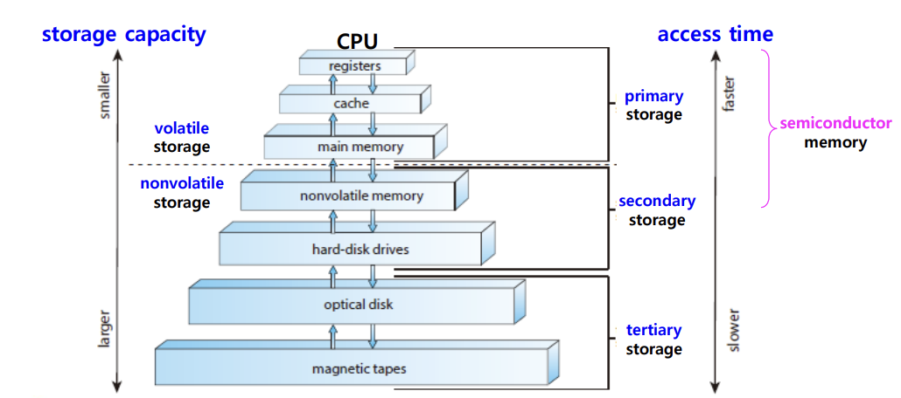
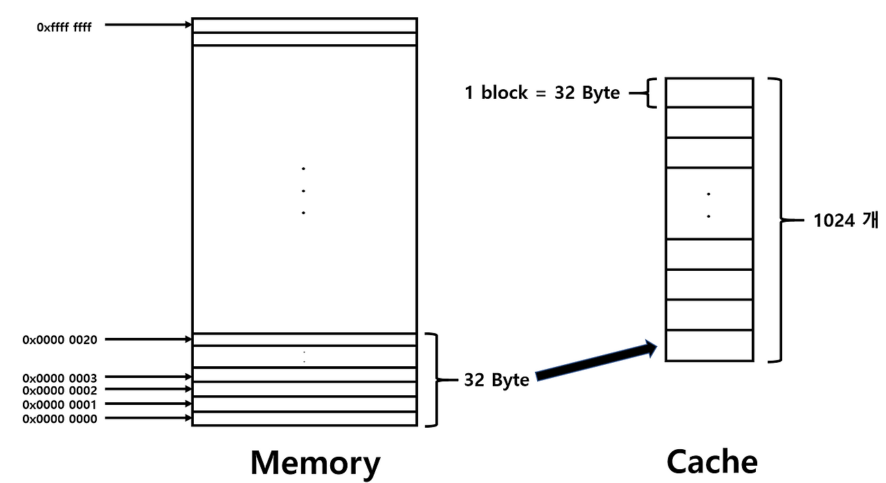
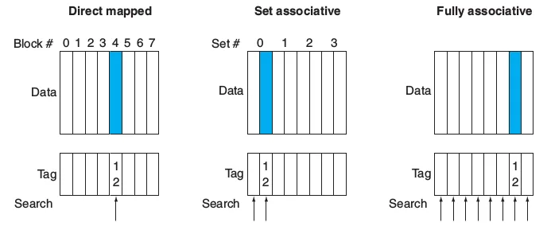

## 메모리 계층 구조

| ← 빠르고 용량 작음 |          |                 |             | 느리고 용량 큼→ |
| ------------------ | -------- | --------------- | ----------- | --------------- |
|                    | 레지스터 | 캐시 (L1-L2-L3) | 메인 메모리 |                 |

- 용량 ↔ 속도의 trade-off
- 메인 메모리에 접근해 데이터를 읽어오는 것은 느림 → 프로세서를 효율적으로 사용할 수 없음
- 성능 개선을 위해 캐시 활용
  : 데이터 일부를 메인 메모리까지 가지 않아도 상대적으로 더 빠르게 접근할 수 있는 캐시에 미리 가져와놓자는 것

### 지역성의 원칙 (Principle of Locality)

- 더 빠르고 작은 메모리에 미리 올려둘 데이터를 어떤 기준으로 고를지
- 프로그램이 실행될 때, 메모리 주소에 대한 접근이 특정 시간/공간 범위 내에 집중되는 경향이 있다는 것
- 메모리 계층 구조를 효율적으로 설계하는 데에 중요한 원칙

#### Temporal locality

- 시간 기반 (time-based)
- 최근에 접근한 적 있는 데이터는 곧 다시 접근될 가능성 높다는 것
- e.g., 반복문 내에서

#### Spatial locality

- 공간 기반 (space-based)
- 최근 접근한 데이터 근처에 저장된 (주소가 가까운) 데이터가 곧 접근될 가능성 높다는 것
- e.g., 배열을 순차적으로 읽을 때

 

### Hit & Miss

- 프로세서에서 명령어 실행에 필요한 데이터가 요청되었을 때, 메모리 계층 중 상위 계층에서 그 데이터가 찾아지는지
- 상위 계층에 데이터가 없으면 그 하위 레벨 → 또 없으면 그 다음 하위 레벨 → … 을 반복해 찾게 되므로, 전체 시스템 성능에 중요한 영향

#### Hit

- 찾으려는 데이터가 상위 레벨 메모리에서 찾아진 경우
- `hit ratio` = `hits` / `access`

#### Miss

- 찾으려는 데이터가 없는 경우
- 더 하위 레벨 메모리에 다시 접근해야 함
- `miss ratio` = `misses` / `access` = 1 - (`hit ratio`)
- `miss penalty`: 더 하위 레벨에 접근하게 되며 추가로 소요되는 비용

 

## 캐시

### 캐시 메모리 구조

#### Block

- 캐시는 block 단위(주소 byte보다 더 큰 chunk)로 데이터에 접근
- why? 매번 메모리↔캐시 오갈 때 개별 주소 단위로 가져오면 비효율적이기 때문

#### Block 크기에 따라

> block 크기가 클수록:

- miss rate 감소 (∵ spatial locality)
- 캐시의 크기가 고정되어 있을 때, 더 큰 블록 = 더 적은 블록 개수 = 유용한 데이터들이 덜 들어옴 = 오염 증가
- 더 큰 miss penalty

 

### 캐시의 성능

> cache performance에 영향을 미치는 요소는 1) cache miss rate 2) cache miss penalty

#### 1. cache miss rate

- miss rate가 낮을수록 성능 ↑
- 찾으려는 데이터가 캐시에 있어야 함
- 캐시 크기가 클수록 miss rate 낮은 경향

#### 2. cache miss penalty

- miss penalty가 작을수록 성능 ↑
- 찾으려는 데이터가 캐시에 없을 때, 추가로 다음 레벨 메모리에 접근하며 소요되는 비용
- 캐시는 L1-L2(-L3) 캐시의 여러 단계로 구성되어 있음
  - 다음 단계(L2) 캐시가 있을 때, 없을 때에 비해 miss penalty를 줄일 수 있음
  - ∵ 메인 메모리에 접근하는 것보다 L2 캐시에 접근하는 것이 더 빠르기 때문

 

### 캐시 쓰기 (Cache Write Policies)

> 연산 후, 데이터가 변경되었을 때 캐시에 있는 데이터와 원본(메인 메모리에 있는) 데이터 간 차이가 있을 수 있음. 이런 일관되지 않은 상태로 인해 발생하는 문제를 해결하기 위한 접근법

#### 1. Write-through

- 캐시 데이터가 업데이트될 때마다 메모리의 데이터도 바로 업데이트하는 것
- write에 필요한 비용 증가
- 캐시 사용으로 인한 이점이 의미가 없어짐

#### 2. Write-buffer

- 메모리 업데이트에 필요한 데이터를 바로 쓰지 않고, buffer에 모아서 가지고 있음
- 이렇게 모아뒀다가 뭉텅이로 메모리에 업데이트

#### 3. Write-back

- 캐시만 업데이트하고, 업데이트된 캐시 블럭이 어떤 건지만 추적
- 그 캐시 블럭이 캐시에서 제거되면, 그때 메모리를 업데이트
- 주로 이 방식 채택

 

### 캐시 매핑

> 캐시에 메모리 주소를 저장하기 위한 방식

#### Direct mapping

- 메모리 주소의 일부를 캐시 인덱스로 사용
- 가장 간단한 매핑 방식
- 캐시 인덱스가 같은 여러 변수를 계속해서 필요로 하는 경우, 이들을 동시에 캐시에 매핑할 수 없기 때문에 hit rate 감소 → 성능이 매우 떨어짐

#### Associative mapping

- 한 캐시 영역에 여러 개의 메모리 블럭이 매핑될 수 있게 함
- set associative
  - n-way set associative: 한 set에 n개 block이 들어갈 수 있다는 것
  - 매핑 방식들의 절충 버전 (주로 이 방식 채택)
- fully associative
  - set associative가 완전히 확장된 버전
  - 메모리 블럭이 캐시 내 어느 위치든 매핑 가능한 것
  - 어떤 주소 블럭이든 갖고 있을 수 있으니 hit rate 높지만, 캐시 내에서 원하는 블럭을 검색하기 위한 비용이 증가
