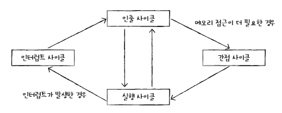
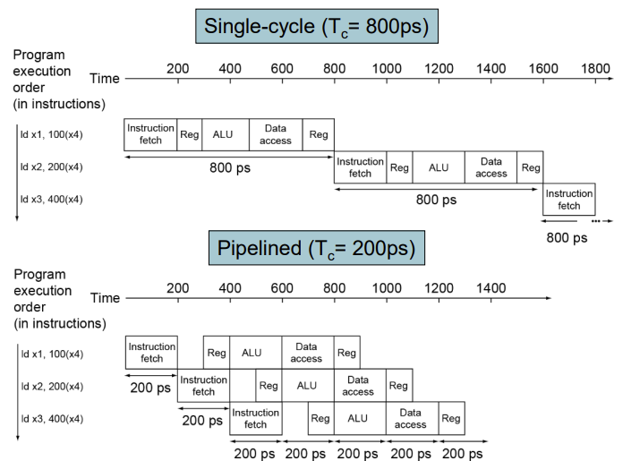

## 명령어 사이클

> 각 명령어를 처리하는 주기 = 하나의 명령어 사이클

### 명령어 사이클의 구성



#### 인출 사이클

- 메모리에 있는 명령어를 CPU로 가져오는 단계

#### 실행 사이클

- 명령어를 실행하는 단계

#### 간접 사이클

- 명령어 실행 과정에서 필요에 의해 추가로 메모리에 접근하는 단계

#### 인터럽트

- 명령어를 실행하는 중 다른 작업을 수행해야 하는 경우

<br>

## 파이프라이닝

### 명령어가 처리되는 순서

> 각 단계는 한 Clock 내에 실행되는 것

1. Instruction Fetch
2. Decode
3. Execute
4. Write Back

<br>

### 명령어 파이프라이닝

> 명령어를 처리할 때, 서로 다른 단계에 있는 명령어들을 동시에 실행할 수 있음

#### 파이프라이닝



- 파이프라이닝 사용 시 이점:
  - 시간 절약
  - 각 자원이 더 효율적으로 사용됨

<br>

### 파이프라이닝 위험 (Piplelining Hazards)

> 파이프라이닝으로 인해 발생하는 이슈. 사이클이 낭비되는 상황

#### 1. Data Hazard

- 명령어 간 데이터 의존성에 의해 발생
- (ex)
  ```
  [1] add x19, x0, x1  // x19 = x10 + x1
  [2] sub x2, x19, x3  // x2 = x19 - x3
  ```
  - 명령어가 위와 같은 순서로 실행된다고 하면, 명령어 [2] 를 실행하기 위해 [1]의 결과가 필요함
  - 그런데 파이프라이닝을 사용할 경우 [1]의 결과가 메모리에 저장되기 전 이 값이 필요하기 때문에 불가능
- 해결:
  - Forwarding: 이전 명령어의 계산결과를 바로 다음 명령어의 연산 입력으로 전달해주기
  - Reordering: 데이터 의존적인 명령어들의 관계가 발생하지 않도록 코드 순서 재배치

#### 2. Control Hazard

- 분기, 예외 등으로 인해 발생
- branch 결과에 따라 다음 실행되는 명령어가 달라질 수 있기 때문에 발생하는 문제
- 해결:
  - Branch prediction: 분기 결과를 미리 예측

#### 3. Structure Hazard

- 서로 다른 명령어가 동시에 CPU 자원을 필요로 할 때 발생
- 해결:
  - instruction memory / data memory 분리
