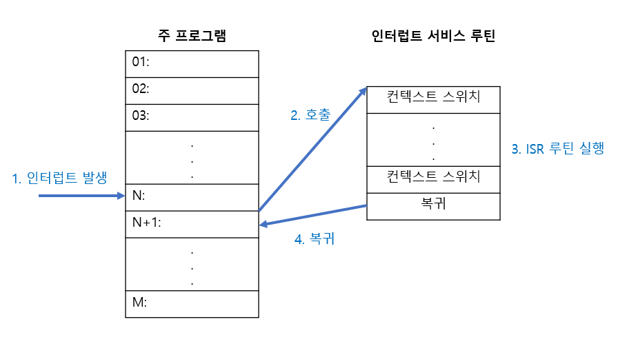

## 인터럽트

> CPU의 작업을 방해하는 시도. 기존 실행 중인 작업을 멈추고 더 우선적으로 처리해야 하는 다른 작업이 발생한 상황.

### 인터럽트의 종류

#### 동기 인터럽트 (= 예외 (exception))

- CPU에 의해 발생하는 인터럽트
- 프로그래밍 상 발생하는 오류 등이 여기에 해당
- 동기 인터럽트의 종류
  | | |
  | --- | --- |
  | Fault | 예외 발생 명령어부터 실행 재개 |
  | Trap | 예외 발생 명령어의 다음부터 실행 재개 |
  | Abort | 실행 중인 프로그램 강제 종료 |
  | SW Interrupt | 시스템 호출 시 발생 |

#### 비동기 인터럽트 (= 하드웨어 인터럽트)

- (주로) I/O 장치에 의해 발생하는 인터럽트
- CPU가 입출력장치에 작업 요청하고 → 입출력장치에서 이 작업이 완료되었다고 다시 CPU에 신호를 보내는 것이 인터럽트
- 비동기 인터럽트의 종류
  (우선순위에 따른 분류)
  | | |
  | --- | --- |
  | maskable interrupt | 막을 수 있는 인터럽트. 필요한 경우 CPU가 막을 수 있음 |
  | non-maskable interrupt | 막을 수 없는 인터럽트. 빨리 처리해야 하는, 우선순위가 높은 인터럽트 |

 

### 인터럽트 방식의 장점

#### 인터럽트를 사용하지 않는다면?

- CPU가 입출력 장치에 작업 요청한 후, 그 작업이 완료되었는지 계속 확인해야 함
- CPU와 입출력 장치의 작업 속도 차이가 크기 때문에, 이러한 방법은 비효율적!!

#### 인터럽트의 장점: 효율적

- CPU는 특정 명령에 대한 완료 여부를 주기적으로 확인할 필요 x
- 인터럽트가 발생했을 때만 그에 대해 처리하면 됨

 

## 인터럽트 처리

### 인터럽트가 처리되는 순서

1. 입출력 장치가 CPU에 인터럽트 요청 신호를 보냄
2. CPU는 명령어 사이클마다 인터럽트 여부를 항상 확인함
3. 이때 인터럽트 요청이 있으면, 현재 인터럽트를 처리할 수 있는지를 확인
4. 인터럽트를 처리할 수 있는 경우, 현재 작업 상태를 저장
5. 인터럽트 서비스 루틴 실행해 인터럽트 처리
6. 저장해뒀던 작업 상태를 복원해 재개

### 문맥 교환 (Context Switch)

> 인터럽트 처리 중 일어나는 단계 중 하나

 
- 인터럽트가 발생하면 CPU는 인터럽트 처리 후 다시 돌아와 작업을 이어갈 수 있도록 현재 실행 중인 프로세스의 상태를 저장해야 함
- 이때 저장되는 상태 정보들을 Context라고 함
