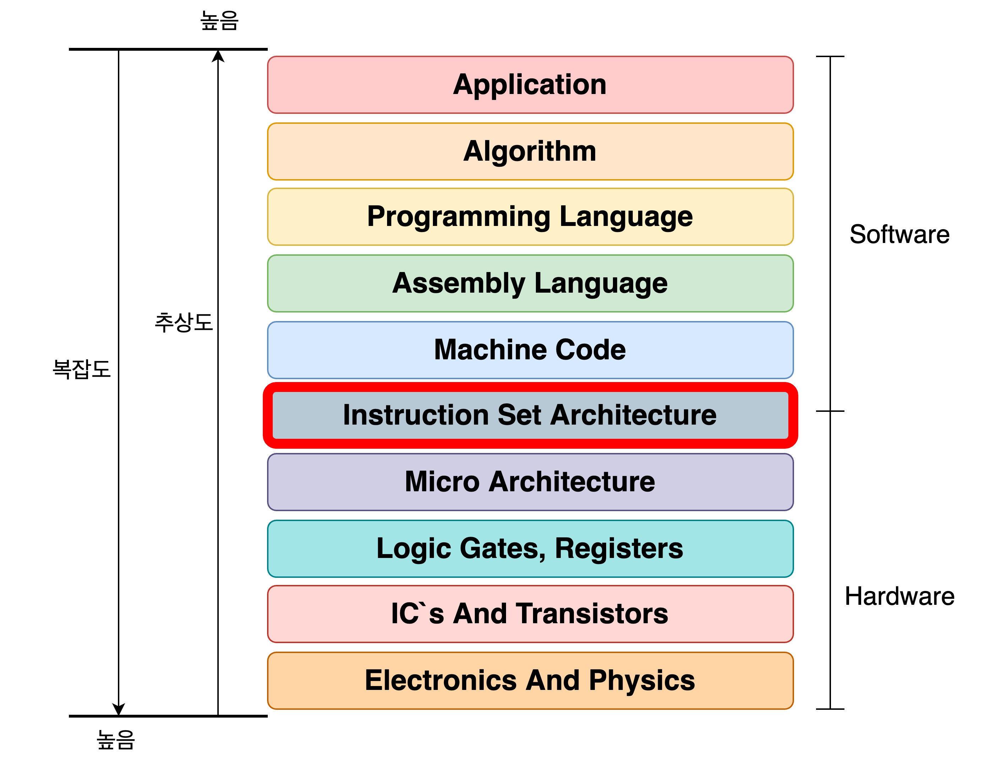

## 📖 명령어 집합 (ISA)

> 명령어 집합 (instruction set) = 명령어 집합 구조 (ISA; Instruction Set Architecture)

 

- CPU마다 명령어의 세세한 생김새, 명령어로 할 수 있는 연산, 주소 지정 방식 등이 다를 수 있음
  - 즉, CPU마다 ISA가 다를 수 있음
- ISA는 **소프트웨어와 하드웨어 사이의 인터페이스**
- 소프트웨어와 하드웨어가 서로 통신할 수 있게 해주는 명령어들의 집합
- ISA를 물리적으로 구현하는 방법을 마이크로 아키텍처라고 함

 

## 📖 CISC

> CISC (Complex Instruction Set Computer)

- 복잡하고 다양한 명령어들을 활용하는 CPU 설계 방식
- CISC 기반 ISA: x86, x86-64 등

#### 다양한 명령어

- 가변 길이 명령어 활용
- 명령어의 형태와 크기 다양함
- 다양한 명령어들을 포함하고 있기 때문에, 일반적으로 우리가 사용하는 **범용 컴퓨터의 CPU**로 많이 사용됨

### CISC의 장점

- 상대적으로 적은 수의 명령어로도 프로그램을 실행할 수 있음
- ARM(RISC 기반 ISA) 명령어 여러 개로 수행할 수 있는 일을, 더 적은 수의 x86-64 명령어로 수행 가능
- 메모리 공간 절약 → 그래서 메모리 용량이 크지 않았던 과거 매우 선호됨

### CISC의 단점

- 다양한 명령어 = 명령어의 크기, 실행시간이 일정하지 않음
  - 파이프라인 구현에 걸림돌
  - 현대 CPU 구현에 치명적인 약점
- 대부분의 복잡한 명령어는 그 사용 빈도가 낮음
- 메모리 성능이 좋아지며 CISC의 장점들의 의미가 없어짐  
  ⇒ CISC 기반 CPU는 성장에 한계가 있음

 

## 📖 RISC

> RISC (Reduced Instruction Set Computer)

### CISC의 한계 보완

- 파이프라이닝을 원활히 하려면 **명령어 길이와 수행 시간이 짧고 규격화**되어 있어야 함
- 어차피 자주 쓰이는 명령어는 정해져 있으므로, 복잡한 기능을 지원하는 명령어를 추가하기보다는 **자주 쓰이는 기본적인 명령어들을 작고 빠르게 만드는 것이 중요**함
- ⇒ RISC의 등장 배경

### RISC

- CISC에 비해 명령어의 종류 적음
- RISC 기반 ISA: ARM 등

#### 메모리 접근 단순화

- 메모리 접근을 단순화하고 최소화 추구
- 메모리에 직접 접근하는 명령어를 load, store 두 개로 제한
  - RISC를 load-store 구조라고 하기도 함
- 하드웨어 구조 단순해지고 레이턴시 낮아짐, 명령어 낭비 감소

#### 레지스터 활용 多

- 메모리 접근 최소화하는 대신 레지스터를 적극적으로 활용
- CISC보다 레지스터를 이용하는 연산 많음
  - 범용 레지스터 개수도 더 많음

#### 짧고 규격화된 명령어

- 같은 수의 명령어에 대해 더 효율적인 수의 clock으로 처리 가능, 발열과 전력 소모도 줄일 수 있음
- 이러한 특징으로 인해 **임베디드 프로세서**에서 RISC 구조 많이 사용

### RISC의 장점

- 짧고 규격화된 명령어, 되도록 1클럭 내외로 실행되는 명령어 지향
  - 즉, 고정 길이 명령어
- → 해석 속도가 빠름
- → 파이프라이닝에 유리함

### RISC의 단점

- 명령어가 하드웨어적으로 호환성이 낮음
- 많은 레지스터 필요
- 명령어 길이 제약되어 명령의 점프 어려움

 

## 📖 RISC vs. CISC

| RISC                             | CISC                             |
| -------------------------------- | -------------------------------- |
| 복잡하고 다양한 명령어           | 단순하고 적은 명령어             |
| 가변 길이 명령어                 | 고정 길이 명령어                 |
| 다양한 주소 지정 방식            | 적은 주소 지정 방식              |
| 프로그램을 이루는 명령어 수 적음 | 프로그램을 이루는 명령어 수 많음 |
| 여러 클럭에 걸쳐 명령어 수행     | 1클럭 내외로 명령어 수행         |
| 파이프라이닝 어려움              | 파이프라이닝 쉬움                |
| 적은 레지스터                    | 많은 레지스터                    |
| 느린 처리속도                    | 빠른 처리속도                    |
| 많은 전력 소모                   | 적은 전력 소모                   |
| 복잡한 HW 구조                   | 단순한 HW 구조                   |
