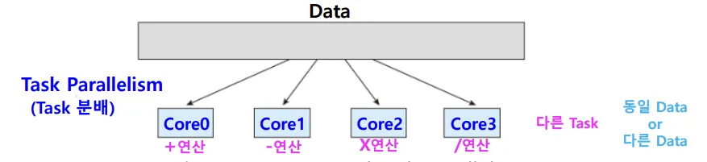
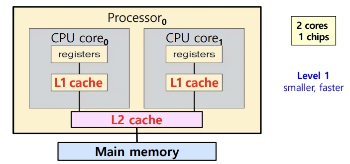

## 📖 병렬 처리

> 한 개 또는 복수의 CPU를 이용해 여러 개의 작업을 동시다발적으로 처리하는 것

### 프로세스와 스레드

#### 프로세스

- CPU가 처리하는 작업의 단위. 실행 중인 프로그램

#### 스레드

- 프로세스 안에서 실행되는 세부 흐름 단위

 

### 동시성과 병렬성

#### Concurrency (동시성)

- 단일 코어 환경에서 여러 작업을 조금씩 번갈아가며 수행하는 것
- CPU는 여러 프로세스 간 전환을 우리가 인지하지 못할 만큼 아주 빠르게 하기 때문에, 동시다발적으로 여러 작업이 처리되는 것처럼 보임

#### Parallelism (병렬성)

- 여러 개의 코어를 가진 CPU를 이용
- CPU 내부의 각 코어마다 다른 작업이 할당되어 병렬적으로 처리됨

 

### 두 가지 Parallelism

#### 데이터 병렬성 (Data parallelism)

- 여러 core에 동일한 data의 subset을 분배
- 각 core에서 동일한 연산 실행

#### 태스크 병렬성 (Task parallelism)

- 여러 core에 task(=threads) 분배
- 각 core는 고유의 연산 수행

 

## 📖 멀티코어 CPU

### 멀티 (···)

| 구분 | Multiprogramming | Multitasking | Multiprocessing | Multithreading |
| --- | --- | --- | --- | --- |
| 정의 | 한 CPU가 여러 프로그램을 동시에 올려두고 번갈아 실행 | Multiprogramming의 확장 | 여러 CPU/코어가 동시에 여러 프로세스를 실행 | 하나의 프로세스 내에서 여러 스레드를 생성해 실행 |
| 실행 방식 | OS가 CPU 스케줄링으로 I/O 대기 시 다른 프로그램 실행 | Context switching 빠르게 자주 발생시켜 여러 프로그램을 동시에 실행하는 것처럼 함  | 각 프로세스를 다른 CPU/코어에 배정해 동시에 실행 (하드웨어적 병렬 처리)  | 동일 프로세스 내 스레드들이 데이터 공유 |
| 목적/효과 | CPU 유휴 시간 최소화, 자원 활용↑ | 사용자 응답성↑ | 실제 병렬 처리, 성능↑ | 자원 공유로 오버헤드↓, 응답성↑ |

⇒ 이 중 **multiprocessing**은 **멀티코어** CPU 하드웨어 시스템 기반으로의 병렬처리 구현법

 

### 코어 & CPU

#### 코어 (core)

- 명령어를 실행하는 부품
- 이전에 ‘CPU가 하는 일’로 통칭해 설명할 때의 ‘**CPU**’ = 지금의 ‘**core**’
- 한 개의 CPU(프로세서) 내에 여러 개 코어가 있을 수 있음

#### 코어 개수와 CPU 성능

- CPU의 성능을 높이는 대표적인 방법은 코어 수를 늘리는 것
- 그러나 코어 개수와 CPU 연산 속도 향상은 비례 x
    - 코어마다 처리할 작업이 적절히 분배되는지가 핵심
  
 

### 멀티코어 시스템

- 한 개의 chip (processor)에 여러 개의 코어를 갖는 것
- single-core chip (한 개의 chip이 한 개의 코어) 여러 개 있는 것보다 멀티코어가 효율적
    - chip 간의 communication보다 chip 안에서의 communication이 더 빠름
    - 전력 소모도 더 적음
- 각 core는 고유의 레지스터와 캐시 가짐
- 오늘날 우리가 사용하는 모든 CPU는 멀티코어

 

### 멀티코어 시스템에서 고려 사항

|  |  |
| --- | --- |
| **작업 분할** | 프로그램을 분석해 병렬로 나눌 수 있는 독립적인 작업을 찾아야 함 |
| **작업 균형** | 각 코어가 처리하는 작업이 균등해야 함 (너무 작은 작업에 별도 코어를 사용하는 것은 비효율적) |
| **데이터 분할** | 작업이 나뉘듯, 데이터도 각 코어가 접근할 수 있게 적절히 분할해야 함 |
| **데이터 의존성** | 한 작업이 다른 작업의 데이터에 의존하는 경우 동기화 필요 |
| **테스트와 디버깅**  | 단일 코어 (병렬 x) 시스템보다 실행 경로가 다양하기 때문에, 테스트와 디버깅 비교적 어려움  |