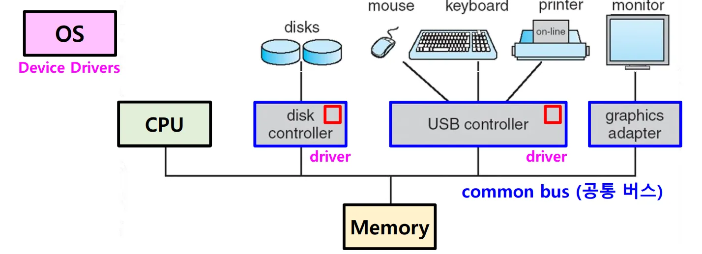
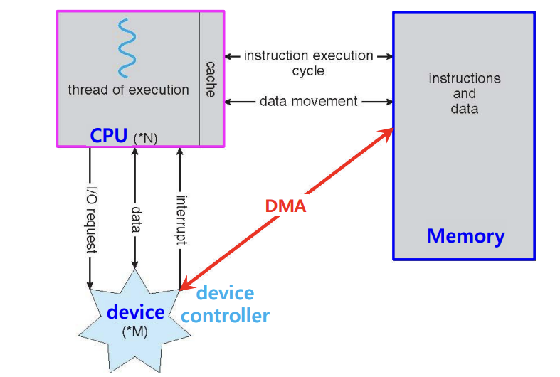

## 📖 버스 구조

### 시스템 버스

- CPU에 비해 입출력 장치들이 느리고, 직접 컨트롤하기에는 입출력 장치들이 너무 다양함
- 이를 중간에서 제어하는 역할을 하는 것이 시스템 BUS
- CPU, 메모리, I/O 장치 간 데이터를 주고받는 공용 경로

 

### 버스 종류

#### 데이터 버스

- CPU ↔ 메모리, CPU ↔ I/O 간 메모리 전달
- 선의 개수에 따라 한 번에 이동할 수 있는 비트 수 결정 (32/64/128/…)
    - 32bit CPU — 워드 (CPU가 한번에 처리하는 데이터 크기) 32bit — 데이터버스 32bit

#### 주소 버스 

- 메모리 주소 전달
- CPU(의 MAR)에서 주기억장치로 메모리 주소값을 전달하는 역할만 함 ∴ 단방향 통신
- 주소 버스의 폭이 기억 장치의 용량 결정

#### 제어 버스

- 데이터 버스, 주소 버스 제어
- CPU에서 입출력장치에 동작을 지시하기 위해 보내는 제어신호 전달
- CPU ↔ 메모리/장치 간 신호 전달

 

## 📖 I/O

### I/O 장치 특성

#### 다양한 종류

- 입출력장치는 종류가 매우 다양함
    - 키보드, 모니터, USB 메모리, 마우스, …
- 다양한 입출력장치와 정보를 주고받는 방식을 규격화하기 어려움

#### CPU, 메모리와의 데이터 전송률 차이 

> 전송률 (transfer rate): 데이터를 얼마나 빨리 교환할 수 있는지 나타내는 지표
> 
> 
> 전송률이 높을수록 같은 시간 내 수많은 데이터를 주고받을 수 있음 
> 
- 입출력장치는 CPU, 메모리와 전송률이 비슷하지 않아 통신에 어려움 있음
- 일반적으로 CPU는 전송률 높고, 입출력장치는 전송률 낮음

 

### 장치 컨트롤러

> Device Controller (= 입출력 제어기 (I/O controller), 입출력 모듈 (I/O module))
> 
- 입출력장치는 상기의 특성으로 인해 CPU와 직접 연결되기보다 중개 요소가 필요
- 입출력장치와 컴퓨터를 연결하는 **하드웨어**가 장치 컨트롤러
- 모든 입출력장치는 각자의 장치 컨트롤러를 통해 컴퓨터 내부와 정보를 주고받고, 장치 컨트롤러는 하나 이상의 입출력장치와 연결되어 있음

#### 장치 컨트롤러의 역할 

- CPU ↔ 입출력장치 간 통신 중개
- 오류 검출
- 데이터 버퍼링
    - 데이터 버퍼링을 통해 CPU ↔ 입출력장치 간 전송률 차이 완화

#### 장치 드라이버

> Device Driver

- 장치 컨트롤러가 컴퓨터 내부와 정보를 주고받을 수 있게 하는 프로그램
- 입출력장치를 연결하기 위한 **소프트웨어적** 통로

 

### I/O 방법의 종류

#### 프로그램된 I/O (= 폴링 방식)

- CPU가 반복적으로 I/O장치 상태를 검사해 동작 처리
- 상태 비트를 주기적으로 검사
- 간단하지만 CPU 낭비 심함

#### 인터럽트 기반 I/O

- CPU가 입출력장치에 작업 요청 → 인터럽트 있을 때만 확인
- CPU는 그동안 다른 작업 수행할 수 있어 효율적
- 인터럽트가 많으면 오버헤드 가능성

#### DMA I/O

> DMA (Direct Memory Access)
> 

- 장치 ↔ 메모리 간 데이터 전송을 CPU 개입 없이 수행
- 장치 컨트롤러의 처리 동안 CPU는 다른 일을 처리할 수 있어 효율적
- 대량 데이터 전송 (블록 단위 데이터 전송)에  효과적
- 버스 충돌 (메모리 접근 경합) 문제 고려 필요