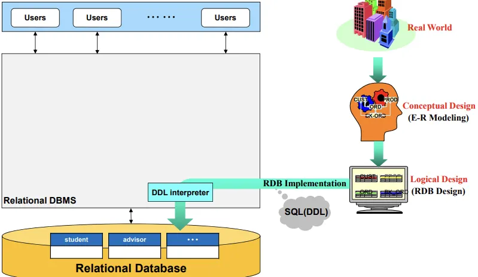
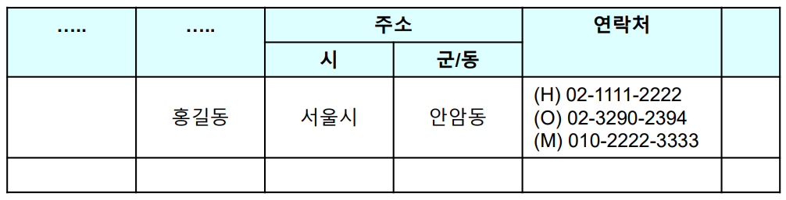
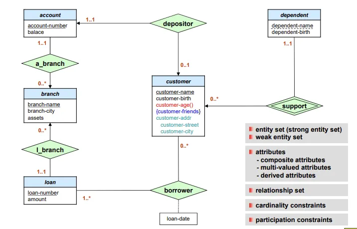
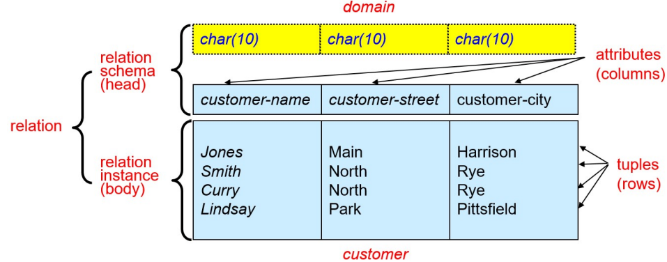
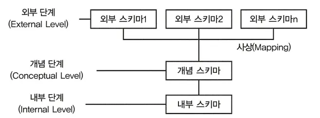

## 📖 데이터 모델

> 데이터베이스의 설계는 **현실 세계의 데이터를 구조적으로 표현하는 것**에서 출발한다.
> 
> 
> 이를 위한 틀이 바로 **데이터 모델(data model)** 이며, 그 결과물이 **스키마(schema)** 다.
> 

### 데이터 모델 (Data Model)

#### 개념

- 데이터를 구조적이고 일관성 있게 표현하기 위한 도구들의 집합
- 데이터 모델이 정의하는 것…
    - **데이터 구조 (data structures)** → 어떤 형태로 저장할 것인가
    - **데이터 관계 (data relationships)** → 데이터 간 관계는 어떤가
    - **데이터 의미 (data semantics)** → 데이터가 의미하는 바는 무엇인가
    - **제약조건 (constraints)** → 데이터 값에 어떤 제약이 있는가

#### 주요 데이터 모델 종류

|  | 설명 | 예시 |
| --- | --- | --- |
| **관계형 모델 (Relational Model)** | 데이터를 **테이블(행, 열)** 형태로 표현 | MySQL, PostgreSQL, Oracle |
| **E-R 모델 (Entity–Relationship Model)** | 개체와 관계를 이용한 설계 중심 모델 | ERD (개념적 설계 시 사용) |
| **객체지향 모델 (Object-based Model)** | 객체와 클래스 기반 구조 | ObjectDB, ORM 기반 시스템 |
| **반정형 모델 (Semi-structured Model)** | 스키마가 느슨한 데이터 표현 | JSON, XML |
| **계층/네트워크 모델 (Old Models)** | 트리/그래프 형태의 구조 | IMS, CODASYL 등 |

 

### 데이터 모델링 단계

| 단계 | 설계자 관점 | 설명 | 결과물 |
| --- | --- | --- | --- |
| **개념적 모델링** | 사용자의 관점 | 현실 세계의 개념을 개체(Entity)와 관계(Relationship)로 표현 | ER 다이어그램 |
| **논리적 모델링** | DB 설계자의 관점 | ERD를 관계형 모델 등으로 변환 | 관계 스키마(Relation Schema) |
| **물리적 모델링** | 개발자/DBA 관점 | 실제 물리적 저장 구조 설계 | 인덱스, 파일 구조 등 |

 

## 📖 데이터 모델 구성 요소

### 개체 (Entity), 속성 (Attribute), 관계 (Relationship)

#### 개체 (Entity)

- 현실 세계에서 **독립적으로 존재하는 객체나 개념**
- 일반적으로 명사형 (예: 학생, 주문, 상품)
- **Entity Set**: 같은 속성을 가진 개체들의 집합

#### 속성 (Attribute)

- 개체가 가지는 **특성값**
- 속성은 **도메인(Domain)** 이라는 값의 범위를 가진다.
    
    예: `학년`의 도메인은 `{1, 2, 3, 4}`
    
- 속성 유형
    
    
    | 속성 유형 | 설명 | 예시 |
    | --- | --- | --- |
    | 단순 속성(Simple) | 더 이상 나눌 수 없음 | 이름, 학번 |
    | 복합 속성(Composite) | 여러 하위 속성으로 구성 | 주소(도시, 도로명, 우편번호) |
    | 단일 값 속성(Single-valued) | 하나의 값만 가짐 | 주민번호 |
    | 다중 값 속성(Multivalued) | 여러 값을 가짐 | 전화번호, 이메일 |
    | 유도 속성(Derived) | 다른 속성으로 계산 | 나이 = 오늘날짜 – 생년월일 |
    
    
    주소: composite attribute / 연락처: mutlivalued attribute
    
 

### 키 (Key)

: 데이터베이스에서 특정 튜플(행)을 식별하기 위한 속성의 집합

| 키 종류 | 설명 | 예시 |
| --- | --- | --- |
| **슈퍼키 (Superkey)** | 튜플을 유일하게 식별할 수 있는 속성들의 집합 | {학번}, {학번, 이름} |
| **후보키 (Candidate Key)** | 최소한의 속성으로 구성된 슈퍼키 | {학번} |
| **기본키 (Primary Key)** | 후보키 중 대표로 선택된 키 (NULL 불가, 중복 불가) | 학번 |
| **대체키 (Alternate Key)** | 기본키로 선택되지 않은 나머지 후보키 | 이메일 |
| **외래키 (Foreign Key)** | 다른 테이블의 기본키를 참조하는 속성 | 주문 테이블의 고객 ID |

 

### 제약 조건 (Constraints)

: 데이터의 무결성 (integrity)을 유지하기 위해 데이터가 지켜야 하는 규칙

| 구분 | 설명 | 예시 |
| --- | --- | --- |
| **개체 무결성 (Entity Integrity)** | 기본키는 NULL일 수 없음 | 학번은 반드시 존재해야 함 |
| **참조 무결성 (Referential Integrity)** | 외래키는 존재하는 기본키만 참조 | 없는 고객 ID 주문 금지 |
| **도메인 무결성 (Domain Integrity)** | 속성 값은 지정된 타입과 범위를 지켜야 함 | 나이는 정수, 0보다 커야 함 |
| **사용자 정의 무결성 (User-defined Integrity)** | 업무 규칙 기반의 제약 | 급여는 100만 원 이상이어야 함 |
- 개체/참조 무결성은 필수
- 나머지는 설계에 따라 추가 정의 가능

 

## 📖 ER 모델 (Entity-Relationship Model)

: 개념적 설계 단계에서, 현실 세계를 개체(entity)와 관계(relationship)로 시각화한 모델

### 주요 구성 요소

- Entity (사각형)
- Relationship (마름모)
- Attribute (타원)
- Cardinality (관계의 수적 제약)
    - 1:1, 1:N, N:M

### 예시

 

## 📖 스키마 (Schema)

### 스키마 (Schema) & 인스턴스 (Instance)

- 스키마: 데이터베이스의 구조적 설계도. 데이터베이스의 청사진
- 인스턴스: 스키마 구조 내에 저장된 실제 데이터 상태

 

### 스키마 3단계 구조

| 단계 | 관점 | 설명 |
| --- | --- | --- |
| **외부 스키마 (External Schema)** | 사용자/응용 관점 | 개별 사용자가 보는 데이터 구조 (View) |
| **개념 스키마 (Conceptual Schema)** | 설계자 관점 | 전체 데이터베이스의 논리적 구조 |
| **내부 스키마 (Internal Schema)** | 개발자/DBA 관점 | 실제 물리적 저장 구조 (파일, 인덱스 등) |

 

### 데이터 독립성 (Data Independence)

: 상위 단계의 구조 변경이 하위 단계에 영향을 주지 않는 성질 

| 구분 | 의미 | 예시 |
| --- | --- | --- |
| **논리적 독립성 (Logical Independence)** | 개념 스키마 변경 시 외부 스키마에 영향 없음 | 새로운 속성 추가해도 사용자 View는 그대로 |
| **물리적 독립성 (Physical Independence)** | 내부 구조 변경 시 개념 스키마에 영향 없음 | 저장 경로·인덱스 변경해도 SQL 그대로 사용 가능 |