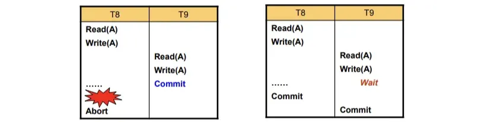
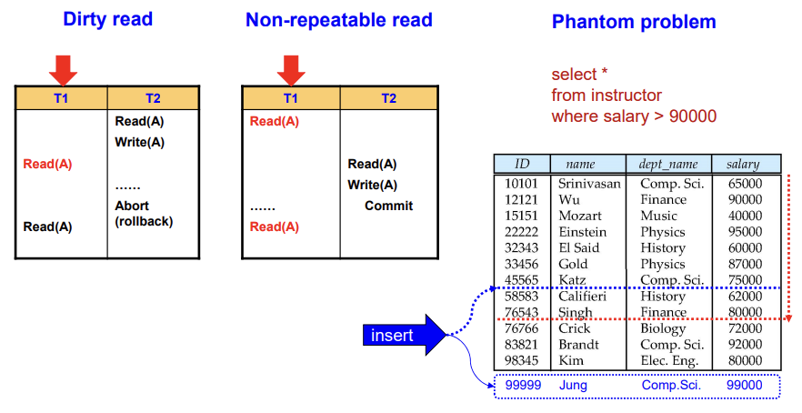

## 📖 트랜잭션 (Transaction)

- 데이터베이스의 상태를 변화시키는 하나 이상의 연산들의 논리적 단위
    
    (하나의 완전한 작업 단위)
    
- 트랜잭션은 여러 개의 SQL 문장(`INSERT`, `UPDATE`, `DELETE`, …)으로 구성될 수 있음
- (ex)
    
    ```sql
    BEGIN TRANSACTION
    UPDATE account SET balance = balance - 50 WHERE name = 'A';
    UPDATE account SET balance = balance + 50 WHERE name = 'B';
    COMMIT;
    ```
    
<br>

### 트랜잭션의 주요 목적

- 데이터 무결성 보장 (Integrity)
- 데이터 일관성 유지 (Consistency)
- 장애 발생 시 복구 가능성 보장 (Recovery)
- 동시성 제어의 기본 단위 제공 (Concurrency Control)

<br>

### 트랜잭션 스케줄

- 여러 트랜잭션이 수행될 때의 실행 순서
- 한 트랜잭션 내 명령어들의 실행 순서를 순차적으로 나열한 것
- 각 트랜잭션은 다음 중 하나로 끝남
    - `COMMIT` : 성공적으로 완료
    - `ROLLBACK`: 실패로 인해 취소

#### Serial vs. Concurrent Schedule

| 구분 | 설명 | 특징 |
| --- | --- | --- |
| **Serial Schedule** | 한 트랜잭션이 끝나야 다른 트랜잭션 시작 | 완전한 Isolation, 느림 |
| **Concurrent Schedule** | 여러 트랜잭션이 interleaving(교차) 실행 | 빠름, 일관성 위험 |

#### Recoverable schedule




- 실패한 트랜잭션의 영향이 다른 트랜잭션에 전파되지 않는 것
- T2가 T1이 수정한 데이터를 읽었다면, T2는 반드시 T1이 Commit된 후에 Commit해야 함.
- 이 조건이 만족되지 않으면 연쇄 롤백 (cascade rollback) 발생 위험

<br>

### 트랜잭션 관련 주요 이슈

- **시스템 장애 (System Failure)**
    - 하드웨어 오류, 시스템 다운, 전원 차단 등
- **동시 실행 (Concurrency)**
    - 여러 트랜잭션이 동시에 실행될 때 발생하는 충돌 문제

⇒ DBMS는 트랜잭션의 정상적인 수행과 비정상적인 상황 모두를 다룰 수 있어야 함 

<br>

### 트랜잭션 격리 수준

#### 발생 가능한 문제



| 문제 유형 | 설명 |
| --- | --- |
| **Dirty Read** | 커밋되지 않은 트랜잭션의 데이터를 읽음 |
| **Non-repeatable Read** | 같은 데이터를 두 번 읽었을 때 값이 달라짐 |
| **Phantom Read** | 다른 트랜잭션이 새 데이터를 삽입/삭제해서 조회 결과가 달라짐 |

#### 격리 수준에 따른 이슈

| 수준 | Dirty Read | Non-repeatable Read | Phantom | 설명 |
| --- | --- | --- | --- | --- |
| **Read Uncommitted** | Y | Y | Y | 트랜잭션 미커밋 데이터 읽기 가능 |
| **Read Committed** | - | Y | Y | 커밋된 데이터만 읽음 |
| **Repeatable Read** | - | - | Y | 같은 데이터 재조회 시 동일 보장 |
| **Serializable** | - | - | - | 완전한 고립, 직렬 스케줄과 동일 |
- 모든 어플리케이션이 완벽한 일관성을 요구하는 것은 아니기에, 일부는 약한 수준으로도 충분
- 일반적으로 대부분의 RDBMS는 Read Committed 또는 Repeatable Read를 기본으로 함

<br>

## 📖 ACID 원칙

> 트랜잭션이 올바르게 수행되기 위해 반드시 지켜야 하는 4가지 속성
> 
> Atomicity, Consistency, Isolation, Durability
> 

### Atomicity (원자성)

- 트랜잭션의 모든 연산은 전부 수행되거나, 전혀 수행되지 않아야 함.
- 트랜잭션은 쪼갤 수 없는 단위라는 뜻
- DBMS는 로그를 이용해 실패 시 원래 상태로 복구해야 함
- 복구 매커니즘 (recovery mechanism)으로 보장됨

<br>

### Consistency (일관성)

- 트랜잭션 수행 전과 수행 후의 DB는 항상 일관성 있는 상태를 유지해야 함
- 트랜잭션 수행 중에는 일시적으로 불일치가 발생할 수 있음
- 성공적인 트랜잭션 종료 후에는 반드시 제약조건들을 만족해야 함
    
    
    |  | ex |
    | --- | --- |
    | **명시적 제약 (Explicit)** | PRIMARY KEY, FOREIGN KEY, CHECK |
    | **암묵적 제약 (Implicit)** | “모든 계좌의 합계는 일정해야 한다” 등 |
- 잘못된 트랜잭션 로직은 DB의 무결성 제약은 보장할 수 있으나, 비즈니스 로직을 깨뜨릴 수 있음

<br>

### Isolation (고립성)

- 여러 트랜잭션이 동시에 실행될 때, 서로의 중간 상태를 볼 수 없어야 함
- 트랜잭션 실행 중 일시적으로 비일관적인 상태의 db에 다른 트랜잭션이 접근하지 않도록
- 완전한 isolation을 위해선 순차적으로 실행하면 되지만 → 성능 저하로 그렇게 하지 않음
- 동시성 제어 (concurrency control)로 격리 수준 조절 가능

<br>

### Durability (지속성)

- 트랜잭션이 성공적으로 완료 commit되면, 그 결과는 시스템 장애가 발생해도 손실되지 않아야 함
- 데이터를 메모리 버퍼 → 디스크로 반영
- commit된 데이터는 복구 가능해야 함
- 복구 매커니즘에 의해 보장됨

<br>

### ACID Summary

| 속성 | 의미 | 보장 수단 |
| --- | --- | --- |
| **A - Atomicity** | 트랜잭션은 전부 수행되거나 전혀 수행되지 않음 | Undo / Rollback |
| **C - Consistency** | 트랜잭션 전후 DB는 항상 일관성 유지 | 제약조건, 논리적 검증 |
| **I - Isolation** | 동시에 실행돼도 서로 영향 X | Lock, Isolation Level |
| **D - Durability** | Commit된 결과는 영구 보존 | Redo / Log, Checkpoint |