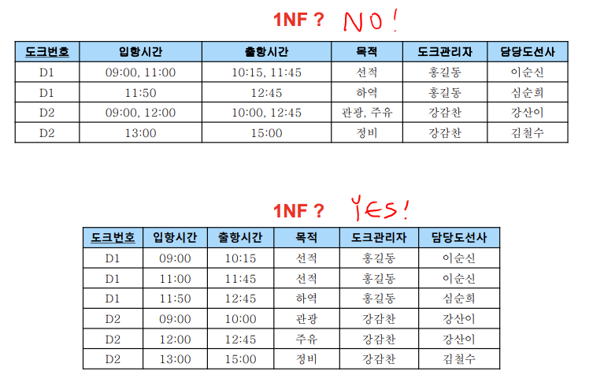
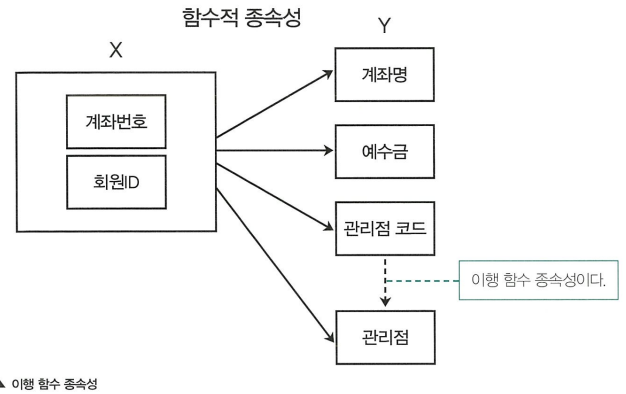
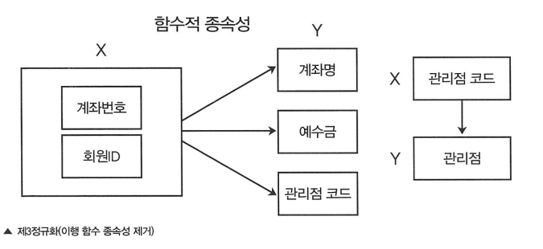

## 📖 함수적 종속성 (Functional Dependency)

- 한 속성 (또는 속성 집합)이 다른 속성 값을 유일하게 결정할 때, **함수적 종속성**이 있다고 함
- 정규화의 핵심 개념

#### `X → Y`

- “X가 Y를 결정한다” = X가 바뀌면 Y도 같이 바뀜 = Y가 X에 함수적으로 종속됨
- X: 결정자, Y: 종속자

#### 예시 

| 학번 | 이름 | 전공 |
| --- | --- | --- |
| 2024001 | 김민수 | 컴퓨터공학 |
| 2024002 | 이서연 | 통계학 |
- 학번 → 이름, 학번 → 전공
- (학번이 바뀌면 나머지도 달라짐)

<br>

## 📖 정규화 (Normalization)

: 데이터 중복을 최소화하면서 이상현상 (anomaly)을 제거하기 위한 테이블 분해 과정

- **삽입 이상**: 불필요한 데이터까지 같이 입력해야 함
- **갱신 이상**: 중복 데이터 중 일부만 수정되어 불일치 발생
- **삭제 이상**: 특정 데이터 삭제 시 필요한 데이터까지 사라짐

<br>

### 정규화 단계별 요약

| 정규형 | 핵심 조건 | 제거되는 종속성 | 설명 |
| --- | --- | --- | --- |
| **1NF** | 모든 속성이 **원자값(atomic)** | 다중값 | 컬럼 값은 나눌 수 없는 단일 값 |
| **2NF** | **부분 함수 종속성 제거** | 기본키 일부에 종속 | 기본키가 복합키일 때 발생 |
| **3NF** | **이행 함수 종속성 제거** | 기본키 아닌 컬럼 간 종속 | 예: A→B, B→C 인 경우 A→C 제거 |
| **BCNF** | 모든 결정자가 **슈퍼키** | 후보키 간 종속 | 3NF보다 더 엄격한 형태 |
| **4NF** | **다중값 종속성 제거** | 하나의 키가 여러 독립 속성을 결정 | 예: 한 학생이 여러 과목과 동아리 |
| **5NF** | **조인 종속성 제거** | 조인으로만 종속된 경우 | 실무에선 거의 사용 X |
- 각 정규화는 순차적으로 진행 (제1정규화 → 제2정규화 → …)
- 실무에서는 대부분 3NF ~ BCNF까지만 수행

<br>

### 제1정규화 (1NF, First Normal Form)

: 원자성 확보

- 모든 속성의 값이 더 이상 쪼갤 수 없는 단일값 (atomic)
- 중첩된 데이터를 별도 테이블로 분리

#### 예시



- 중첩된 데이터를 데이터 하나당 한 행을 갖도록 분리

<br>

### 제2정규화 (2NF)

: 부분 함수 종속 제거

- 복합키 (두 개 이상의 컬럼)중 일부에만 종속된 속성 분리
- 기본키가 하나인 경우 2NF는 자동 만족

#### 예시

| (주문ID, 제품ID) | 제품명 | 수량 | 단가 |
| --- | --- | --- | --- |
| 1, A | 마우스 | 2 | 10,000 |
| 1, B | 키보드 | 1 | 20,000 |
- `제품명`, `단가`는 `제품ID` 속성에만 종속됨
- → `제품`이라는 새 테이블로 분리

<br>

### 제3정규화 (3NF)

: 이행 함수 종속 제거

- 기본키 외의 컬럼 간 종속성 제거

#### 예시

- 이행 함수 종속성 발생: 관리점 코드가 관리점을 함수적으로 종속
    
    
    
- 이행 함수 종속성 제거: 분해해 새로운 테이블 도출
    
    
    
<br>

### BCNF (Boyce-Codd Normal Form)

- 모든 결정자가 슈퍼키여야 함
    - 존재하는 모든 함수적 종속성 중 좌변(X)가 슈퍼키 역할을 해야 함
- 후보키 간 종속성 문제 해결

#### 슈퍼키 (superkey)

- 튜플을 유일하게 식별할 수 있는 속성(들의 집합)
- `학생(학번, 이름, 생년월일, 전화번호)` 에서 가능한 슈퍼키는
    - `{학번}`, `{이름, 생년월일, 전화번호}`, `{전화번호}` 등
    - `{이름}` 은 중복 가능하므로 슈퍼키 x
- 어떤 속성 집합이 모든 속성을 함수적으로 결정하면 그 속성 집합이 슈퍼키

#### 예시 1

```
R(ID, name, salary, dept_name, building, budget)
```

- 함수적 종속:
    - `ID` → `ID`, `name`, `salary`, … (pk)
    - `dept_name` → `building`, `budget`
- 여기서 `dept_name`이 슈퍼키가 아님 ⇒ BCNF 위반
- 해결: 별도 테이블 `R2(dept_name, building, budget)` 분리

#### 예시 2

```
Class(학번, 과목, 교수)
```

- 함수적 종속:
    - `(학번, 과목)` → `교수`
    - `교수` → `과목`
- 여기서 `교수`가 슈퍼키가 아님
- 해결: 별도 테이블 `R2(교수, 과목)`  분리

<br>

## 📖 반정규화 (Denormalization)

: 정규화로 인한 조인 과다로 성능이 저하될 때, 성능 향상을 위해 일부 중복을 허용하는 과정

### 반정규화 목적

- 조회(SELECT) 속도 향상
- 조인(JOIN) 횟수 감소
- 집계, 요약 쿼리 단순화

<br>

### 반정규화 단점

- 데이터 **중복 발생** → 수정 시 일관성 깨질 수 있음
- **쓰기 성능 저하** (여러 테이블 동시 갱신 필요)

<br>

### 반정규화를 수행하는 경우

- 조인이 너무 많아 쿼리 성능이 저하되는 경우
- 데이터가 매우 자주 조회되고 거의 갱신되지 않는 경우
- 대용량 통계, 리포트용 쿼리 (ex. 매출 요약, 주문 통계)

<br>

### 반정규화 기법

| 구분 | 설명 | 예시 |
| --- | --- | --- |
| **계산된 컬럼 추가** | 미리 계산해 저장 | 총판매액, 평균점수 |
| **테이블 병합** | 1:1 또는 1:N 테이블 통합 | 고객 + 주문 정보 |
| **수평 분할** | 특정 조건으로 행 나누기 | 지역별 고객 테이블 |
| **수직 분할** | 자주 쓰는 컬럼만 별도 테이블 | 로그인용 최소정보 테이블 |
| **요약 테이블 추가** | 통계용 별도 테이블 | 월별 매출 요약 테이블 |

<br>

## 💭 정규화 vs. 반정규화 Summary

| 구분 | 정규화 | 반정규화 |
| --- | --- | --- |
| 목적 | 데이터 일관성, 무결성 확보 | 성능 향상, 조인 감소 |
| 데이터 중복 | 최소화 | 허용 |
| 설계 복잡도 | 높음 | 단순 |
| 조인 비용 | 증가 | 감소 |
| 적용 시점 | 설계 초기 | 성능 문제 발생 시 |
| 사용 예시 | 은행, ERP, 회계시스템 | 로그, 통계, 리포트 DB |