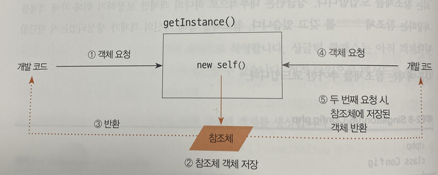
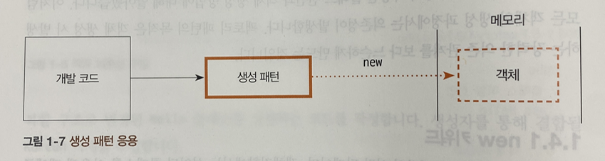

## 📝 디자인 패턴 (Design Pattern)

- 소프트웨어 설계 과정에서 자주 등장하는 문제를 해결하기 위해 만들어진 재사용 가능한 설계 템플릿
- 객체와 클래스 간 역할, 협력 구조의 재사용에 초점
- 프레임워크와 달리 구현보다는 설계 구조를 제공
- 목적: 설계 문제의 표준화, 객체 간 의존성 감소, 확장성 및 유지보수성 향상

<br>

## 📖 싱글톤 패턴 (Singleton Pattern)

- 프로그램 전체에서 **하나의 인스턴스만 존재**하도록 보장하는 패턴
- 공통 객체를 여러 곳에서 공유해야 할 때 사용
- 이미 생성된 인스턴스가 있으면 그대로 반환, 없다면 새로 생성
- 전역 상태를 관리하거나, 객체 생성 비용이 큰 경우에 유용

<br>

### 싱글톤이 필요한 이유

- **객체 생성 비용 절감**(DB 커넥션 등 heavy object)
- **전역 상태 관리** (설정, 로깅)
- **일관성 유지** (여러 모듈에서 동일 객체 공유)
- **리소스 공유** 필요할 때

<br>

### 싱글톤 패턴 작동




#### 예시

```python
class SingletonMeta(type):
    _instances = {}

    def __call__(cls, *args, **kwargs):
        if cls not in cls._instances:
            cls._instances[cls] = super().__call__(*args, **kwargs)
        return cls._instances[cls]

class Logger(metaclass=SingletonMeta):
    pass

a = Logger()
b = Logger()

print(a is b)  # True
```
<br>

### 장단점

| 장점 | 단점 |
| --- | --- |
| 인스턴스 하나 공유로 메모리 절약 | 전역 상태 공유 → 디버깅 어려움 |
| 객체 생성 비용 절감 | 테스트 어려움 (mocking 어려움) |
| 리소스 관리에 적합 | DIP 위반 가능(의존성 강해짐) |
| 일관된 접근 경로 제공 | 남용 시 유지보수 악화 |

<br>

### 싱글톤을 사용하면 좋은 경우

- DB 커넥션 풀(Connection Pool)
- 캐시(Cache) 관리 객체
- 로깅(Logger)
- 환경 설정(Configuration)
- 스레드 풀(Thread Pool)

<br>

## 📖 팩토리 패턴 (Factory Pattern)

- **객체 생성 로직을 별도 팩토리에서 담당**하는 패턴
- 클라이언트는 “무엇을 만들지”만 알고 “어떻게 만드는지”는 팩토리가 책임짐
- 객체 생성과 사용을 분리 → 결합도 감소

<br>

### 팩토리 패턴 작동



#### 예시

```python
class Animal():
	def speak(self):
		pass

class Cat(Animal):
	def speak(self):
		print("meow")

class Dog(Animal):
	def speak(self):
		print("bark")

def FactoryFn(animal:str) -> Animal:
	if animal == "Cat":
		return Cat()
	elif animal == "Dog":
		return Dog()

cat = FactoryFn("Cat")
cat.speak()

dog = FactoryFn("Dog")
dog.speak()
```

<br>

### 장단점

| 장점 | 단점 |
| --- | --- |
| 객체 생성 로직 캡슐화 | 클래스 수 증가 가능 |
| OCP 만족(확장에 유리) | 구조 복잡도 증가 |
| 클라이언트가 생성 방식을 몰라도 됨 | 초기 설계 시간 증가 |
| 테스트 쉬움(Mock 생성 용이) | 과사용하면 불필요한 추상화 |

<br>

### 팩토리를 사용하면 좋은 경우

- 생성해야 하는 객체 종류가 많을 때
- 객체 생성 기준이 자주 바뀌는 시스템
- 제품군(Theme, OS별 기능 등)에 따라 생성되는 객체가 다를 때
- 클라이언트가 객체 생성 방식을 몰라야 할 때

<br>

## 💭 싱글톤 vs. 팩토리

| 항목 | 싱글톤 | 팩토리 |
| --- | --- | --- |
| 목적 | 인스턴스 단 하나 보장 | 객체 생성 로직 분리 |
| 초점 | “몇 개 만들까?” | “어떻게 만들까?” |
| 장점 | 메모리 절약, 일관성 유지 | 유연성, 확장성 |
| 단점 | 전역 상태 위험 | 구조 복잡 가능성 |

