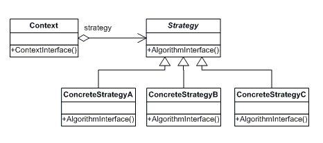

## 📖 전략 패턴 (Strategy Pattern)

- **알고리즘을 전략 객체로 캡슐화하여**, 실행 중에 알고리즘을 자유롭게 교체할 수 있도록 만든 패턴
- 클라이언트는 “무슨 전략을 쓸지”만 주입하면 되고, 내부 로직은 전략이 처리함
- if/else 분기문을 제거하고 유연성을 확보할 수 있음
- 동일한 문제 해결 방식이 여러 개일 때 적합

<br>

### 전략 패턴 구조

```python
[Context] ----> [Strategy Interface] ----> [Concrete Strategies]
     |                       |                     |
     |--- set_strategy() ----|---- execute() ------|

```

- **Context**: 전략을 사용하는 클라이언트
- **Strategy Interface**: 알고리즘의 공통 인터페이스
- **Concrete Strategy**: 알고리즘의 실제 구현체

<br>

### 전략 패턴 작동



#### 예시

```python
class SortStrategy:
    def sort(self, data):
        pass

class QuickSort(SortStrategy):
    def sort(self, data):
        print("퀵정렬 수행")

class MergeSort(SortStrategy):
    def sort(self, data):
        print("병합정렬 수행")

class DataList:
    def __init__(self, strategy: SortStrategy):
        self.strategy = strategy

    def set_strategy(self, strategy: SortStrategy):
        self.strategy = strategy

    def execute(self, data):
        self.strategy.sort(data)

d = DataList(QuickSort())
d.execute([1,2,3])
d.set_strategy(MergeSort())
d.execute([1,2,3])

```

<br>

### 장단점

| 장점 | 단점 |
| --- | --- |
| if-else 제거 → 코드 깔끔 | 전략 클래스 수 증가 |
| 알고리즘 교체가 매우 쉬움 | 구조가 커질 수 있음 |
| OCP(확장에 열려 있음) 만족 | 클라이언트가 전략 선택 필요 |
| 단위 테스트 쉬움 | - |

<br>

### 전략 패턴이 좋은 경우

- 실행 시점에 알고리즘을 바꿔야 할 때
- 조건문 지옥(if/elif/else)을 제거하고 싶을 때
- 할인 정책/정렬 방식/로그 출력 방식 등 **동작의 다양성**이 필요할 때
- AI 모델 전환, 추천 알고리즘 변경 등 "교체 가능한 로직"이 많을 때

<br>

## 📖 템플릿 메서드 패턴 (Template Method Pattern)

- 하위 클래스에서 구체적으로 처리하는 디자인 패턴
- 알고리즘의 전체 흐름(템플릿)은 부모 클래스가 정의하고 일부 단계(훅 메서드)는 **자식 클래스가 오버라이드**하여 구현하는 패턴
- 공통 구조는 유지하면서, 세부 동작만 다양화하고 싶을 때 사용
- 상위 클래스: **알고리즘의 전체 골격(Template Method)** 정의
- 하위 클래스: 필요한 단계만 **오버라이드(override)** 해서 커스텀
- 알고리즘의 흐름은 고정되어 있어 변경되면 안 됨
- 중복 로직 제거 + 일관된 처리 흐름 보장

<br>

### 템플릿 메서드 구조

```python
[Abstract Class]
   ├── template_method()  ← 알고리즘의 전체 흐름
   ├── step1()
   ├── step2()
   └── step3()

[Concrete Class A] → step2() 재정의  
[Concrete Class B] → step2() 재정의  
```

<br>

### 템플릿 메서드 작동


#### 예시

```python
from abc import ABC, abstractmethod

class DataPipeline(ABC):
    def run(self):
        self.load()
        self.process()
        self.save()

    @abstractmethod
    def load(self):
        pass

    @abstractmethod
    def process(self):
        pass

    def save(self):
        print("데이터 저장 완료")

class CSVDataPipeline(DataPipeline):
    def load(self):
        print("CSV 파일 로드")

    def process(self):
        print("CSV 데이터 처리")

class APIDataPipeline(DataPipeline):
    def load(self):
        print("API 호출하여 데이터 로드")

    def process(self):
        print("API 데이터 변환")

pipeline = CSVDataPipeline()
pipeline.run()

```

<br>

### 장단점

| 장점 | 단점 |
| --- | --- |
| 알고리즘 흐름을 강제하여 안정적인 구조 확보 | 상속 기반 → 유연성(조합성) 떨어짐 |
| 중복 코드 제거 | 자식 클래스가 너무 많아질 수 있음 |
| 공통 로직 재사용 ↑ | 패턴 남용 위험 |
| 일관된 프로세스 보장 | 변경 시 부모 클래스 영향 큼 |

<br>

### 템플릿 메서드가 좋은 경우

- 처리 흐름은 동일하지만 세부 동작만 다른 경우
- 예:
    - 문서 생성 방식 다름 (PDF / Word / HTML)
    - 결제 프로세스의 세부 검증만 다름
    - 데이터 수집 방식만 다른 ETL 파이프라인
    - 뉴스레터, 리포트 자동 생성, 분석 프로세스

<br>

## 💭 전략 패턴 vs. 템플릿 메서드

### 공통점과 차이점

|  | 전략(Strategy) | 템플릿 메서드(Template Method) |
| --- | --- | --- |
| 핵심 개념 | 알고리즘 교체 가능 (구성 기반) | 알고리즘 틀 고정 + 단계만 재정의 (상속 기반) |
| 중심 원리 | 객체 위임 (Composition) | 상속(Inheritance) |
| 사용 상황 | 여러 알고리즘을 바꿔가며 사용 | 공통 흐름 유지 + 일부만 다양해야 함 |
| 유연성 | 매우 높음 | 낮음(상속 구조 고착) |
| 예시 | 결제 방식, 정렬 방식, 추천 알고리즘 | 템플릿 기반 문서 생성, 파이프라인 |

<br>

### 각 패턴을 사용하면 좋은 경우

| 상황 | 적합한 패턴 |
| --- | --- |
| 프로세스의 전체 흐름은 동일하되, 세부 단계만 달라질 때 | **템플릿 메서드** |
| 알고리즘 자체가 완전히 달라질 수 있고, 유연하게 교체해야 할 때 | **전략 패턴** |
| if-else 조건이 많아지는 상황을 해결하고 싶을 때 | **전략 패턴** |
| 상속으로 공통 로직 공유 + 일부 기능만 다양화 | **템플릿 메서드** |