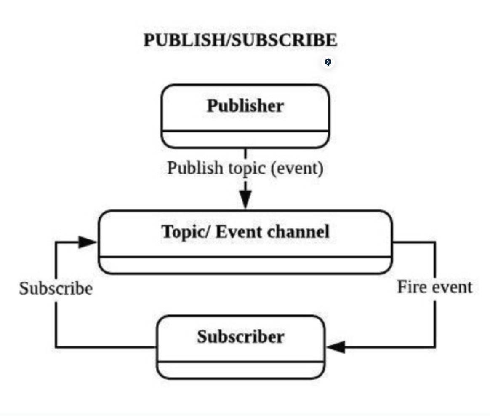

## 📖 옵저버 패턴 (Observer Pattern)

- **한 객체(Subject)의 상태 변화**를 여러 객체(Observer)에게 **자동으로 알리는 패턴**
- Subject는 자신의 상태 변화가 발생할 때 Observer에게 직접 통지(`notify`)함
- **일대다(1:N) 의존관계**를 느슨하게 구성할 때 사용

<br>

### 작동 방식


1. `Observer`가 `Subject`에 등록(subscribe)
2. `Subject` 상태 변경
3. `Subject → Observer`에게 직접 알림(notify)
4. `Observer`는 콜백 메서드로 변화 대응

#### Observer & Object

| Observer | Object |
| --- | --- |
| 객체의 변화를 감지하는 감시자 | 관찰 대상 |
| 객체의 상태 변화가 있으면 동작하는 메서드 있음 | 옵저버를 추가하고, 변화가 생기면 옵저버에 알림  |

#### 예시

```python
class Subject:
    def __init__(self):
        self.observers = []
        self.state = None

    def attach(self, observer):
        self.observers.append(observer)

    def set_state(self, state):
        self.state = state
        self.notify()

    def notify(self):
        for obs in self.observers:
            obs.update(self.state)

class Observer:
    def update(self, state):
        print(f"상태 변경 감지 → {state}")

subj = Subject()
subj.attach(Observer())
subj.set_state("새 데이터 도착!")
```

<br>

### 장단점

| 장점 | 단점 |
| --- | --- |
| 객체 간 자동 알림으로 편리 | 객체 간 의존성이 존재 → 결합도 ↑ |
| 일관성 있는 업데이트 보장 | Observer가 많아지면 Subject가 과부하 |
| 구현 간단 | 확장 어려움 |

<br>

## 📖 퍼블리셔-서브스크라이버 패턴 (Pub-Sub Pattern)

- 메시지를 전달하는 **퍼블리셔와** 메시지를 받는 **서브스크라이버를 직접 연결하지 않음**
- 중간 메시지 브로커(Message Broker)가 존재해 서로 완전히 디커플링
- 퍼블리셔는 브로커에 “이 이벤트 발행할게!” 하고
    
    서브스크라이버는 브로커로부터 “이 이벤트 받으면 나에게 알려줘!”라고 등록
    
<br>

### 작동 방식




1. `Publisher` → `Broker` 에 메시지 publish
2. `Subscriber` → `Broker` 에 특정 topic 구독
3. `Broker`가 topic 매칭해서 `Subscriber`에게 메시지 전달

#### 예시

```python
class Broker:
    def __init__(self):
        self.subscribers = {}

    def subscribe(self, topic, handler):
        self.subscribers.setdefault(topic, []).append(handler)

    def publish(self, topic, message):
        for handler in self.subscribers.get(topic, []):
            handler(message)

broker = Broker()

def user_notification(msg):
    print(f"유저 알림: {msg}")

broker.subscribe("order.created", user_notification)

broker.publish("order.created", "신규 주문 생성됨!")
```

<br>

### 장단점

| 장점 | 단점 |
| --- | --- |
| 완전한 디커플링 | 브로커 장애 → 전체 서비스 영향 |
| 서비스 확장성 매우 좋음 | 메시지 지연 가능성 |
| 다양한 이벤트 처리 가능 | 일관성 없어 인프라 구성 복잡 |

<br>

## 💭 옵저버 vs. 퍼블리셔-서브스크라이버

### 차이점

|  | 옵저버 | 퍼블리셔–서브스크라이버 |
| --- | --- | --- |
| **결합도(Coupling)** | Subject ↔ Observer **직접 참조** | Publisher ↔ Subscriber **서로 모름**(완전 decoupling) |
| **중간 매개체** | 없음 | 메시지 브로커 있음 |
| **규모** | 소규모 시스템, 내부 객체 간 알림 | 대규모 시스템, 마이크로서비스 |
| **알림 방식** | 내부 메서드 호출 기반 | 메시지/Event 기반 |
| **예시** | UI 이벤트, 모델-뷰 간 변경 통지 | Kafka, Redis Pub/Sub, RabbitMQ |
| **의존성 방향** | Subject가 Observer를 알고 있음 | publisher/subscriber 서로 모름 |

<br>

### 사용 목적 차이

#### 옵저버 패턴

- 객체 간 상태 변화를 **즉시 반영해야 할 때**
- GUI에서 버튼 클릭 시 여러 동작이 일어나야 할 때
- 모델 변경 시 뷰가 자동으로 업데이트되는 MVC 구조

#### 퍼블리셔-서브스크라이버 패턴

- 서비스 간 결합도를 낮춰야 하는 **마이크로서비스 환경**
- 이벤트 기반 아키텍처(Event-driven architecture)
- 알림 시스템, 주문 생성 → 결제 서비스 호출 → 배송 서비스 호출 등

<br>

### 각 패턴을 사용하면 좋은 경우

| 상황 | 패턴 |
| --- | --- |
| 객체들 간 내부 알림/이벤트 처리 | 옵저버 |
| 시스템 간 모듈/서비스 분리 필요 | Pub-Sub |
| 마이크로서비스, 비동기 이벤트 | Pub-Sub |
| UI 이벤트 처리 | 옵저버 |
| 실시간 이벤트 방송 | Pub-Sub |

