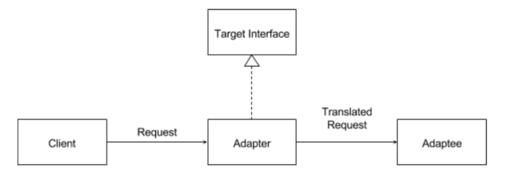
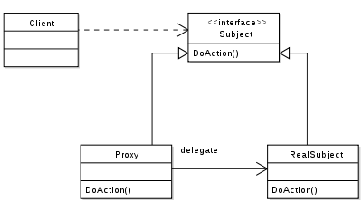

## 📖 어댑터 패턴 (Adapter Pattern)

- 서로 호환되지 않는 인터페이스를 연결해주는 패턴
- 기존 코드를 수정하지 않고, 중간에서 변환기(Adaptor) 역할 제공
- 현실 비유: 돼지코, USB-C → Lightning 젠더

### 어댑터 패턴을 사용하는 경우

- 기존 시스템은 유지하고 새 인터페이스를 적용해야 할 때
- 외부 라이브러리, 레거시 코드와 연결해야 할 때
- 인터페이스가 다른 객체를 동일한 방식으로 사용해야 할 때

<br>

### 작동 방식

#### 구조 



#### Python 예시

```python
class KoreanOutlet:
    def plug_korean(self):
        print("🔌 한국 전원에 연결됨")

class USDevice:
    def plug_us(self):
        print("🇺🇸 미국 플러그 장치 작동")

class Adapter:
    def __init__(self, us_device):
        self.us_device = us_device

    def plug_korean(self):
        print("🔄 변환 중...")
        self.us_device.plug_us()

device = USDevice()
k_adapter = Adapter(device)
k_adapter.plug_korean()
```

<br>

### 장단점

| 장점 | 단점 |
| --- | --- |
| 기존 코드 수정 없이 재사용 가능 | 많은 클래스를 어댑트하면 구조가 복잡 |
| 레거시 코드와의 호환 용이 | 모든 기능을 매핑해야 하면 오버헤드 |

<br>

## 📖 데코레이터 패턴 (Decorator Pattern)

- 객체에 동적으로 기능을 추가하는 패턴
- 상속 대신 합성(composition) 을 사용해 기능 확장
- 실제 객체를 감싸는(wrapper) 구조
- 기능을 추가하면서도 기존 객체의 인터페이스는 유지

<br>

### 데코레이터 패턴을 사용하는 경우

- 특정 기능을 상황에 따라 선택적으로 추가하거나 빼고 싶을 때
- 다양한 조합의 기능을 유연하게 구성해야 할 때
- 상속을 남발하지 않으면서 기능 확장 유지하고 싶을 때

<br>

### 작동 방식

#### 구조


#### Python 예시

```python
class Coffee:
    def cost(self):
        return 3000

class MilkDecorator:
    def __init__(self, coffee):
        self.coffee = coffee

    def cost(self):
        return self.coffee.cost() + 500

class WhipDecorator:
    def __init__(self, coffee):
        self.coffee = coffee

    def cost(self):
        return self.coffee.cost() + 700

coffee = Coffee()
coffee = MilkDecorator(coffee)
coffee = WhipDecorator(coffee)

print(coffee.cost())  # 4200
```

<br>

### 장단점

| 장점 | 단점 |
| --- | --- |
| 런타임 동적 기능 확장 | 래퍼가 많아지면 디버깅 어려움 |
| 조합이 자유로움 | 구조가 깊어져 복잡해짐 |
| 상속 대신 객체 합성 | 작은 객체들이 많이 생성될 수 있음 |

<br>

## 📖 프록시 패턴 (Proxy Pattern)

- 특정 객체에 대한 접근을 제어하기 위해 대리(proxy) 객체를 두는 패턴
- 실제 객체(real object)를 감싸고 대신 요청 처리

<br>

### 프록시 패턴을 사용하는 경우

- 원본 객체 생성 비용이 클 때(지연 로딩)
- 접근 권한/보안 체크가 필요할 때
- 원본에 대한 호출을 가로채고 싶을 때 (logging, caching)
- 구체적인 업무를 담당하는 클래스에 접근하기 전에, 간단한 사전 작업 처리하는 클래스(=proxy)를 두는 구조

<br>

### 작동 방식

#### 구조



#### Python 예시

```python
class RealImage:
    def __init__(self, filename):
        self.filename = filename
        print("📂 원본 이미지 로딩...")

    def display(self):
        print(f"🖼️ Display: {self.filename}")

class ImageProxy:
    def __init__(self, filename):
        self.filename = filename
        self.real_image = None

    def display(self):
        if not self.real_image:
            self.real_image = RealImage(self.filename)
        print("🔎 프록시가 요청 전달")
        self.real_image.display()

img = ImageProxy("photo.png")
img.display()

```

<br>

### 장단점

| 장점 | 단점 |
| --- | --- |
| 불필요한 객체 생성을 방지(지연 로딩) | 코드 구조가 더 복잡해짐 |
| 접근 제어·로깅·캐싱 등 부가기능 제공 | 과도한 프록시 사용 시 관리 비용 증가 |
| 원본 객체 보호 | 성능 병목 가능성 |

<br>

## 💭 어댑터, 데코레이터 & 프록시

| 패턴 | 목적 | 키워드 | 구조적 관계 |
| --- | --- | --- | --- |
| **Adapter** | 인터페이스 변환 | 호환성 해결 | Adaptee 감싸서 인터페이스 변경 |
| **Decorator** | 기능 확장 | 동적 기능 추가 | 객체를 감싸서 기능 추가 |
| **Proxy** | 접근 제어 | 대리, 보호, 지연 로딩 | RealSubject 감싸서 접근 제어 |