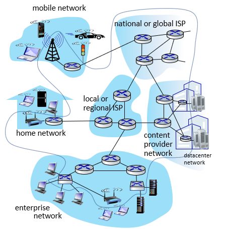
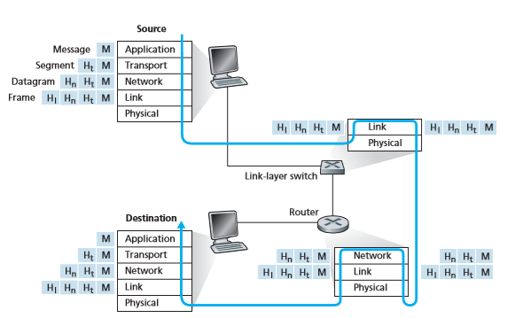

## 📖 컴퓨터 네트워크 기초 개념

### 인터넷과 네트워크

- **네트워크(Network)**: 여러 장치(노드)가 연결되어 데이터를 주고받는 통신망
- **인터넷(Internet)**: 여러 개의 네트워크가 상호 연결된 “네트워크의 네트워크”

 

### 네트워크 구성 요소

| 구분 | 설명 | 예시 |
| --- | --- | --- |
| **호스트(Host)** | 데이터를 생성·송신·수신하는 단말 | 서버, PC, 스마트폰, IoT 기기 |
| **네트워크 장비(Network Device)** | 데이터 전송을 중계하거나 경로를 결정 | 허브, 스위치, 라우터, 공유기 |
| **통신 매체(Transmission Medium)** | 데이터를 전송하는 물리적 경로 | 유선(광케이블, 랜선), 무선(Wi-Fi, LTE 등) |
| **메시지(Message)** | 네트워크를 통해 주고받는 정보 단위 | 웹페이지 요청, 이메일, 파일 등 |
- **서버(Server)**: 서비스를 제공하는 호스트
- **클라이언트(Client)**: 서비스를 요청하는 호스트

 

### 네트워크의 범위

| 구분 | 설명 | 예시 |
| --- | --- | --- |
| **LAN (Local Area Network)** | 근거리 네트워크, 한정된 공간 내 통신망 | 가정, 학교, 사무실 |
| **WAN (Wide Area Network)** | 광역 네트워크, 여러 LAN을 연결 | 인터넷, 통신사망(ISP) |
- **ISP (Internet Service Provider)**: 인터넷 연결 서비스 제공자
    - 국내 ISP는 KT, LG U+, SK브로드밴드 등

 

### 메시지 교환 방식

| 구분 | 특징 | 예시 |
| --- | --- | --- |
| **회선 교환(Circuit Switching)** | 통신 전 고정된 경로를 설정, 일정한 전송속도 | 전통 전화망 |
| **패킷 교환(Packet Switching)** | 데이터를 패킷 단위로 분할·전송, 경로 공유 | 현대 인터넷 구조 |
- 인터넷은 대부분 패킷 교환 방식 사용

 

## 📖 OSI 7계층 & TCP/IP 모델

### 네트워크 참조 모델 **(Network Reference Model)**

- 네트워크 통신 과정을 계층화하여 표현한 구조
- 대표적인 모델: OSI 7계층, TCP/IP 4계층 모델

#### 계층 구조의 장점

- **모듈화**: 설계 및 확장 용이성
- **문제 진단과 해결 용이**: 통신 과정에서 문제 발생 시 문제의 원인을 계층별로 진단할 수 있음
- 각 계층의 기능 독립성 확보

#### 프로토콜 (protocol)

- 노드 간 정보를 올바르게 주고받기 위해 합의된 규칙이나 방법
- 서로 다른 통신 장비들이 정보를 주고받기 위해 프로토콜 필요
- 네트워크 모델의 각 계층은 자신의 기능을 수행하는 프로토콜 집합으로 구성됨

#### 네트워크 참조 모델의 역할?

- 프로토콜이나 네트워크 장비들이 지켜야 하는 규칙이나 법규, 가이드라인으로서의 역할을 하는 것은 아님
- 특정 계층으로 분류하기 어렵거나 여러 계층을 포괄하는 프로토콜이나 네트워크 장비들이 있을 수 있음
- 네트워크 구조에 대한 개념 참조를 위해 사용하는 것

 

### OSI 7계층 모델

- 국제 표준화 기구 (ISO)에서 만든 네트워크 참조 모델
- 하위 계층은 상위 계층의 기능을 지원
- 상위 계층은 하위 계층의 서비스를 이용

|  | 이름 | 역할 | 대표 프로토콜 |
| --- | --- | --- | --- |
| 7 | 응용 계층 (Application layer) | 사용자 응용 서비스 제공 | HTTP, FTP, SMTP, … |
| 6 | 표현 계층 (Presentation layer) | 데이터 변환, 압축, 암호화 |  |
| 5 | 세션 계층 (Session layer) | 연결 생성, 유지, 종료 |  |
| 4 | 전송 계층 (Transport layer) | 신뢰성 있는 전송, 포트 관리 | TCP, UDP |
| 3 | 네트워크 계층 (Network layer) | 경로 결정, 주소 지정 | IP |
| 2 | 데이터 링크 계층 (Data link layer) | 프레임 전송, 오류 검출 | 이더넷, 토큰링, Wi-Fi, WLAN 등 |
| 1 | 물리 계층 (Physical layer) | 비트 단위 신호 전송 | 케이블, 허브 |
- 프로토콜의 개수로 각 계층을 그리면 모래시계 모양
    - 3, 4 계층의 대표 프로토콜은 다른 프로토콜이 필요가 없는 수준
    - 그 외 계층은 프로토콜 종류 다양함

 

### TCP/IP 모델

> = TCP/IP 4계층, 인터넷 프로토콜 스위트 (internet protocol suite), TCP/IP 프로토콜 스택
> 
- 네트워크의 실용적 구현을 기술한 모델
- 왜 이름이 TCP/IP? 이 두 프로토콜이 오늘날 네트워크 구현의 핵심이기 때문

|  | 이름 | 주요 역할 |
| --- | --- | --- |
| 4 | 응용 계층 | 사용자 서비스 |
| 3 | 전송 계층 | 송수신 간 신뢰성 확보 |
| 2 | 인터넷 계층 | 패킷 라우팅, IP 주소 지정 |
| 1 | 네트워크 액세스 계층 | 물리적 전송, 프레임 처리 |

 

### TCP/IP 계층 모델 vs. OSI 7계층 모델

- OSI 모델: 주로 네트워크를 이론적으로 기술하고 이해할 때
- TCP/IP 모델: 실제 인터넷 구현에 기반한 구조

 

## 📖 계층적 구조로 보는 송수신 과정

### 네트워크 통신 과정

#### 송수신 흐름

- 송신 측: 상위 계층 → 하위 계층
- 수신 측: 하위 계층 → 상위 계층

#### 패킷 (Packet)

- 패킷 교환 네트워크에서 메시지가 송수신되는 단위
- 헤더, 페이로드, (트레일러)로 구성됨
    - **헤더 (Header)**: 송/수신 정보, 제어 정보
    - **페이로드 (Payload)**: 실제 전송 데이터
    - **트레일러 (Trailer)**: 오류 검출용 정보
- 패킷은 송신 과정에서 **캡슐화**, 수신 과정에서 **역캡슐화**가 이루어짐

 

### 캡슐화

#### 캡슐화 (Encapsulation)

- 송신 과정에서 헤더 및 트레일러를 추가해 나가는 과정
- 각 계층에서는 상위 계층으로부터 내려받은 패킷에 헤더를 덧붙인 후 하위 계층으로 전달

#### 역캡슐화 (Decapsulation)

- 캡슐화의 반대
- 수신 과정에서 캡슐화 과정에서 붙인 헤더 및 트레일러를 각 계층에서 확인 후 제거해 원래 데이터 복원