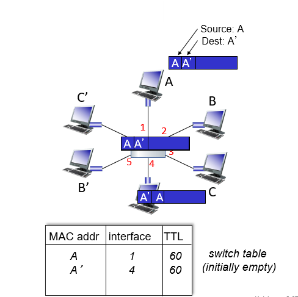

## 📖 데이터링크 계층

### 데이터링크 계층 개요

- 인접한 네트워크 노드 간 신뢰성 있는 데이터 전송을 담당
- 상위 계층 (네트워크 계층)으로부터 전달받은 데이터를 프레임 단위로 나누어 전송
- 하위 계층 (물리 계층)에서 발생할 수 있는 오류를 검출하고, 필요 시 재전송
- 대표 프로토콜: Ethernet (IEEE 802.3), Wi-Fi (IEEE 802.11)

<br>

### 데이터링크 계층의 구성

> MAC 서브계층과 LLC 서브계층으로 나뉨
> 

#### MAC (Media Access Control)

- 물리적 하위 계층
- 실제 전송 매체 (케이블, 전파 등)에 접근하고 통신 제어
- MAC 주소 (물리 주소) 사용해 장치 식별
    - 48비트 (6바이트)로 구성
    - 앞 24비트: 제조사 식별자
    - 뒤 24비트: 고유 일련번호
- 충돌 제어 (CSMA/CD, CSMA/CA) 기능 담당

#### LLC (Logical Link Control)

- 논리적 상위 계층
- 네트워크 계층과 데이터링크 계층 연결
- 데이터 프레임의 헤더/트레일러 생성 및 오류 검출 담당

<br>

### 주요 기능

#### 프레이밍 Framing

- 네트워크 계층의 데이터그램(datagram)을 받아 프레임(frame)으로 캡슐화
- **헤더(Header)**: 출발지/목적지 MAC 주소 등
- **트레일러(Trailer)**: 오류 검출 정보 (FCS, CRC 등)

#### 물리적 주소 지정

- **MAC 주소**를 사용해 같은 네트워크 내의 수신 장치 식별
- IP 주소가 논리적 주소라면, MAC 주소는 **하드웨어 물리 주소**

#### 흐름 제어 (Flow Control)

- 송신자와 수신자의 **데이터 처리 속도 차이**를 조정
- 전송 과부하(Overflow) 방지
- 대표 기법:
    - **Stop and Wait:** 한 프레임 전송 후 ACK 수신 시 다음 프레임 전송
    - **Sliding Window:** 여러 프레임을 연속 전송 후 확인 응답(ACK)을 묶어서 받음

#### 오류 제어 (Error Control)

- 전송 중 발생한 **비트 오류**를 감지하고 재전송
- 오류 검출 시 프레임 전체를 재전송
- **오류 검출 방식:** 패리티 비트, CRC
- **오류 복구:** ARQ (Automatic Repeat reQuest)
    - Stop-and-Wait ARQ, Go-Back-N ARQ, Selective Repeat ARQ

#### 매체 접근 제어 (Meda Access Control)

- 여러 장치가 하나의 전송 매체를 공유할 때 **충돌 방지/해결**
- 대표 기법:
    - **CSMA/CD (Ethernet)** – 유선 환경
    - **CSMA/CA (Wi-Fi)** – 무선 환경

<br>

## 📖 이더넷 (Ethernet)

- 현대 LAN, 특히 유선 LAN 환경에서 가장 대중적으로 사용되는 기술
- IEEE에서 정의한 표준 이더넷 규격 집합: IEEE 802.3
- 프레임 구조, 전송 방식, 전송 속도 등의 규칙 정의

### 이더넷 프레임 구성

- 이더넷 프레임: 이더넷 네트워크에서 주고받는 프레임

```
+-----------+-----------------+-----------------+---------+--------------------+---------+
| preamble  | dest. address   | source address  |  type   | data (payload)     |   CRC   |
+-----------+-----------------+-----------------+---------+--------------------+---------+
| 8 bytes   | 6 bytes         | 6 bytes         | 2 bytes | 46 ~ 1500 bytes    | 4 bytes |
+-----------+-----------------+-----------------+---------+--------------------+---------+
```

| 구성 요소 | 설명 |  |
| --- | --- | --- |
| **preamble** | 프레임 시작을 알리는 신호 패턴 (동기화용 |  |
| **목적지 MAC 주소 (6B)** | 수신 장치의 MAC 주소 | 헤더 |
| **출발지 MAC 주소 (6B)** | 송신 장치의 MAC 주소 | 헤더 |
| **Type 필드 (2B)** | 상위 계층 프로토콜 구분 (IPv4: 0x0800, ARP: 0x0806 등) | 헤더 |
| **데이터 (46~1500B)** | 실제 전송 데이터 |  |
| **FCS (4B)** | 오류 검출을 위한 코드 | 트레일러 |

<br>

## 📖 스위치 (Switch)

### 스위치

- 데이터링크 계층의 네트워크 장비
- MAC 주소 테이블을 기반으로 프레임을 전송할 대상 결정

<br>

### MAC 주소 학습 과정



1. 스위치는 프레임 수신 시 **출발지 MAC 주소**와 **포트 번호**를 테이블에 등록
2. 목적지 MAC 주소를 테이블에서 검색
    - 있으면 → 해당 포트로만 전송
    - 없으면 → 전체 포트로 **브로드캐스트**
3. 이후 통신이 반복되면 불필요한 전송 없이 효율적으로 전달 가능

<br>

### 전송 방식

- **반이중 (Half Duplex)**: 송신 / 수신 중 하나만 가능
- **전이중 (Full Duplex)**: 송수신 동시 가능, 충돌 없음

<br>

## 📖 ARP (Address Resolution Protocol)

- **IP 주소 → MAC 주소로 변환**하는 프로토콜
- 동작 과정:
    1. 송신자가 브로드캐스트로 ARP Request 전송 (IP 주소)
    2. 해당 IP를 가진 장치가 ARP Reply로 응답 (MAC 주소)
- 응답 결과는 ARP 캐시(테이블)에 일정 시간 저장되어 재사용 가능
- 반대로 MAC → IP 변환은 RARP (Reverse ARP) 담당 — 현재는 DHCP가 이 역할