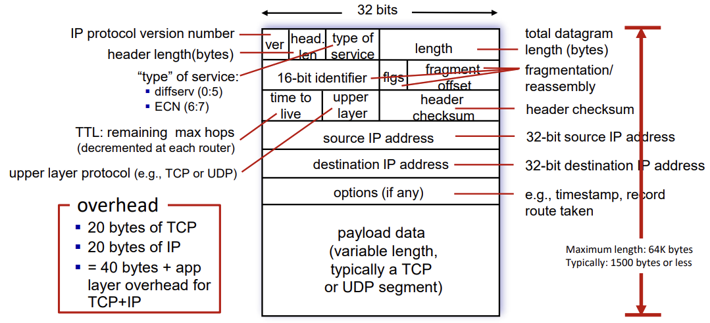
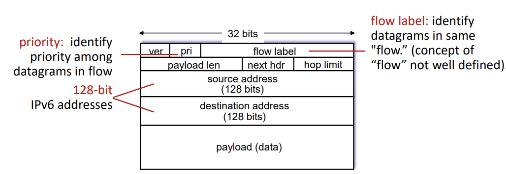
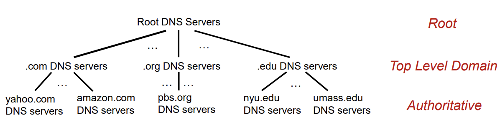
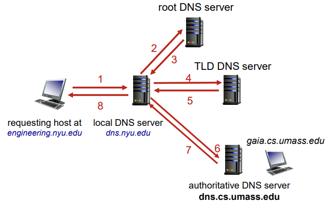

## 📖 IP 주소

### Network Layer 주요 기능

| 기능 | 설명 |
| --- | --- |
| **Routing (라우팅)** | 송신지 → 수신지까지의 경로 결정 |
| **Path Selection Algorithms** | 최적 경로 탐색 (라우팅 프로토콜, SDN 등) |
| **IP Protocol** | 데이터그램 포맷, 주소 체계, 전송 규칙 |
| **ICMP Protocol** | 오류 보고 및 네트워크 진단 (ping, traceroute 등) |
- vs. Transport Layer:
    - 전송 계층은 **end-to end 통신에,**
    - 네트워크 계층은 **host-to-host 경로 결정**에 초점

<br>

### IP 주소 개념

- **IP 주소 (Internet Protocol Address):**
    - 네트워크 상에서 **각 장치를 구별하기 위한 논리적 주소**
    - (vs. MAC 주소: 물리적 주소)
- 각 호스트는 고유한 IP 주소를 가지며, IP는 **네트워크 구간 식별 + 호스트 식별** 기능을 함
- 구조:
    
    ```
    [ 네트워크 부분 | 호스트 부분 ]
    ```
    
<br>

### IPv4 vs. IPv6

#### IPv4 (Internet Protocol version 4)

- 32비트 주소 체계 → 약 **43억 개(2³²)** 주소
- **점으로 구분된 10진수 표기법 (Dotted Decimal Notation)**
    - (ex) `192.168.0.10`
- 주소 고갈 문제 → 사설 IP, NAT 등의 기법 등장

#### IPv6 (Internet Protocol version 6)

- 128비트 주소 체계 → 사실상 무한대 수준의 주소
- **16진수 콜론 표기법 (Colon Hexadecimal Notation)**
    - (ex) `2001:0db8:85a3:0000:0000:8a2e:0370:7334`
- IPv4 주소가 부족해질 것으로 예상하고 개발되었지만, 동적 할당 (DHCP)와 NAT 기법 덕분에 IPv4 여전히 널리 사용 중

#### IPv4 vs. IPv6

- 데이터그램 형식 비교
    - IPv4
        
        
        
    - IPV6
        
        
        
    
    ⇒ IPv6이 구조 더 단순
    
- IPv4 `TTL` → IPv6 `hop limit`
    - IPv4는 시간 기반 개념인 TTL (time to live)
    - IPv6에서는 몇 홉을 지나는지의 개념으로 바뀜

<br>

**⇒ Summary**

|  | IPv4 | IPv6 |
| --- | --- | --- |
| 발표 연도 | 1981 | 1999 |
| 주소 길이 | 32bit | 128bit |
| 표기 형식 | 10진수, 점 구분 | 16진수, 콜론 구분 |
| 예시 | 192.168.0.1 | 3FFE:F200:0234::1 |
| 주소 개수 | 약 43억 개 | 사실상 무한대 (2¹²⁸) |
| TTL 필드명 | Time to Live | Hop Limit |
| 헤더 구조 | 복잡, 다양한 옵션 | 단순화되어 라우팅 효율↑ |

<br>

## 📖 DNS (Domain Name System)

### DNS

> “사람이 기억하기 쉬운 도메인 이름 → IP 주소로 변환”
> 

| 구분 | 예시 |
| --- | --- |
| **Host 이름** | www.google.com |
| **IP 주소** | 142.250.196.14 |
- 사람은 **이름(name)** 으로, 라우터는 **주소(address)** 로 통신
- DNS는 **분산 데이터베이스 + 애플리케이션 계층 프로토콜**로 동작
    - UDP 53번 포트 사용
    - 클라이언트–서버 구조 (브라우저 → DNS 서버)

<br>

### DNS 주요 기능

|  |  |
| --- | --- |
| **Hostname → IP 변환** | 웹 브라우저, 메일 등에서 도메인을 IP로 변환 |
| **호스트/메일 서버 별칭(alias)** | 별칭(host alias)에 대한 실제 이름(canonical name) 조회 |
| **부하 분산 (Load Distribution)** | 여러 서버가 한 도메인을 공유할 경우, 요청을 분산 |
| **캐싱 (Caching)** | 자주 사용하는 주소 매핑 정보를 로컬에 저장해 성능 향상 |

<br>

### DNS 계층 구조



- **Root DNS Servers**
    - 전 세계에 분산된 13개 루트 서버(복제 포함 수백 대)
    - `.com`, `.org`, `.kr` 등의 **TLD 서버 주소 제공**
    - ICANN이 관리
- **TLD (Top Level Domain) Servers**
    - `.com`, `.net`, `.edu`, `.kr` 등 상위 도메인 관리
    - 각 도메인에 해당하는 **authoritative 서버의 IP 주소 제공**
- **Authoritative DNS Servers**
    - 조직(기업, 학교 등)의 자체 DNS 서버
    - 실제 도메인 이름과 IP 주소의 매핑 데이터 보유
- **Local DNS Server**
    - ISP나 기업, 학교 단위에서 운영
    - 클라이언트의 DNS 요청을 대신 처리하고 캐싱 수행

<br>

### DNS 동작 과정

(ex) *engineering.nyu.edu*에 있는 host가 *gaia.cs.umass.edu*의 IP 주소를 원함



1. host가 자신의 local DNS server에 질의 (변환할 hostname인 *gaia.cs.umass.edu* 포함)
2. local DNS server가 질의를 root DNS server에 전달
3. root server가 *edu*를 인식하여 *.edu* TLD server의 IP주소 목록을 local server에 전달
4. local server가 TLD server에 질의 전달
5. TLD server가 *umass.edu* 인식하여 *dns.umass.edu* authoritative DNS server의 IP주소 전달
6. local server가 authoritative server에 질의 전달
7. authoritative server가 *gaia.ce.umass.edu*의 IP주소 응답
8. local server가 host에 해당 IP주소 전달

#### Query 방식

|  |  |  |
| --- | --- | --- |
| **Recursive Query** | 클라이언트가 local DNS에 요청하면, local DNS가 대신 모든 계층 탐색 | 상위 서버 부하↑ |
| **Iterative Query** | DNS 서버가 “다음 서버 주소”만 알려주고, 클라이언트가 직접 탐색 | 부하 분산 가능 |

<br>

### DNS 캐싱 & 갱신

- DNS 서버는 응답 받은 매핑 결과를 일정 기간 **캐싱**
- TTL(Time To Live) 만료 시 삭제
- 오래된 캐시 정보로 인해 “주소 불일치”가 발생할 수 있음 → **Best-effort 시스템**

<br>

### DNS 보안

|  |  |
| --- | --- |
| **DDoS 공격** | 대량의 DNS 요청으로 루트/TLD 서버를 마비시키려는 공격 |
| **Redirect Attack** | DNS 응답 위조로 사용자를 가짜 사이트로 유도 |
| **DNS Cache Poisoning** | 악성 응답을 캐시에 주입하여 잘못된 주소로 유도 |
| **DNSSEC (DNS Security Extensions)** | 응답 무결성·인증을 보장하는 보안 확장 프로토콜 |