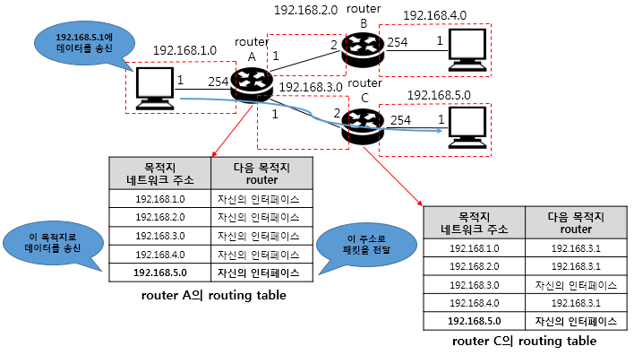

## 📖 라우팅

### 라우팅 개요

- **라우팅 (Routing)**: 네트워크에서 패킷이 목적지까지 가는 최적의 경로를 찾는 과정
- **라우터 (Router)**: 이 과정을 수행하는 장비
- vs. **포워딩 (Forwarding)**: 정해진 경로로 실제 패킷을 보내는 것

<br>

### 라우팅 테이블 (Routing Table)



- 라우터는 라우팅 테이블을 참조하여 패킷을 어디로 보낼지 결정함
- 목적지 네트워크, 다음 홉, 인터페이스, 메트릭 등의 정보가 저장됨

#### 라우팅 테이블 확인 예시 (Linux)

```
$ ip route 
```

```
Destination        Gateway        Flags    Netif    Expire
default           192.168.1.1      UGSc     en0
192.168.1.0/24    link#5           U        en0
```

- `default`: 기본 게이트웨이 (모든 타 네트워크로 가는 기본 경로)
- `192.168.1.0/24`: 로컬 네트워크 직접 연결된 네트워크)
- `Gateway`: 다음 홉의 IP 주소

#### Longest Prefix Match (LPM)

- 여러 경로가 일치할 경우, 가장 구체적인 네트워크 주소 (긴 프리픽스)를 우선 적용함

<br>

### 게이트웨이 (Gateway)

- 내 네트워크에서 다른 네트워크로 패킷을 보내는 출입구 역할
- 같은 네트워크에서는 직접 통신 가능하지만,
    
    ```
    192.168.1.10 → 192.168.1.20 (직접 전송)
    ```
    
- 다른 네트워크 (ex: 인터넷)으로 가려면 게이트웨이를 통과해야 함
    
    ```
    192.168.1.10 → [게이트웨이 192.168.1.1] → 인터넷 → 8.8.8.8 (Google DNS)
    ```
    
- 게이트웨이는 보통 라우터의 내부 인터페이스 주소

<br>

### 패킷이 네트워크를 통해 이동하는 과정

```
Host A (192.168.1.10)
   ↓
[Default Gateway 192.168.1.1]
   ↓
Router → Router → Router
   ↓
Host B (10.0.0.5)
```

1. Host A가 IP 패킷 생성 (목적지 `10.0.0.5`)
2. 목적지가 자신의 네트워크에 없으므로, 게이트웨이로 전송
3. 게이트웨이가 라우팅 테이블을 참조해 다음 홉으로 포워딩
4. 여러 라우터를 거쳐 목적지 네트워크로 이동
5. 최종 라우터가 목적지 호스트에 직접 전달

<br>

### 라우팅 분류

#### 정적 라우팅 (Static Routing)

- 관리자가 수동으로 경로 지정
- 패킷 전송이 이루어지기 전에 전송 경로를 미리 라우터가 저장해 중개하는 방식
- 단순하고 안정적
- 경로 정보 갱신 시 바로 대처 어려움

#### 동적 라우팅 (Dynamic Routing)

- 라우터의 경로 정보를 네트워크 상황에 따라 적절하게 변경하는 방식
- 경로 정보의 변경 주기에 맞춰 계속 보완 가능
- 복잡한 작업 추가됨 → 부하 가능성

<br>

### 라우팅 알고리즘

#### Distance Vector

- 이웃으로부터 거리 정보를 받아 갱신
- RIP 프로토콜 사용
- 간단하지만 수렴 느림, 루프 위험

#### Link State

- 전체 네트워크의 링크 상태를 알고 최단 경로 계산
- OSPF 프로토콜 사용
- 빠른 수렴, 대규모 네트워크에 적합

#### Path Vector 

- AS (자율 시스템) 경로 정보 교환
- BGP 프로토콜 사용
- 인터넷 간 (AS 간) 라우팅용

<br>

## 📖 라우팅 프로토콜

> 동적 라우팅
> 

### 라우팅 프로토콜 개요

- 라우터 간 경로를 교환하고 테이블을 갱신하기 위한 규칙 세트
- 크게 두 범주로 구분됨
    
    
    |  | 범위 | 예시 |
    | --- | --- | --- |
    | **IGP (Interior Gateway Protocol)** | 동일한 자율시스템(AS) 내부 라우팅 | RIP, OSPF, EIGRP |
    | **EGP (Exterior Gateway Protocol)** | 다른 AS 간 라우팅 | BGP |

#### AS (Autonomous System)

- 동일한 관리자에 의해 여러 내부 라우팅 프로토콜을 동일한 정책으로 운영 관리하는 라우터와 서브 네트워크의 집합체
- AS 내의 라우터들은 동일한 라우팅 프로토콜 사용
- AS 내 라우터와 네트워크는 한 조직에 의해 관리됨

<br>

### RIP (Routing Information Protocol)

- **Distance Vector Algorithm (Bellman-Ford)** 기반
- Metric: hop 수 (최대 15 hop)
- 주기적으로(30초) 전체 테이블을 브로드캐스트
- 포트: UDP 520
- **장점:** 단순, 설정 쉬움
- **단점:** 느린 수렴, 대규모 네트워크 비효율
- **Count-to-Infinity Problem**
    
    → 라우팅 루프 발생 시 hop 수가 무한히 증가
    
    → 해결: Split Horizon, Poison Reverse
    
<br>

### OSPF (Open Shortest Path First)

- **Link State Algorithm (Dijkstra)** 기반
- Metric: 링크의 비용(Cost = 1/Bandwidth)
- 네트워크를 **Area** 단위로 나눠 관리 (예: Backbone Area 0)
- 포트: IP 프로토콜 89
- **장점:** 빠른 수렴, 대규모 네트워크에 적합
- **단점:** 설정 복잡, 자원 소모 큼

<br>

### BGP (Border Gateway Protocol)

- **Path Vector Algorithm** 기반
- 서로 다른 자율 시스템(AS) 간 라우팅 (Inter-domain Routing)
- 포트: TCP 179
- Metric: 경로 길이, 정책, AS-PATH 등
- **정책 기반 라우팅 (Policy-based Routing)** 지원
- 인터넷 백본(Backbone)에서 핵심 역할 수행
- “가장 빠른” 경로보다 “가장 정책적으로 적합한” 경로를 선택
    
    예: 특정 국가의 망을 우회하거나, 협력 ISP 경로를 우선 사용 등