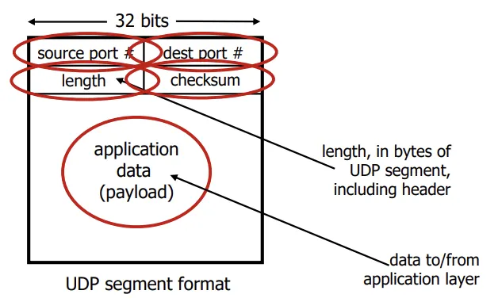
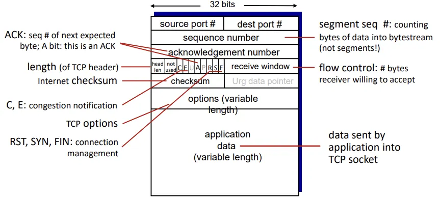

## 📖  전송 계층 (Transport Layer)

### 전송 계층의 역할

- 서로 다른 프로세스 간 (end-to-end) 통신 제공
- 포트 번호를 통해 응용 계층의 프로세스들을 식별
- 신뢰성 있는 데이터 전송, 흐름 제어, 혼잡 제어 등을 통해 신뢰성 보완

 

### IP의 한계와 전송 계층의 보완

| IP의 한계 |  | 전송 계층에서의 보완 |
| --- | --- | --- |
| 신뢰성 없음: 패킷 손실, 순서 뒤바뀜, 중복 가능 | ⇒ | (TCP) 오류 검출, 재전송, 순서 제어 |
| 연결 관리 없음: 송수신 간 연결 상태 없음 | ⇒ | (TCP) 연결 설정 (3-way handshake) |
| 혼잡 대응 불가: 네트워크 과부하 시 패킷 드롭 | ⇒ | (TCP) 혼잡 제어 |
| 프로세스 구분 불가: 호스트만 구분 가능 | ⇒ | 포트 번호를 통해 각 애플리케이션 식별 |

 

### 전송 계층 개요

#### Flow Control vs. Congestion Control

- **Flow Control (흐름 제어)**
    - 수신자가 감당 가능한 속도로 데이터 전송
    - 송수신자 간
    - (ex) 수신 버퍼 오버플로 방지
- **Congestion Control (혼잡 제어)**
    - 네트워크 전체의  혼잡 상황을 고려해 전송 속도 조절
    - 네트워크 전체
    - (ex) 네트워크 패킷 드롭 방지
- 둘 다 신뢰성 (reliable transport)을 위한 필수 요소

#### 주요 프로토콜: TCP, UDP

|  | 연결 여부 | 신뢰성 | 혼잡 제어 |
| --- | --- | --- | --- |
| **TCP** | 연결형 (Connection-oriented) | 있음 (재전송, 순서 보장) | 있음 |
| **UDP** | 비연결형 (Connectionless) | 없음 (Best-effort) | 없음 |

#### Segment

- 전송 계층에서는 데이터 단위를 세그먼트(Segment)라고 함
- vs. IP 계층에서는 패킷(Packet)

 

### Transport-Layer Services

#### 전송 계층의 기능

- 송신 측
    - 애플리케이션 메시지를 세그먼트로 분할
    - TCP/UDP 헤더를 추가 후 IP 계층에 전달
- 수신 측
    - 세그먼트 수신 후 헤더 검사
    - 애플리케이션 메시지로 재조립 후 상위 계층에 전달

#### Transport vs. Network Layer

|  | Transport Layer | Network Layer |
| --- | --- | --- |
| 단위 | **Process ↔ Process** | **Host ↔ Host** |
| 역할 | 포트 기반 논리적 통신 | IP 기반 실제 경로 전달 |
| ex | TCP, UDP | IP, ICMP |
- analogy
    
    > 서로 다른 두 집에 사는 아이들끼리 편지를 주고받을 때
    > 
    - 집 = Host
    - 아이들 = Process
    - 편지 = Message
    - 우편 서비스 = Network Layer
    - 편지를 받아 아이에게 전달하는 부모 = Transport Layer

 

### RDT (Reliable Data Transfer)

> 신뢰할 수 있는 데이터 전송
> 
- 하위 계층이 오류를 일으킬 수 있는 환경에서, 정확하고 순서 있는 데이터 전송을 보장하기 위한 전송 프로토콜의 추상 모델
- RDT 개념을 구현한 프로토콜이 TCP

#### RDT 발전 단계 

| 버전 | 주요 특징 | 설명 |
| --- | --- | --- |
| **RDT 1.0** | 완전 신뢰 채널 | 오류나 손실이 없는 이상적인 채널에서 동작. 별도의 오류 제어 불필요 |
| **RDT 2.0** | 오류 검출 | 비트 오류 발생 가능. Checksum을 통해 오류 검출, ACK/NACK으로 재전송 수행 |
| **RDT 2.1 / 2.2** | 중복·손실 처리 | ACK/NACK 손실 및 중복 전송 문제 해결. Sequence Number 도입 |
| **RDT 3.0** | 패킷 손실 처리 | 패킷 손실까지 고려. Timeout 기반 재전송 적용 (Stop-and-Wait) |
| **Pipeline RDT** | 성능 개선 | 여러 패킷을 동시에 전송 (Go-Back-N, Selective Repeat). TCP의 핵심 구조 기반 |

 

## 📖 TCP vs. UDP

### UDP (User Datagram Protocol)

#### UDP 특징

- **Connectionless**: 연결 설정 없이 바로 전송
- **Best-effort delivery**: 전송 보장 없음 (순서 보장 x, 재전송 x)
- **Low overhead**: 헤더가 매우 작음 (8바이트)
- 흐름 제어, 혼잡 제어, 순서 보장 기능 없음
- 실시간성 중요하고 약간의 손실은 허용되는 서비스에 적합
    - (ex) DNS, 온라인 게임, 실시간 스트리밍

#### UDP 헤더 구조

 

### TCP (Transmission Control Protocol)

#### TCP 특징

- **Connection-oriented**: 3-way handshake를 통해 설정
- **Reliable**: 순서 보장, 손실 시 재전송, 흐름/혼잡 제어 제공
- **Full-duplex communication**: 양방향 동시 전송 가능
- **Byte-stream service**:  애플리케이션 데이터가 연속된 바이트 흐름으로 처리됨

#### 주요 기능

- **연결 설정/해제**: 3-way handshake / 4-way termination
- **오류 검출 및 재전송**: Checksum, ACK/NACK
- **순서 제어**: sequence number
- **흐름 제어**: sliding window
- **혼잡 제어**: slow start, congestion avoidance
- **신뢰성 보장**: 수신 확인 및 재전송

#### TCP 헤더 

 

### TCP vs. UDP

|  | **TCP** | **UDP** |
| --- | --- | --- |
| 연결 방식 | 연결형 (Connection-oriented) | 비연결형 (Connectionless) |
| 신뢰성 | 보장 (재전송, 순서 유지) | 보장하지 않음 (Best-effort) |
| 오류 제어 | 있음 (ACK, Checksum) | 최소한의 오류 검출만 |
| 흐름/혼잡 제어 | 모두 지원 | 없음 |
| 전송 단위 | Segment | Datagram |
| 헤더 크기 | 20~60 bytes | 8 bytes |
| 속도 | 느림 (오버헤드 큼) | 빠름 (오버헤드 적음) |
| 사용 예시 | 웹, 이메일, 파일 전송 | 스트리밍, 게임, DNS |