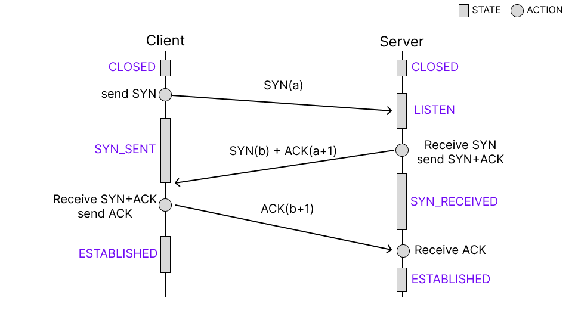

## 📖 3-Way Handshake: TCP의 연결 설정

### 3-Way Handshake

- TCP는 신뢰성 있는 연결 지향형 통신 (Connection-oriented communication)을 위해, 데이터 전송 전 반드시 양쪽이 연결 의사를 확인하는 절차를 수행
- 이 과정이 3-way handshake

#### 목적

- 양쪽이 모두 데이터 전송 준비가 되었음을 확인
- 양쪽의 초기 시퀀스 번호 (Sequence Number) 교환해 데이터 순서 동기화
- TCP가 신뢰성 있는 통신을 제공하도록 하는 기초 과정

#### 사용되는 플래그 정보

| 플래그 | 의미 | 설명 |
| --- | --- | --- |
| **SYN (Synchronize)** | 연결 요청 | 초기 시퀀스 번호(ISN) 교환 |
| **ACK (Acknowledgment)** | 응답 확인 | 패킷을 정상적으로 수신했음을 알림 |

#### 연결 상태 정보

| 상태 | 설명 |
| --- | --- |
| **CLOSED** | 포트가 닫혀 있음 |
| **LISTEN** | 서버가 연결 요청 대기 중 |
| **SYN_SENT** | 클라이언트가 SYN 요청 전송 후 대기 |
| **SYN_RECEIVED** | 서버가 SYN 수신 후 SYN+ACK 송신 |
| **ESTABLISHED** | 연결 완료, 데이터 송수신 가능 상태 |

 

### 3-Way Handshake 동작 과정

|  | 송신자(Client) | 수신자(Server) | 설명 |
| --- | --- | --- | --- |
| ① | SYN(seq=x) 전송 | LISTEN | 연결 요청 |
| ② | SYN+ACK(seq=y, ack=x+1) 전송 | SYN_RECEIVED | 요청 수락 및 응답 |
| ③ | ACK(ack=y+1) 전송 | ESTABLISHED | 연결 확립 완료 |
- 이후, client / sever 모두 ESTABLISHED 상태가 되어 데이터 송수신 가능
- 양측 연결 완료 시점에는 약 0.5 RTT 차이

 

### 2-Way Handshake의 한계

> 2-Way Handshake: 하나의 SYN 요청, 하나의 ACK 응답만 존재
> 

#### 발생할 수 있는 문제

- ISN 동기화 불가
    - 클라이언트가 서버의 Initial Sequence Number (ISN)을 알 수 없음
    - → 데이터 순서 보장 불가능
    - → 중복 및 지연된 세그먼트 구분 어려움
- Half-open connection 발생
    - 한쪽은 연결이 닫혔다고 인식했지만, 다른 한쪽은 여전히 열린 상태로 남음
    - → 서버 리소스 낭비
    - → SYN Flooding 공격에 취약

#### SYN Flooding 공격

- 공격자가 서버에 대량의 TCP SYN 요청 패킷을 보내 서버의 리소스를 고갈시키는 공격

| 단계 | 설명 |
| --- | --- |
| ① | 공격자가 SYN 패킷을 다량 전송 |
| ② | 서버는 SYN+ACK 응답 후 ACK 대기 (SYN_RECEIVED 상태 유지) |
| ③ | ACK가 오지 않아 연결이 완성되지 않음 → 백로그 큐 자원 고갈 |
| ④ | 새로운 정상 요청 처리 불가 → **서비스 거부(DoS)** 상태 발생 |
- 방어 방법:
    - Backlog Queue 확장: 임시 버퍼 크기 증가
    - SYN Cookie: 서버가 요청 상태를 저장하지 않고, ISN에 암호화된 쿠키 값을 넣어 검증
    - Rate Limiting / 로드밸런싱 : 연결 요청 수를 제한하거나 부하 분산 처리
    - 방화벽, DDoS 필터링: 비정상적 요청 차단

 

### 3-Way Handshake 이후 데이터 송수신

- 3-Way Handshake로 연결이 확립되면, 각 TCP 세그먼트에는 일련번호와 응답번호가 포함되어 데이터의 순서와 신뢰성을 보장

| 필드 | 역할 |
| --- | --- |
| **Sequence Number (SEQ) (일련번호)** | “이 데이터가 몇 번째 바이트인지” 표시 → 데이터 송수신 시 순서 보장  |
| **Acknowledgment Number (ACK) (응답번호)** | “다음으로 받을 데이터 번호”를 알려줌 → 수신 측이 몇 번째 데이터를 수신했는지  |
- ACK와 SEQ의 첫 수는 난수로 주어지고, 한 번 전송될 때마다 각자 번호가 1씩 증가해 연결되도록 설계되어 있음

 

## 📖 4-Way Handshake: TCP의 연결 종료

### 4-Way Handshake

- 데이터 송수신이 완료된 후, 양방향 통신을 독립적으로 종료하기 위한 과정

#### 사용되는 플래그 정보 

| 플래그 | 의미 |
| --- | --- |
| **FIN (Finish)** | 데이터 전송 완료 및 연결 종료 요청 |
| **ACK** | 종료 요청 수락 확인 |

#### 상태 정보 

| 상태 | 설명 |
| --- | --- |
| **FIN_WAIT1** | FIN 송신 후 ACK 대기 |
| **FIN_WAIT2** | FIN에 대한 ACK 수신 후 상대의 FIN 대기 |
| **CLOSE_WAIT** | FIN 수신 후 데이터 전송 마무리 대기 |
| **LAST_ACK** | 데이터 송신 완료 후 FIN 전송 및 ACK 대기 |
| **TIME_WAIT** | 모든 FIN/ACK 수신 후 잠시 대기 (지연 패킷 수신 대비) |
| **CLOSED** | 연결 완전히 종료 |

 

### 4-Way Handshake 동작 과정

|  | 송신자(Client) | 수신자(Server) | 설명 |
| --- | --- | --- | --- |
| ① | FIN 송신 (FIN_WAIT1 진입) | 수신 대기 | 연결 종료 요청 |
| ② | ACK 응답 (CLOSE_WAIT 진입) | FIN_WAIT2 진입 | 종료 요청 수락 |
| ③ | FIN 송신 (LAST_ACK 진입) | 대기 | 서버 종료 요청 |
| ④ | ACK 응답 (TIME_WAIT 진입) | CLOSED | 연결 완전 종료 |

 

### QnA

#### 왜 연결 설정은 3단계, 종료는 4단계?

- 연결 설정 때는 양쪽이 동시에 SYN을 교환할 수 있지만, 종료는 한쪽이 먼저 FIN을 보내기 때문에 ACK와 FIN을 분리해서 주고받기 위함

#### FIN보다 늦게 도착하는 데이터가 발생하면?

- 서버가 FIN을 보낸 직후 이전 데이터 패킷이 지연되어 도착할 수 있음
    
    → 클라이언트가 이를 수신하지 못하면 데이터 유실 가능
    
- 이런 상황에 대비해 클라이언트는 TIME_WAIT 상태로 잠시 대기 (기본 240sec)하며 이런 지연 패킷을 기다림

#### ISN (Initial Sequence Number) 난수화 이유

- 중복 연결 방지
    
    : 동일한 IP/포트 쌍 재사용 시, 이전 연결의 패킷이 새 연결에 섞이는 문제 예방
    
- 보안 강화
    
    : ISN이 예착 가능하면 (ex. 0부터 시작) 세션 하이재킹 공격에 취약해짐
