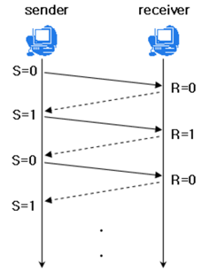
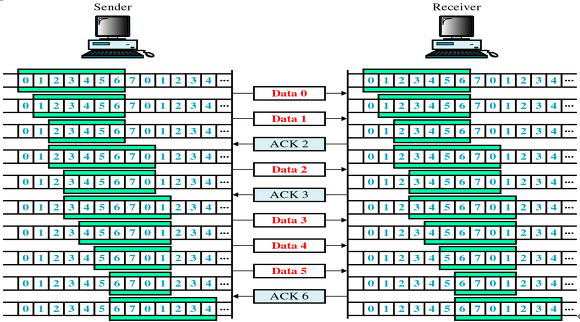
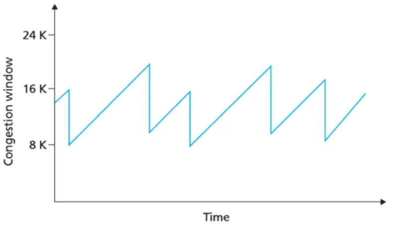
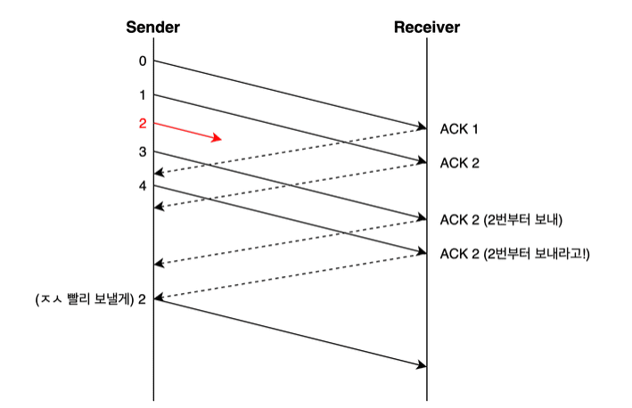
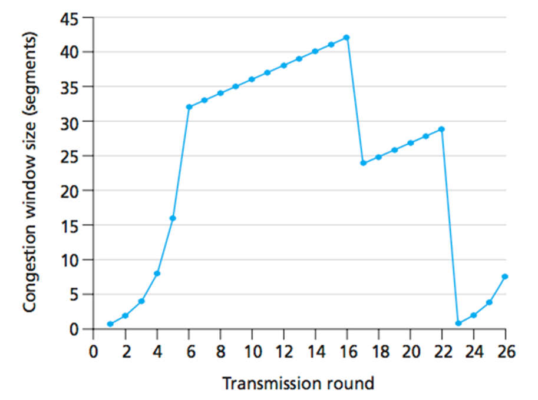
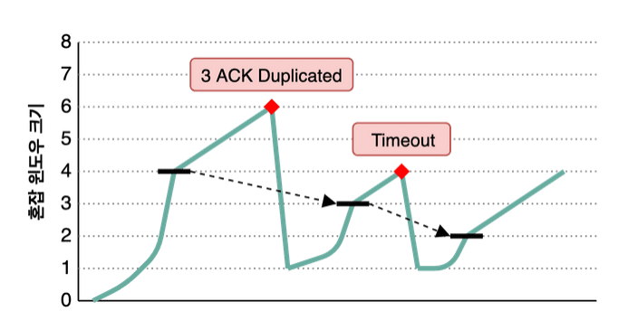
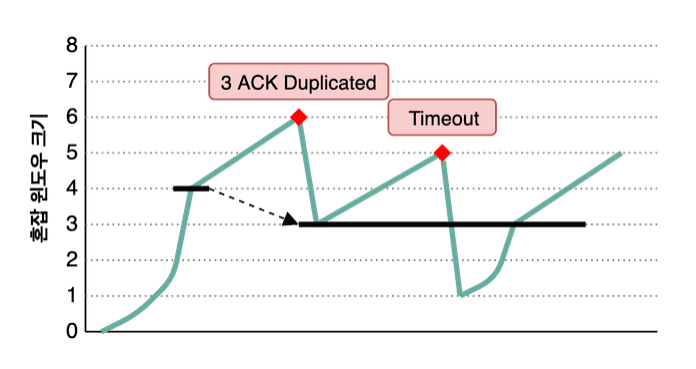

## 📖 흐름 제어 (Flow Control)

- 송신 측의 전송 속도가 수신 측 처리 속도보다 빠른 경우,수신 측 버퍼가 가득 차면서 패킷 손실이 발생할 수 있음
- 송신 측과 수신 측의 데이터 처리 속도 차이를 조절해 송신 측이 수신 측의 버퍼 한계를 초과하지 않도록 하는 기법 = 흐름 제어

### Stop and Wait

 

- 한 번에 하나의 패킷만 전송
- 매번 전송한 패킷에 대해 확인 응답 (ACK) 받으면 다음 패킷 전송
- 구현 간단하지만, 1 RTT동안 송신이 멈추므로 비효율적

<br>

### Sliding Window

- 수신 측이 윈도우 크기를 설정하고, 송신 측은 ACK 기다리지 않고 윈도우 크기만큼 연속적으로 전송 가능
- 오늘날 TCP는 대부분 슬라이딩 윈도우 방식 채택

#### 윈도우 크기 

- 초기 윈도우 크기는 3-Way Handshake 과정에서 합의됨
- 이후 수신 측은 ACK 응답 시 현재 버퍼 여유 공간을 TCP 헤더 `window size` 필드로 송신 측에 보냄
- 송신 측은 이 정보를 바탕으로 전송량을 동적으로 조절

#### 동작 방식

 

1. 송신자는 윈도우 크기만큼 패킷 전송
2. 수신자가 일부 수신하고 ACK 전송
3. 송신자는 ACK로 확인된 데이터만큼 윈도우를 옆으로 옮겨 다음 패킷들 전송 
- example
    
    ```
    윈도우 크기 7 -> [0~6] 전송
    ACK=2 수신 -> [2~8] 전송 
    ```
    

#### 재전송 (Retransmission)

- 송신 측은 ACK를 일정 시간 내에 받지 못하면 재전송 수행
- 이때 단순 패킷 유실이 아니라 수신 측의 버퍼에 남는 공간 부족일 수도 있음
- 이를 해결하기 위해 윈도우 크기 정보와 함께 ACK를 교환해 불필요한 재전송 방지

<br>

## 📖 혼잡 제어 (Congestion Control)

- 네트워크 내 라우터의 처리량을 초과할 정도로 패킷이 몰릴 경우 패킷 손실, 지연, 재전송이 반복되며 네트워크 전체가 혼잡 상태에 빠짐
- 송신 측의 전송 속도를 동적으로 조절해 네트워크 혼잡을 완화하고 안정적인 전송률을 유지하기 위한 기법 = 혼잡 제어

<br>

### 주요 혼잡 제어 기법

#### AIMD (Addictive Increase / Multicative Decrease)

 

- 선형 증가, 곱 감소
- 전송 성공 시 윈도우 1씩 증가, 손실 감지 시 절반으로 감소
- 급격한 혼잡 발생을 방지하며 안정성 확보
- 초반에는 전송 속도 상승이 느림
- ⇒ 조심스럽게 올리고, 빠르게 줄이는 보수적 제어 방식

#### Slow Start (느린 시작)

- 초기 전송률을 지수적으로 빠르게 늘려 대역폭 활용도 개선
- 패킷 손실 감지 시 윈도우 크기를 1로 줄여 리셋
- 임계점 (ssthresh)까지는 지수적으로, 이후 선형으로 증가

#### Fast Retransmit (빠른 재전송)

 

- 중복 ACK 3회 수신 시 재전송
- timeout 기다리지 않고 즉시 재전송
- 전송 지연을 최소화하고, ACK 손실 시에도 안정적으로 동작
- ⇒ 시간 초과 발생하기 전에 미리 재전송

#### 빠른 회복 (Fast Recovery)

 

- 혼잡 감지 후 창 크기를 완전히 줄이지 않고, 반으로 줄인 후 선형 증가
- 네트워크가 완전히 붕괴되지 않은 경우 효율적으로 회복할 수 있게 함

<br>

### 혼잡 제어 정책

- TCP 혼잡 제어 정책은 Tahoe, Reno, New Reno, Cubic, Ealstic-TCP 등등 다양함
- 공통적으로 혼잡이 발생하면 윈도우 크기를 줄이거나, 혹은 증가시키지 않으며 혼잡을 회피한다는 전제

#### 기본 개념

| 용어 | 의미 |
| --- | --- |
| **Timeout** | ACK 응답이 일정 시간 내 도착하지 않음 → 패킷 손실 가정 |
| **3 Duplicate ACK** | 동일 ACK 3회 연속 수신 → 일부 데이터 손실로 판단 |
| **ssthresh (Slow Start Threshold)** | Slow Start와 AIMD 전환 기준선 |

#### TCP Tahoe

 

- 초기에는 slow start로 윈도우 크기 지수적 증가
- 혼잡 감지 후 (timeout 또는 3 ACK dup) 윈도우 크기 1로 리셋, ssthresh는 혼잡 지점의 1/2로
- 이후 다시 slow start 시작
- 한 번 혼잡 상황이 발생한 지점을 기억하고, 그 지점이 가까워지지 않도록 합리적으로 조절
- 혼잡 후 회복 속도가 느리다는 단점

#### TCP Reno

 

- TCP Tahoe 이후에 나온 정책, Tahoe 개선 버전
- 초기에는 slow start로 시작
- 3 ACK dup 발생 시
    - fast retransmit + fast recovery
    - 윈도우 크기 반으로 줄이고, ssthresh는 줄어든 윈도우 값으로
    - 이후 AIMD로 선형 증가 계속
- timeout 발생 시
    - 윈도우 크기 1로 바로 줄이고, ssthresh 유지
    - slow start로 복귀
- timeout에 비해 3 ACK dup는 심한 혼잡 상황이 아니라고 가정하는 것. 혼잡 상황의 심각도에 따라 유연하게 대응하는 정책

#### Tahoe vs. Reno 요약

| 구분 | **Tahoe** | **Reno** |
| --- | --- | --- |
| 초기 증가 | Slow Start (지수 증가) | 동일 |
| 혼잡 감지 | Timeout, Dup ACK | 동일 |
| Dup ACK 대응 | 윈도우 1로 리셋 (Slow Start 재시작) | Fast Retransmit + Fast Recovery |
| Timeout 대응 | 윈도우 1로 리셋 | 동일 |
| 회복 속도 | 느림 | 빠름 |
| 특징 | 단순, 보수적 | 실무 TCP의 기반 모델 (현대형 TCP로 발전) |

<br>


### 확장된 TCP 혼잡 제어 알고리즘

- New Reno: Fast Recovery 개선 — 여러 손실 세그먼트 처리 가능
- CUBIC: Linux 커널 기본 TCP, RTT 독립적, 빠른 회복 성능
- BBR (Google): 대역폭 측정 기반, AIMD 방식 탈피 (최신 모델)

<br>

## 🎙️ 예상 질문

#### TCP/IP 통신에서 흐름 제어 기법이 필요한 이유?

송 수신자 간의 TCP 버퍼의 크기 차이로 인해 생기는 데이터 처리 속도 차이를 해결하기 위해

#### TCP/IP 흐름 제어 기법의 종류?

Stop and Wait과 Sliding Window 기법이 있다. Stop and Wait은 전송한 패킷에 대해 확인 응답(ACK)을 받으면 다음 패킷을 전송하는 제어 기법이고, Sliding Window는 수신 측에서 설정한 윈도우 크기만큼 송신 측에서 확인 응답(ACK) 없이 패킷을 전송할 수 있게 하여 데이터 흐름을 동적으로 조절하는 제어 기법이다.

#### TCP/IP 혼잡 제어 기법은 왜 사용되는가?

송신 측에서 보내는 데이터의 양이 라우터가 처리할 수 있는 양을 초과하면 초과된 데이터는 라우터가 처리하지 못한다. 송신 측은 초과된 데이터를 손실 데이터로 간주하고 계속 재전송하여 네트워크를 혼잡하게 한다. 이런 상황을 예방하기 위해 송신 측의 전송 속도를 적절히 조절하는 혼잡 제어 기법이 사용된다. 대표적으로 AIMD, Slow Start, 빠른 재전송, 빠른 회복 등이 있다.