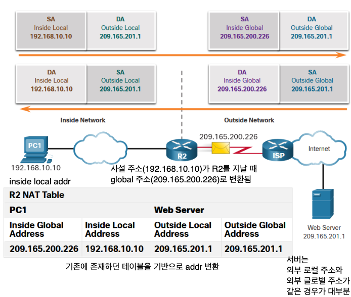

## 📖 NAT (Network Address Translation)

- 사설 IP ↔ 공인 IP 변환 기술
- IPv4 주소 부족 문제 해결 및 내부 네트워크 보호를 위해 고안됨
- 라우터나 게이트웨이가 패킷의 IP 주소/포트 변환하며 통신 중계

 

### 동작 방식

- 내부 네트워크의 여러 장치가 하나의 public IP 공유
- NAT 라우터가 내부 장치들의 연결 상태를 NAT Table에 기록

| 구분  | 설명 |
| ---  | --- |
| Inside Local  | 내부 호스트의 사설 주소 |
| Inside Global  | 외부에서 본 출발지 주소 |
| Outside Global | 외부 서버 주소 |
| Outside Local | 내부에서 본 외부 주소 (보통 동일) |

 

### NAT 유형

| 유형 | 설명 | 특징 |
| --- | --- | --- |
| **정적 NAT (Static NAT)** | 1:1 고정 매핑 | 주소가 변하지 않음 (서버에 적합) |
| **동적 NAT (Dynamic NAT)** | 주소 풀에서 임의 할당 | 일시적 연결용 |
| **PAT (Port Address Translation)** | 1개의 공인 IP에 여러 포트 할당 | 가장 일반적 (NAT Overload) |

 

### NAT 장단점

#### 장점

- 공인 IP 절약
- 내부 네트워크 주소 구조 보호
- 외부로부터 직접 접근 차단 → **보안성 강화**

#### 단점

- 패킷 지연 발생 (주소 변환 오버헤드)
- End-to-End 연결 불가 (IPsec 등 터널링 복잡)
- 외부에서 내부 서버로 직접 접근 어려움
- 일부 비연결형(UDP) 서비스는 별도 설정 필요

 

## 📖 VPN (Virtual Private Network)

- 공중망(인터넷)을 통해 **사설망처럼 안전하게 통신**하는 기술
- 데이터를 암호화하여 **기밀성(confidentiality)** 과 **무결성(integrity)** 보장
- 실제로는 Public Network 위에 **가상의 터널(Tunnel)** 을 만드는 구조

 

### VPN의 주요 기능

|  |  |
| --- | --- |
| **데이터 암호화 (Confidentiality)** | 외부에서 내용을 볼 수 없게 함 |
| **데이터 무결성 (Integrity)** | 중간 변조 탐지 및 차단 |
| **인증 (Authentication)** | 올바른 사용자/장비만 접근 가능 |
| **접근 제어 (Access Control)** | 인증된 사용자만 사설망 접근 허용 |

 

### VPN 종류

|  | 설명 | 예시 |
| --- | --- | --- |
| **Site-to-Site VPN** | 두 지점을 터널로 연결 | 기업 본사 ↔ 지사 간 내부망 통신 |
| **Remote-Access VPN** | 사용자 → 기업망 | 재택근무자가 사내 서버 접근 |
| **Enterprise VPN** | 기업이 자체 구축·운영 | 자체 IPsec/SSL VPN |
| **Service Provider VPN** | 통신사업자 제공 | MPLS 기반, 고객별 논리적 분리 |

 

### 주요 프로토콜

| 구분 | 특징 |
| --- | --- |
| **IPsec VPN (Internet Protocol Security)** | 네트워크 계층, IP 기반 암호화 (보안이 강함) |
| **SSL VPN (Secure Socket Layer)** | 전송 계층, 브라우저 기반 접근 (유연성이 높음) |

 

### VPN의 장단점

#### 장점

- 전용회선 없이 보안성 확보 → 비용 절감
- 원격 근무, 출장 등 다양한 환경 지원
- 암호화·인증으로 안전한 트래픽 유지

#### 단점 

- 속도 저하 (암호화/복호화 과정)
- 설정 복잡 (특히 NAT 환경에서는 IPsec 충돌 가능)
- 중앙 게이트웨이 장애 시 전체 서비스 중단 위험

 

## 📖 방화벽 (Firewall)

- 네트워크 경계에서 트래픽을 감시하고 필터링하는 보안 시스템
- 허용 정책에 맞는 패킷만 통과시키고 나머지는 차단

### 주요 역할

- **트래픽 제어** — 허용/차단 규칙에 따른 접근 관리
- **외부 위협 방어** — 악성 트래픽, DoS, 해킹 차단
- **내부 네트워크 보호** — 내부 사용자 부적절 접근 차단

 

### 동작 방식

|  |  |
| --- | --- |
| **패킷 필터링 (Packet Filtering)** | IP, Port, Protocol 기반 단순 필터링 |
| **상태 기반 검사 (Stateful Inspection)** | 연결 상태 추적, 세션 단위 필터링 |
| **애플리케이션 계층 필터링 (Application Layer Filtering)** | 애플리케이션 단위 분석 (HTTP, FTP 등) |

 

### 방화벽 유형

|  | 설명 | 예시 |
| --- | --- | --- |
| **하드웨어 방화벽** | 독립형 장비, 대규모 환경 | Cisco ASA, FortiGate |
| **소프트웨어 방화벽** | OS 내부 방화벽, 개인 PC용 | iptables, Windows Firewall |
| **차세대 방화벽 (NGFW — Next-Gen Firewall)** | 트래픽 분석 + 침입탐지 결합 | Palo Alto, Check Point |

 

## 💭 NAT, VPN, 방화벽

| 항목 | 주요 역할 | 계층 | 보안 성격 |
| --- | --- | --- | --- |
| **NAT** | IP 주소 변환, 내부 보호 | Network Layer | 주소 은닉 (기초 보안) |
| **VPN** | 암호화된 터널 생성 | Network / Transport | 데이터 암호화 (전송 보안) |
| **Firewall** | 트래픽 정책 기반 차단 | Network / Application | 접근 제어 (경계 보안) |

⇒ 네트워크 보안을 위해 함께 사용되는 기술