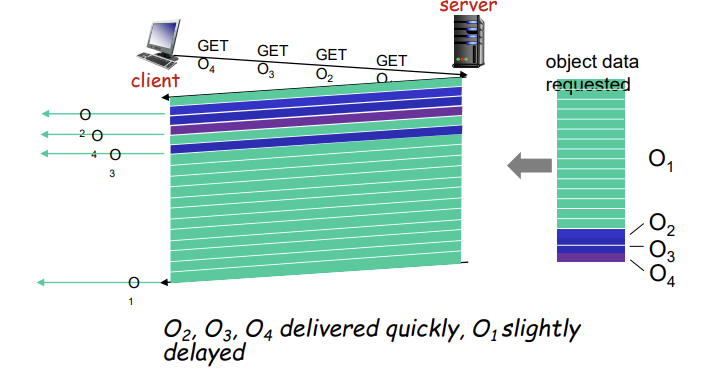
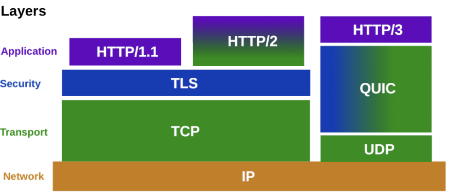

## 📖 HTTP (HyperText Transfer Protocol)

> 웹에서 클라이언트와 서버가 요청(Request)과 응답(Response)을 주고받는 통신 규약
> 
- 애플리케이션 계층의 프로토콜
- TCP 위에서 동작 (80번 포트)
- HTML, 이미지, 오디오 등 다양한 객체 전송
- 웹 브라우저(클라이언트)와 웹 서버 간의 **비연결, 무상태** 통신

#### HTTP 기본 구조 

| 구분 | 설명 |
| --- | --- |
| **요청 (Request)** | 브라우저가 서버에 페이지, 이미지, 데이터 등을 요청 |
| **응답 (Response)** | 서버가 요청에 맞는 데이터를 전송 |
| **전송 방식** | TCP 3-way handshake 후, HTTP 메시지 교환 |

#### HTTP 특징

| 특징 | 설명 |
| --- | --- |
| **비연결(Connectionless)** | 요청-응답 후 연결 종료 |
| **무상태(Stateless)** | 이전 요청의 상태를 기억하지 않음 (→ 쿠키/세션으로 보완 가능) |

+

- 요청/응답 구조가 명확하고 단순해 구현 용이
- 헤더 기반으로 다양한 기능 확장 가능

<br>

### HTTP 동작 방식

```
[Client] --- HTTP Request ---> [Server]
[Server] --- HTTP Response --> [Client]
```

- 클라이언트가 요청을 보내면, 서버는 응답을 반환하고 연결 종료
- 요청은 메서드(GET, POST, PUT, DELETE 등)와 헤더(Header)로 구성
- 응답은 상태 코드(Status Code)와 본문(Body)로 구성

<br>

### HTTP의 발전

#### 요약

| 버전 | 주요 특징 | 핵심 개선 |
| --- | --- | --- |
| **HTTP 1.0** | 요청당 TCP 연결 | RTT 과다, 비효율 |
| **HTTP 1.1** | Persistent Connection 도입 | 파이프라이닝 가능 |
| **HTTP 2.0 (2015)** | **멀티플렉싱(Multiplexing)**: 한 연결에 여러 스트림 | HOL(Head-of-Line) Blocking 완화 |
| **HTTP 3.0 (2020~)** | **UDP 기반 QUIC 프로토콜 사용** | 연결 성능 향상, 내장 TLS 보안 |

#### Non-Persistent vs. Persistent Connection

| 구분 | Non-Persistent (HTTP 1.0) | Persistent (HTTP 1.1 이상) |
| --- | --- | --- |
| 연결 유지 | 요청-응답 후 바로 종료 | 여러 요청/응답에 연결 재사용 |
| 효율성 | 비효율적 (RTT ↑) | 효율적 (RTT ↓) |
| 특징 | 요청마다 TCP 연결 필요 | 하나의 TCP로 여러 객체 송수신 |
| RTT 계산 | `2*RTT + 전송시간` | `1*RTT + 전송시간` (평균 절반 감소) |

#### HTTP/2




- 여러 요청을 **프레임 단위로 쪼개** 전송 → 큰 파일이 작은 요청을 막지 않음 (HOL blocking 방지)
- 서버가 클라이언트 요청 전에 데이터 push 가능 (Server Push)
- 헤더 압축으로 데이터 절약

#### HTTP/3



- **TCP → UDP 기반 QUIC** 사용
- 내장 TLS로 보안 내재화
- 개별 스트림 단위로 손실 복구 → 지연 최소화
- 모바일 환경에서 연결 끊김 시 빠른 재연결 가능

<br>

### HTTP의 한계

|  |  |
| --- | --- |
| **평문 전송 (No Encryption)** | 데이터가 암호화되지 않아 도청/변조 가능 |
| **인증 부재 (No Authentication)** | 서버의 신원 검증 불가 (가짜 사이트 위험) |
| **무결성 부재 (No Integrity)** | 전송 중 데이터 위변조 탐지 불가 |

<br>

## 📖 HTTPS (HTTP Secure)

> HTTP + TLS/SSL
> 
> 
> 데이터를 암호화해 전송하고, 웹사이트의 신원을 인증하는 보안형 HTTP 프로토콜
> 
- 기본 443 포트
- 보안 프로토콜: 원래 SSL(Secure Socket Layer) → 현재 TLS(Transport Layer Security)로 명칭 바뀜
- TCP 연결 이후 TLS를 통해 암호화 세션 생성, 통신

#### HTTPS 보안 구성 요소 

| 보안 요소 | 설명 | 보장 개념 |
| --- | --- | --- |
| **암호화 (Encryption)** | 데이터 내용이 노출되지 않게 보호 | 기밀성 (Confidentiality) |
| **무결성 (Integrity)** | 전송 중 데이터 변경 방지 | 변조 방지 |
| **인증 (Authentication)** | 서버(또는 클라이언트)의 신원 확인 | 신뢰성 |

<br>

### HTTPS 동작

#### (1) 공개키 / 비대칭키 암호화 

- 공개키(Public Key)로 암호화 → 개인키(Private Key)로 복호화
- 신원 확인 및 대칭키 교환에 사용
- 단점: 속도 느림

#### (2) 대칭키 암호화

- 하나의 동일한 키로 암호화/복호화
- 빠르지만 키 공유 시 위험
- 실제 데이터 전송 시 사용

⇒ 비대칭키로 안전하게 대칭키 교환하고, 이후 대칭키로 통신 

#### HTTPS Handshake 과정 (TLS)

1. **Client Hello** – 브라우저가 지원 가능한 암호화 방식, 난수 정보 전송
2. **Server Hello** – 서버가 인증서(공개키)와 세션 정보 제공
3. **Certificate Verify** – 클라이언트가 인증서의 신뢰성(CA 확인) 검증
4. **Key Exchange** – 공개키로 대칭키(세션키) 교환
5. **Finished** – 이후 대칭키 기반 암호화된 통신 시작

#### 인증서와 CA (Certificate Authority)

| 구성요소 | 설명 |
| --- | --- |
| **CA (인증기관)** | 서버의 신원을 보증하는 제3자 |
| **인증서 (SSL/TLS Certificate)** | 서버의 공개키, 도메인 정보, CA 서명 포함 |
| **브라우저 검증** | 브라우저가 내장 루트 CA 목록으로 유효성 판단 |

⇒ “🔒 연결이 안전합니다” 표시는 브라우저가 인증서 유효성을 통과했다는 의미

<br>

### HTTPS 장단점

#### 장점

- 데이터 보안 강화
- 피싱 방지, 신뢰성 향상
- 검색엔진 (SEO) 우대
- 데이터 무결성 확보

#### 단점

- 암호화로 인한 처리 부하
- 인증서 발급/유지 비용
- 초기 연결 지연
- 오프라인 캐싱 어려움

⇒ 최근에는 하드웨어 성능 향상과 무료 인증서 (Let’s Encrypt)로 단점 대부분 해소 

<br>


## 💭 HTTP & HTTPS

### HTTP vs. HTTPS

- 계층 구조로 보면
    
    
    |  | HTTP | HTTPS |
    | --- | --- | --- |
    | Application Layer | HTTP | **HTTP (그대로)** |
    | Transport Layer | TCP | **TLS + TCP** |
    | Network Layer | IP | IP |
    | Data Link Layer | Ethernet 등 | Ethernet 등 |

<br>

### HTTPS = HTTP + 보안

- HTTP/2부터는 HTTPS 형태로만 사용되는 버전
- 대부분의 요즘 웹 브라우저들은 `HTTP/2 + TLS(HTTPS)` 또는 `HTTP/3 + QUIC(TLS 내장)` 형태만 지원
- 현대의 HTTP = 사실상 HTTPS 라고 볼 수 있음

|  | HTTP | HTTPS |
| --- | --- | --- |
| **보안성** | 평문 전송 | 암호화 (TLS) |
| **포트 번호** | TCP 80 | TLS 443 |
| **속도** | 빠름 (보안 無) | 약간 느림 (보안 有) |
| **인증서 필요** | 불필요 | 필수 (CA 발급) |
| **사용 예시** | 일반 정보 페이지 | 로그인, 결제, 개인정보 페이지 |
| **요약**  | 웹의 기본 통신 규약으로, 보안은 없음 | HTTP에 보안 계층을 더한 안전한 통신  |