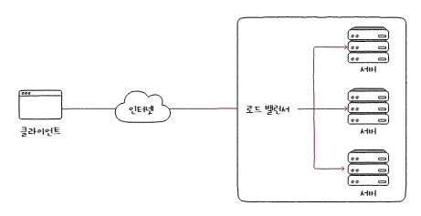

## 📖 로드 밸런싱 (Load Balancing)

: 여러 서버에 트래픽을 분산시켜 전체 시스템의 가용성과 성능을 향상시키는 기술

- 여러 대의 서버가 동일한 서비스를 제공할 때, 특정 서버에 부하가 집중되지 않도록 요청을 고르게 나누는 기술
- 로드 밸런서 (Load Balancer)라는 장치 또는 소프트웨어가 수행
- 장애 발생 시 트래픽을 자동으로 다른 서버로 우회시켜 무중단 서비스 가능

### 로드 밸런서 (Load Balancer)

- 클라이언트 ↔ 서버 사이 중간 게이트웨이 역할
- 클라이언트의 요청을 받아 적절한 서버로 트래픽 분배
- 물리적 장비 (L4/L7 스위치) 또는 소프트웨어 형태 (HAProxy, Nginx, Envoy 등)로 구현 가능

 

### 로드 밸런싱 방식 (계층 기준)

|  |  |
| --- | --- |
| **L4 Load Balancer** | 전송 계층(TCP/UDP) 기반. IP 주소와 포트 정보로 트래픽 분산 (빠르고 단순함). |
| **L7 Load Balancer** | 애플리케이션 계층(HTTP/HTTPS) 기반. 요청 URL, 쿠키, 헤더 등 세밀한 기준으로 트래픽 분산 가능. |

 

### 로드 밸런싱 알고리즘

- 부하가 균등하게 분산되도록 부하 대상을 선택하는 방법
- 로드 밸런서가 요청을 전달할 수 있는 서버 여러 개 중에 어디에 요청을 전달할지 선택하는 것

| 알고리즘 | 설명 |
| --- | --- |
| **라운드 로빈 (Round Robin)** | 순차적으로 각 서버에 요청 분배. |
| **최소 연결 (Least Connections)** | 현재 연결 수가 가장 적은 서버로 분배. |
| **가중 라운드 로빈 (Weighted Round Robin)** | 서버별 처리 능력에 따라 가중치를 부여. 고성능 서버에 더 많은 요청을 분배. |
| **IP 해시 (IP Hash)** | 클라이언트의 IP를 기반으로 항상 동일한 서버에 연결 (세션 유지에 유리). |
| **응답 시간 기반** | 서버 응답 시간을 모니터링해 가장 빠른 서버로 분배. (동적 방식) |

 

### 로드 밸런싱의 장점

- 서버 과부하 방지 및 장애 시 무중단 서비스 제공 (고가용성, High Availability)
- 트래픽 급증 시 자동 확장 가능 (Auto Scaling 연계)
- 네트워크 응답 속도 향상 및 서비스 안정성 확보

 

## 📖 CDN (Content Delivery Network)

: 지리적으로 분산된 캐시 서버를 통해 콘텐츠를 사용자에게 빠르게 전달하는 시스템 

- 웹 서버 (Origin server)의 정적 콘텐츠를 사용자와 가까운 위치의 캐시 서버에 저장해 응답 속도를 향상시키는 기술
- 사용자 근처에서 응답 → 지연 시간 최소화

### CDN 주요 구성 요소

| 구성요소 | 설명 |
| --- | --- |
| **Origin Server** | 원본 콘텐츠가 저장된 서버 |
| **Edge Server (POP)** | 사용자의 요청을 처리하는 지역 캐시 서버 |
| **DNS 라우팅** | 사용자의 위치에 따라 가장 가까운 POP로 트래픽 유도 |
| **캐시 정책 (TTL)** | 콘텐츠를 POP에 저장하는 기간을 제어 (TTL 만료 시 재요청) |

 

### CDN 작동 방식

#### 캐싱 (Caching)

- 정적 콘텐츠를 **CDN 서버(POP)** 에 저장
- 최초 요청 시 오리진 서버에서 데이터를 가져와 캐시 저장
- 이후 동일한 요청은 POP에서 바로 응답 (오리진 부하 감소)

#### 동적 가속 (Dynamic Acceleration)

- 캐싱 불가능한 동적 콘텐츠 (실시간 데이터, 로그인 정보 등)에 대해 라우팅 최적화 및 전송 경로 단축 기술을 사용해 속도를 개선

 

### CDN 장점

- **전송 지연(Latency) 감소**: 사용자 근처에서 콘텐츠 제공
- **트래픽 부하 분산**: 오리진 서버의 과부하 방지
- **보안 강화**: DDoS 공격 완화, HTTPS 인증서 공유, 트래픽 필터링 가능
- **비용 절감**: 대역폭 절감으로 서버 운영비 절감
- **확장성 향상**: 전 세계 POP 네트워크로 손쉽게 글로벌 서비스 제공

 

## 💭 CDN vs. 로드 밸런싱

| 구분 | 로드 밸런싱 (Load Balancer) | CDN (Content Delivery Network) |
| --- | --- | --- |
| **주요 목적** | 서버 간 트래픽 분산 | 콘텐츠 전송 속도 향상 |
| **위치** | 데이터센터 내부(Front of servers) | 전 세계 POP 네트워크 |
| **대상** | 서버 인스턴스 (Backend) | 사용자 요청 (Frontend) |
| **중점** | 효율적 분산, 가용성 확보 | 지연 최소화, 사용자 경험 향상 |
| **적용 계층** | L4, L7 (Transport/Application Layer) | L7 (Application Layer) |
| **예시 기술** | Nginx, HAProxy, AWS ELB | Cloudflare, Akamai, AWS CloudFront |
- 로드 밸런싱 → 주로 지리적으로 가까운 서버들 간 트래픽 균등하게 분산시키는 역할
- CDN → 넓은 지리적 영역에 콘텐츠 분산시켜 전 세계의 사용자에 일관된 경험 제공
- ⇒ 둘 다 각자의 고유한 역할을 하며, 서버와 클라이언트 간 상호작용을 최적화해 현대 응용 프로그램 제공과 호스팅에서 중요한 도구