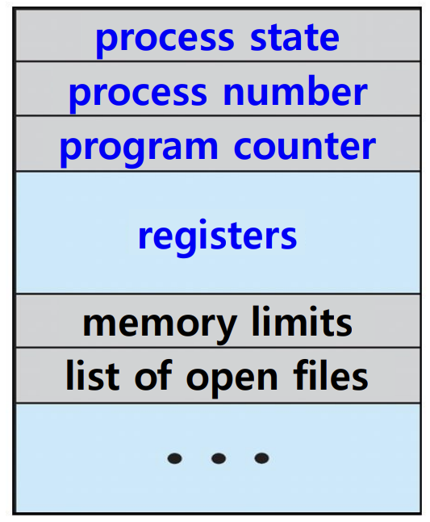
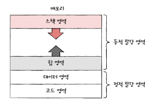
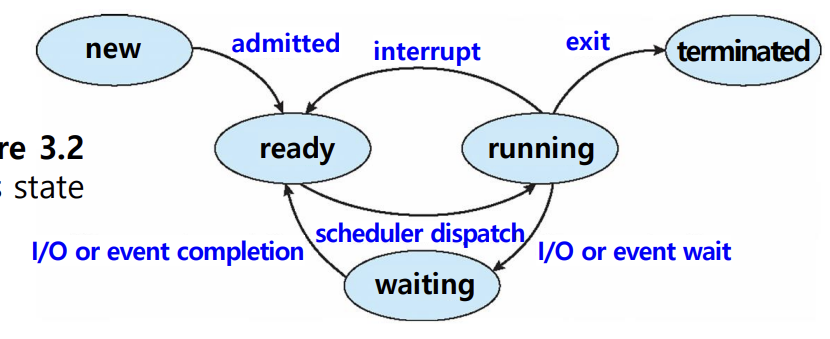

## 📖 프로세스 개념

### 프로그램 vs. 프로세스

- 프로그램: 디스크에 저장된 실행 가능한 명령어 집합 (수동적, passive entity)
- 프로세스: 메모리에 적재되어 실행 중인 프로그램 (능동적, active entity)
- 프로그램이 메모리에 올라와 프로세스 제어 블록(PCB)을 할당받으면 프로세스가 됨.

| 프로그램 | 프로세스 |
| --- | --- |
| a passive entity | an active entity |
| 디스크에 저장된 명령어 집합 | 실행 중인 프로그램 (PC, 레지스터 자원 포함)  |

 

### 프로세스 제어 블록

> 프로세스 제어 블록 (PCB; Process Control Block) (= Task Control Block)

 

- 운영체제가 프로세스를 관리하기 위한 자료구조
- 프로세스 실행/재실행에 필요한 모든 정보 저장
- 프로세스마다 고유한 PCB가 존재

#### PCB에 저장되는 정보 예시

- 프로세스 ID (PID; Process ID)
- 현재 프로세스 상태
- 프로그램 카운터 (다음 명령어 주소)
- CPU 레지스터 값
- CPU 스케줄링 정보
- 메모리 관리 정보
- 사용한 파일과 입출력장치 목록

 

### 프로세스의 메모리 영역

> 프로세스는 사용자 영역에서 다음과 같이 구성됨:

  

|  |  |  |
| --- | --- | --- |
| **Stack** | **스택 영역** | 함수 호출, 지역 변수, 리턴 값 등 |
| **Heap** | **힙 영역** | 동적 할당 메모리 |
| **Data** | **데이터 영역** | 전역 변수, static 변수 |
| **Text** | **코드 영역** | 실행 코드  |

#### 특징

- Text, Data: 크기 고정 (정적 할당 영역)
- Stack, Heap: 실행 중에 크기 가변적 (동적 할당 영역)
    - OS가 둘이 충돌하지 않도록 관리

 

## 📖 프로세스 상태 전이

### 프로세스 상태

|  |  |
| --- | --- |
| **New (생성)** | 메모리에 적재되고 PCB가 생성된 상태 |
| **Ready (준비)** | CPU 할당을 기다리는 상태 |
| **Running (실행)** | CPU를 할당받아 명령어 수행 중 |
| **Waiting/Blocked (대기)** | I/O 완료 등 이벤트를 기다리는 상태 |
| **Terminated (종료)** | 실행이 끝나고 자원이 회수된 상태 |

#### 특징

- 한 순간에 한 코어에서 **하나의 프로세스만 실행(Running 상태) 가능**
- 나머지는 준비 또는 대기 상태로 실행되기를 기다림

 

### 프로세스 계층 구조

#### 부모 프로세스 & 자식 프로세스

- 프로세스는 실행 중 새로운 프로세스를 생성 가능
- 부모 프로세스가 생성한 프로세스 = 자식 프로세스
- 부모와 자식은 서로 다른 PID를 가짐
- 프로세스들은 트리(계층 구조)를 형성
    
    
    

#### 프로세스 생성 기법

- `fork()`: 부모 프로세스를 복사해 자식 프로세스 생성
    - 열린 파일, 메모리 등은 상속
    - PID, 메모리 위치는 다름
- `exec()`: 프로세스 메모리 공간을 새로운 프로그램으로 교체
    - 코드/데이터 영역은 새로운 프로세스로 덮어씌워짐
- cf. Windows에서는 `CreateProcess()` → 프로세스 생성과 프로세스 적재를 한 번에 처리