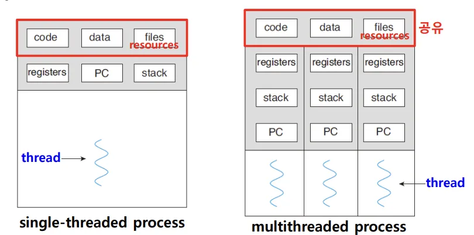
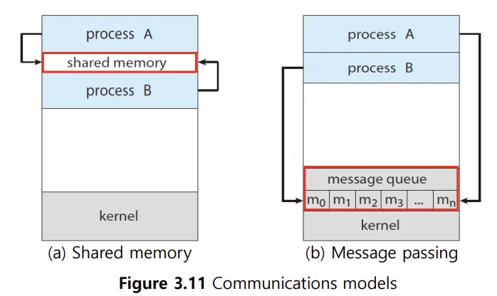

## 📖 스레드 개념

### 스레드

> 스레드 (Thread)
> 
- 스레드: 프로세스를 구성하는 실행의 흐름 단위
- 하나의 프로세스는 여러 개의 스레드를 가질 수 있음
- 스레드를 이용해 하나의 프로세스에서 여러 작업을 동시에 실행 가능

 

### 스레드 구성

 

- 스레드마다 **각기 다른 스레드 ID, 레지스터 값, 스택**을 구성
    - ⇒ 스레드마다 각기 다른 코드를 실행할 수 있음
- 한 프로세스 내 스레드들은 **프로세스 자원 (코드, 데이터 등)을 공유함**

 

### 프로세스 vs. 스레드

|  | 프로세스 | 스레드 |
| --- | --- | --- |
| 정의 | 실행 중인 프로그램 | 프로세스를 구성하는 실행 흐름 단위 |
| 자원 | 독립된 메모리 공간 (코드, 데이터, 힙, 스택) | 프로세스 자원 (코드, 데이터, 힙) 공유, 스택만 독립 |
| 실행 단위 | OS가 관리하는 기본 실행 단위 | CPU 스케줄러가 실제로 처리하는 실행 단위 |
| 통신 | 프로세스 간 통신 (IPC) 필요 | 같은 프로세스 내에서는 자원 공유 (통신 용이) |

 

## 📖 멀티프로세스 vs. 멀티스레드

### 단일 스레드 vs. 멀티스레드

#### 단일 스레드 프로세스

- 스레드 개념이 도입되기 전
- 하나의 프로세스는 한 번에 하나의 일만 처리

#### 멀티스레드 프로세스

- 하나의 프로세스가 여러 스레드를 통해 동시에 여러 작업 수행
- 스레드 간 협력, 자원 공유 쉬움
  
 

### 멀티프로세스 vs. 멀티스레드

> 동일한 작업을 수행하는 단일 스레드 프로세스를 여러 개 실행하기 vs. 하나의 프로세스를 여러 스레드로 실행하기

#### 멀티프로세스 

- 여러 프로세스를 동시에 실행하는 것 (ex: 같은 프로그램을 fork을 여러 번)
- 각 프로세스는 독립된 메모리 공간을 사용하므로 안정성 ↑
- 같은 코드와 데이터가 메모리에 중복되어 올라가 있으므로 자원 낭비 발생

#### 멀티스레드

- 하나의 프로세스를 여러 스레드로 나누어 실행
- 스레드들은 코드·데이터·힙 공유, 스택·레지스터는 독립
- 메모리 사용 효율적, 스레드 간 협력 및 통신 용이함
- 한 스레드 오류 발생 시 프로세스 전체에 영향 줄 수 있어 안정성 ↓

#### 프로세스 간 통신 

> IPC; Inter-Process Communication
 
- 기본적으로 프로세스들은 메모리 공유 x
- → 프로세스 간 협력 작업을 위해 IPC 필요

 

- 두 가지 방식으로 IPC 가능
    1. 공유 메모리 (shared memory)
        - 프로세스들이 특정 메모리 영역 공유
        - 속도 빠름 / 동기화 제어 필요
    2. 메시지 전달 (message passing)
        - OS를 통해 파일(메시지) 주고받음
        - 동기화 쉬움 / 속도 느릴 수 있음