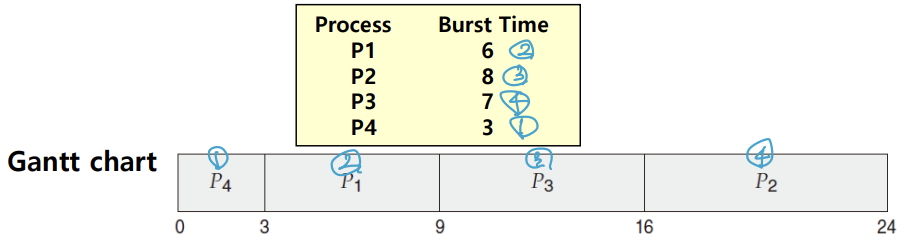
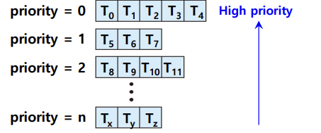
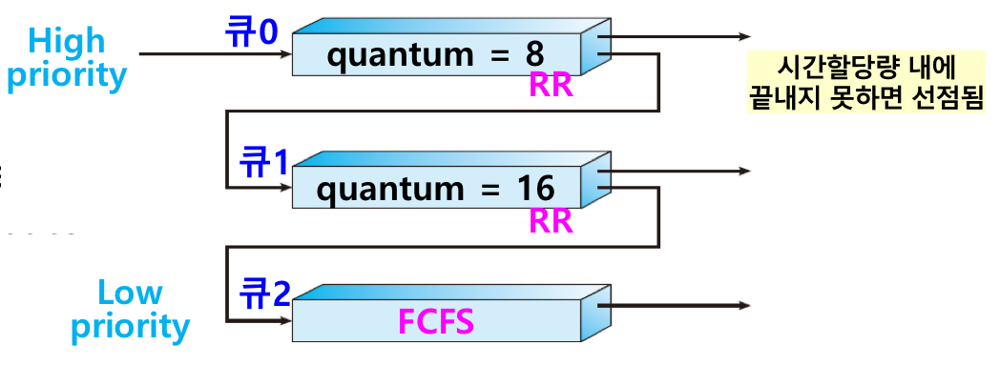

## 📖 CPU 스케줄링

### CPU 스케줄링 개요

#### 프로세스 실행 사이클 

- CPU burst ↔ I/O burst 반복 → 종료
- 프로세스의 종류마다 CPU를 이용하는 시간의 양이 차이남
    - 입출력 집중 프로세스 (I/O bound process): 짧은 CPU burst 여러 번 → I/O 위주
    - CPU 집중 프로세스 (CPU bound process): 긴 CPU 몇 번 → CPU 위주

#### CPU 스케줄링

- 운영체제가 준비 큐(ready queue)에 있는 프로세스들 중 하나를 선택해 CPU를 배분하는 것
- 프로세스마다 CPU를 이용하는 시간의 양이 차이나기 때문에, 모든 프로세스가 CPU를 차례로 돌아가는 것보다 각각 상황에 맞게 CPU를 배분해야 함
- 목표는 CPU와 I/O 장치를 최대한 활용해 전체 시스템 성능을 최적화하는 것

 

### 스케줄링 큐

#### Ready Queue (준비 큐)

- CPU 할당을 대기하고 있는 프로세스들이 저장된 큐
- FIFO, Priority Queue, Linked List 등으로 구현 가능

#### Waiting Queue (대기 큐)

- I/O 완료를 기다리는 대기 상태의 프로세스들이 저장된 큐

⇒ CPU가 idle할 때마다, ready queue에서 프로세스들이 선택되어 실행됨 

 

### 선점형 스케줄링, 비선점형 스케줄링

#### 선점형 스케줄링 (preemptive scheduling)

- 실행 중인 프로세스를 강제로 중단해 다른 프로세스에 CPU 자원 할당 가능
- 어느 한 프로세스가 자원 사용을 독점할 수 없음
- 특정 프로세스의 독점 방지 → 응답성 ↑
- 문맥 교환 자주 발생해 오버헤드 가능성 ↑

#### 비선점형 스케줄링 (non-preemptive scheduling)

- 실행 중인 프로세스가 종료되거나 스스로 다른 대기 상태 (I/O 요청 등) 접어들기 전까지는 강제 종료 불가
- 한 프로세스가 자원 사용을 독점할 수 있음
- 문맥 교환이 적어 오버헤드 가능성 ↓
- 자원 독점 가능성이 낮아 응답성 ↓

 

### 스케줄링 성능 기준 (Scheduling Criteria)

|  |  |
| --- | --- |
| **CPU 이용률 (CPU utilization)** | 가능한 CPU를 바쁘게 (보통 40~90%) |
| **처리량 (Throughput)** | 단위 시간당 완료된 프로세스 수 |
| **처리 시간 (Turnaround time)** | 제출 ~ 완료까지 걸린 총 시간 |
| **대기 시간 (Waiting time)** | Ready queue에서 기다린 총 시간 |
| **응답 시간 (Response time)** | 요청 후 첫 응답까지 걸린 시간 |

⇒ 목표:

- CPU 이용률, 처리량 ↑
- 처리 시간, 대기 시간, 응답 시간 ↓

 

## 📖 스케줄링 알고리즘 종류

> 실제 OS에서는 여러 방식을 조합해 사용함!

### FCFS Scheduling

> First Came First Served Scheduling; 선입 선처리 스케줄링

- 단순히 준비 큐에 삽입된 순서대로 프로세스들을 처리
- CPU를 먼저 요청한 프로세스부터 CPU 할당
- 비선점형 스케줄링
    - CPU 할당되면 terminating이나 I/O request로 해제될 때까지 점유

#### FCFS 스케줄링의 장단점

- (+) 가장 단순하고 이해하기 쉬움
- (-) 프로세스들이 기다리는 시간이 매우 길어질 수 있음
    - CPU burst time 편차 심하면 평균대기시간이 크게 달라짐
    - 특히 interactive system에서 단점; 대화형 시스템은 각 프로세스가 정기적으로 CPU 얻는 것이 중요함

#### convoy effect (호위 효과) 

- 다른 프로세스들이 하나의 긴 프로세스가 CPU 양도하기를 기다림
- 특히 긴 프로세스 뒤에 짧은 프로세스 있는 경우

  

### SJF Scheduling , SRT Scheduling

> Shortest Job First Scheduling; 최단 작업 우선 스케줄링   
> Shortest Remaining Time Scheduing: 최소 잔여 시간 우선 스케줄링
> 
- CPU 사용 시간이 짧은 프로세스를 먼저 실행 (같은 값이라면 FCFS)
- 비선점형 (SJF): CPU burst 짧은 프로세스 우선 실행
- 선점형 (SRT): 새로 ready queue에 들어온 프로세스의 CPU burst가 더 짧으면 선점
    - 선점형 SJF = SRT

#### SJF / SRT 스케줄링의 장단점

- (+) 주어진 프로세스에 대해 평균대기시간을 최소로 함
    - 짧은 프로세스일수록 대기시간이 줄어들고, 긴 프로세스들이 오래 대기하게 되므로 평균대기시간 감소
- (-) 실제로 next CPU burst 길이를 정확히 알 수 없음
    - CPU 스케줄링 수준에서는 구현 불가
    - 근사값으로 예측해 활용할 수 있음

#### example

- waiting time
    - P1: 3 ms
    - P2: 16 ms
    - P3: 9 ms
    - P4: 0 ms
- average waiting time = `(3 + 16 + 9 + 0) / 4` = `7 ms`
    - FCFS 스케줄링이었다면? `(0 + 6 + 14 + 21) / 4` = `10.25 ms`

 

### RR Scheduling

> Round Robin Scheduling; 라운드 로빈 스케줄링
> 
- FCFS + “**타임 슬라이스**” 라는 개념이 더해진 것
    - **타임 슬라이스 (time slice)**: 각 프로세스가 CPU를 사용할 수 있는 정해진 시간
- 정해진 타임 슬라이스만큼의 시간 동안 돌아가며 CPU를 이용하는 선점형 스케줄링
- 각 프로세스는 정해진 시간만큼 CPU 사용, 완료되지 않으면 다시 큐의 맨 뒤에 삽입

#### 타임 슬라이스의 크기

- RR 스케줄링에서는 타임 슬라이스의 크기가 매우 중요
- 타임 슬라이스가 너무 크면 → FCFS랑 다를 바가 없음. 호위 효과 발생 가능성
- 타임 슬라이스가 너무 작으면 → 문맥 교환에 따른 오버헤드 ↑
- 80% 이상의 프로세스 CPU burst가 time slice 안에 끝나는 것이 이상적

 

### Priority Scheduling

> 우선순위 스케줄링
> 
- 프로세스들마다 우선순위를 부여하고, 가장 높은 우선순위를 가진 프로세스부터 실행
    - 우선순위는 OS 내부적 또는 외부적으로 정의될 수 있음
    - 메모리 사용량, I/O burst와 CPU burst 비율, 프로세스 자체의 중요도 등…
- 같은 우선순위면 FCFS로
- SJF, SRT 스케줄링도 넓은 의미에서 우선순위 스케줄링
    - 각각 작업 시간과 남은 시간이 짧은 프로세스에 높은 우선순위를 부여하는 것
- 선점형/비선점형 방식으로 구현 가능
    - 선점형: 새 프로세스 우선순위가 더 높다면 선점
    - 비선점형: 우선순위 높은 새로 도착한 프로세스를 ready queue의 앞으로

#### starvation 

> 기아 현상
> 
- 우선순위 스케줄링의 근본적인 문제
- 우선순위가 낮은 프로세스는 준비 큐에 얼마나 먼저 삽입되었는지와 상관없이 무한 대기 가능성
- 해결:
    - aging: 프로세스가 대기할수록 우선순위를 점차 높이기
    - RR + priority scheduling: 같은 우선순위를 가진 프로세스들 간에는 Round Robin 방식으로 실행

 

### Multilevel Queue Scheduling

> 다단계 큐 스케줄링
> 
- 우선순위 스케줄링의 발전된 형태
- 우선순위별로 Ready Queue를 사용
- 우선순위가 가장 높은 큐에 있는 프로세스들을 먼저 처리 → 그 다음 우선순위 큐의 프로세스들 처리
    
    
    
- 큐별로 타임 슬라이스와 스케줄링 알고리즘을 다르게 사용할 수 있음
- 프로세스 유형별로 우선순위를 구분해 실행하는 것이 편리해짐

#### 다단계 큐 스케줄링의 장단점

- (+) 유형별로 스케줄링을 분리
- (-) 단점: 큐 간 프로세스가 이동 불가

### Multilevel Feedback Queue Scheduling

> 다단계 피드백 큐 스케줄링
> 
- 다단계 큐 스케줄링의 발전된 형태
- 프로세스들이 큐 간 이동 가능
- 다단계 큐 프로세스에서 발생할 수 있는 기아 현상 예방 가능

#### 작동 방식

- 새로 준비 상태가 된 프로세스는 일단 우선순위 가장 높은 큐에 삽입되어 실행
- 그 큐에서 실행이 끝나지 않으면, 다음 우선순위의 큐로
- 결과적으로, CPU를 비교적 오래 사용해야 하는 CPU 집중 프로세스들은 우선순위가 낮아지고 CPU를 비교적 적게 사용하는 입출력 집중 프로세스들은 우선순위 높은 큐에서 실행됨
- Starvation 예방: 낮은 프로세스들에서 너무 오래 기다리고 있는 프로세스들은 점차 우선순위 높은 곳으로 이동시킴 (= aging)

#### 다단계 피드백 큐 스케줄링의 장단점

- (+) Starvation 방지, 유연성
- (-) 규현 복잡함